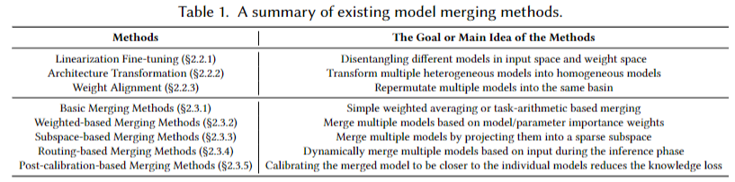

# Awesome-Model-Merging-Methods-Theories-Applications
[]()


> [!TIP]
🔥We are progressively marking papers that use  <font color=red>model size **$\geq$ 7B**</font> in experiments. 

> [!IMPORTANT]
<font color="red">If you have a relevant paper not included in the library, or have any clarification about the content of the [paper](https://arxiv.org/pdf/2408.07666), please [contact us](#contact)!</font>

---


A comprehensive list of papers about **'[Model Merging in LLMs, MLLMs, and Beyond: Methods, Theories, Applications and Opportunities](https://arxiv.org/pdf/2408.07666)'**.

## Abstract
> Model merging is an efficient empowerment technique in the machine learning community that does not require the collection of raw training data and does not require expensive computation. As model merging becomes increasingly prevalent across various fields, it is crucial to understand the available model merging techniques comprehensively. However, there is a significant gap in the literature regarding a systematic and thorough review of these techniques. To address this gap, this survey provides a comprehensive overview of model merging methods and theories, their applications in various domains and settings, and future research directions. Specifically, we first propose a new taxonomic approach that exhaustively discusses existing model merging methods. Secondly, we discuss the application of model merging techniques in large language models, multimodal large language models, and 10+ machine learning subfields, including continual learning, multi-task learning, few-shot learning, etc. Finally, we highlight the remaining challenges of model merging and discuss future research directions.

<center>

</center>

## Citation

If you find our paper or this resource helpful, please consider cite:
```
@article{Survery_ModelMerging_2024,
  title={Model Merging in LLMs, MLLMs, and Beyond: Methods, Theories, Applications and Opportunities},
  author={Yang, Enneng and Shen, Li and Guo, Guibing and Wang, Xingwei and Cao, Xiaochun and Zhang, Jie and Tao, Dacheng},
  journal={arXiv preprint arXiv:2408.07666},
  year={2024}
}
```
Thanks!

******


## Framework
- [Awesome-Model-Merging-Methods-Theories-Applications](#awesome-model-merging-methods-theories-applications)
  * [Survey](#survey)
  * [Benchmark/Evaluation](#benchmark-evaluation)
  * [Advanced Methods](#advanced-methods)
    + [Pre-Merging Methods](#pre-merging-methods)
      - [Linearization Fine-tuning](#linearization-fine-tuning)
      - [Architecture Transformation](#architecture-transformation)
      - [Weight Alignment](#weight-alignment)
      - [Others](#others)
    + [During Merging Methods](#during-merging-methods)
      - [Basic Merging Methods](#basic-merging-methods)
      - [Weighted-based Merging Methods](#weighted-based-merging-methods)
      - [Subspace-based Merging Methods](#subspace-based-merging-methods)
      - [Routing-based Merging Methods](#routing-based-merging-methods)
      - [Post-calibration based Methods](#post-calibration-based-methods)
    + [Theories and Analysis of Model Merging](#theories-and-analysis-of-model-merging)
  * [Application of Model Merging in Foundation Models](#application-of-model-merging-in-foundation-models)
    + [Model Merging in Large Language Model](#model-merging-in-large-language-model)
      - [Human Preference Alignment for LLMs](#human-preference-alignment-for-llms)
      - [Detoxifcation of LLMs](#detoxifcation-of-llms)
      - [Knowledge Unlearning of LLMs](#knowledge-unlearning-of-llms)
      - [Faster Training of LLMs](#faster-training-of-llms)
      - [Combine the Capabilities of Expert LLMs](#combine-the-capabilities-of-expert-llms)
    + [Model Merging in Multimodal Large Language Models](#model-merging-in-multimodal-large-language-models)
      - [Model Merging for Multimodal Fusion](#model-merging-for-multimodal-fusion)
      - [Model Merging for Cross-Modal Knowledge Transfer](#model-merging-for-cross-modal-knowledge-transfer)
    + [Model Merging in Image Generative Models](#model-merging-in-image-generative-models)
      - [Style Mixing in Generative Models](#style-mixing-in-generative-models)
      - [Reducing Training Cost of Generative Models](#reducing-training-cost-of-generative-models)
      - [Enhancing the Faithfulness of Diffusion Models](#enhancing-the-faithfulness-of-diffusion-models)
  * [Application of Model Merging in Different Machine Learning Subfields](#application-of-model-merging-in-different-machine-learning-subfields)
    + [Model Merging in Continual Learning](#model-merging-in-continual-learning)
      - [Model Merging to Mitigate Catastrophic Forgetting](#model-merging-to-mitigate-catastrophic-forgetting)
    + [Model Merging in Multi-Task/Multi-Objective/Multi-Domain/Auxiliary Learning](#model-merging-in-multi-task-multi-objective-multi-domain-auxiliary-learning)
      - [Model Merging for Knowledge Transfer in Multi-Task Learning](#model-merging-for-knowledge-transfer-in-multi-task-learning)
      - [Model Merging for Knowledge Transfer in Multi-Objective Optimization](#model-merging-for-knowledge-transfer-in-multi-objective-optimization)
      - [Model Merging for Knowledge Transfer in Multi-Domain Learning](#model-merging-for-knowledge-transfer-in-multi-domain-learning)
      - [Model Merging for Knowledge Transfer in Auxiliary Learning](#model-merging-for-knowledge-transfer-in-auxiliary-learning)
    + [Model Merging in Out-of-Distribution/Domain Generalization](#model-merging-in-out-of-distribution-domain-generalization)
      - [Model Merging for Better Out-of-Distribution Generalization](#model-merging-for-better-out-of-distribution-generalization)
      - [Model Merging for Better Domain Generalization](#model-merging-for-better-domain-generalization)
    + [Model Merging in Federated Learning](#model-merging-in-federated-learning)
      - [Model Merging for Local Knowledge Aggregation](#model-merging-for-local-knowledge-aggregation)
    + [Model Merging in Zero-shot/Few-shot Learning](#model-merging-in-zero-shot-few-shot-learning)
      - [Model Merging for Cross-task Generalization in Zero-shot Learning](#model-merging-for-cross-task-generalization-in-zero-shot-learning)
      - [Model Merging for Cross-task Generalization in Few-shot Learning](#model-merging-for-cross-task-generalization-in-few-shot-learning)
    + [Model Merging in Adversarial Learning](#model-merging-in-adversarial-learning)
      - [Model Merging as an Attack](#model-merging-as-an-attack)
      - [Model Merging as a Defense](#model-merging-as-a-defense)
  * [Other Applications](#other-applications)


----------
## Survey
| **Paper Title** | **Year** | **Conference/Journal** |
| --------------- | :----: | :----: |
| [Model Merging in LLMs, MLLMs, and Beyond: Methods, Theories, Applications and Opportunities](https://arxiv.org/abs/2408.07666)| 2024 | Arxiv |
| [A Survey on Model MoErging: Recycling and Routing Among Specialized Experts for Collaborative Learning](https://www.arxiv.org/pdf/2408.07057)| 2024 | Arxiv |
| [Merge, Ensemble, and Cooperate! A Survey on Collaborative Strategies in the Era of Large Language Models](https://arxiv.org/pdf/2407.06089)| 2024 | Arxiv |
| [Learn From Model Beyond Fine-Tuning: A Survey](https://arxiv.org/pdf/2310.08184)| 2023 | Arxiv |
| [Deep Model Fusion: A Survey](https://arxiv.org/pdf/2309.15698)| 2023 | Arxiv |

## Benchmark/Evaluation
| **Paper Title** | **Year** | **Conference/Journal** | **Remark** |
| --------------- | :----: | :----: | :----: |
| [What Matters for Model Merging at Scale?](https://arxiv.org/pdf/2410.03617)| 2024 | Arxiv | PaLM-2 (1B, 8B, 24B, 64B), PaLM-2-IT (1B, 8B, 24B, 64B)|
| [Realistic Evaluation of Model Merging for Compositional Generalization](https://arxiv.org/pdf/2409.18314)| 2024 | Arxiv |
| [Fine-tuning large language models for domain adaptation: Exploration of training strategies, scaling, model merging and synergistic capabilities](https://arxiv.org/pdf/2409.03444) | 2024 | Arxiv |Llama-3.1-8B, Mistral-7B-v0.3|
| [FusionBench: A Comprehensive Benchmark of Deep Model Fusion](https://arxiv.org/pdf/2406.03280)| 2024 | Arxiv |
| [Arcee's MergeKit: A Toolkit for Merging Large Language Models](https://arxiv.org/pdf/2403.13257)| 2024 | Arxiv |

## Advanced Methods
<center>

</center>

### Pre-Merging Methods

#### Linearization Fine-tuning
| **Paper Title** | **Year** | **Conference/Journal** | **Remark** |
| --------------- | :----: | :----: | :----: |
| [Fine-Tuning Linear Layers Only Is a Simple yet Effective Way for Task Arithmetic](https://arxiv.org/pdf/2407.07089) | 2024 |  Arxiv |
| [Tangent Transformers for Composition,Privacy and Removal](https://openreview.net/pdf?id=VLFhbOCz5D) | 2024 |ICLR  |
| [Parameter Efficient Multi-task Model Fusion with Partial Linearization](https://openreview.net/pdf?id=iynRvVVAmH) |  2024 |ICLR  |
| [Task Arithmetic in the Tangent Space: Improved Editing of Pre-Trained Models](https://openreview.net/pdf?id=0A9f2jZDGW) | 2023 | NeurIPS |


#### Architecture Transformation
| **Paper Title** | **Year** | **Conference/Journal** | **Remark** |
| --------------- | :----: | :----: | :----: |
| [Knowledge fusion of large language models](https://openreview.net/pdf?id=jiDsk12qcz) | 2024 |  ICLR | Llama-2 7B, OpenLLaMA 7B, MPT 7B |
| [Knowledge Fusion of Chat LLMs: A Preliminary Technical Report](https://arxiv.org/pdf/2402.16107) | 2024 |Arxiv  | NH2-Mixtral-8x7B, NH2-Solar-10.7B, and OpenChat-3.5-7B |
| [On Cross-Layer Alignment for Model Fusion of Heterogeneous Neural Networks](https://arxiv.org/pdf/2110.15538) |2023  |ICASSP   |
| [GAN Cocktail: mixing GANs without dataset access](https://www.ecva.net/papers/eccv_2022/papers_ECCV/papers/136830207.pdf) | 2022 | ECCV |


#### Weight Alignment
| **Paper Title** | **Year** | **Conference/Journal** | **Remark** |
| --------------- | :----: | :----: | :----: |
| [Equivariant Deep Weight Space Alignment](https://openreview.net/pdf/6d437eeb362255b4b2d75a5c6847880fb4a00e3c.pdf) | 2024 | ICML  |
| [Harmony in diversity: Merging neural networks with canonical correlation analysis](https://openreview.net/pdf?id=XTr8vwAr2D) | 2024 | ICML |
| [Transformer fusion with optimal transport](https://arxiv.org/pdf/2310.05719) | 2024 | ICLR  |
| [Layerwise linear mode connectivity](https://openreview.net/pdf?id=LfmZh91tDI) | 2024 | ICLR |
| [ZipIt! Merging Models from Different Tasks without Training](https://openreview.net/pdf?id=LEYUkvdUhq) | 2024 |ICLR  |
| [Proving linear mode connectivity of neural networks via optimal transport](https://arxiv.org/pdf/2310.19103) | 2024 | AISTATS |
| [Training-Free Pretrained Model Merging](https://openaccess.thecvf.com/content/CVPR2024/papers/Xu_Training-Free_Pretrained_Model_Merging_CVPR_2024_paper.pdf) | 2024 |CVPR  |
| [Merging LoRAs like Playing LEGO: Pushing the Modularity of LoRA to Extremes Through Rank-Wise Clustering](https://arxiv.org/pdf/2409.16167)| 2024 | Arxiv | Llama2-7b, Llama2-13b |
| [C2M3: Cycle-Consistent Multi Model Merging](https://arxiv.org/pdf/2405.17897) | 2024 | NeurIPS |
| [PLeaS--Merging Models with Permutations and Least Squares](https://arxiv.org/pdf/2407.02447)| 2024 | Arxiv |
| [Rethink Model Re-Basin and the Linear Mode Connectivity](https://arxiv.org/pdf/2402.05966) | 2024 | Arxiv |
| [Git Re-Basin: Merging Models modulo Permutation Symmetries](https://arxiv.org/pdf/2209.04836) | 2023 | ICLR |
| [Re-basin via implicit Sinkhorn differentiation](https://openaccess.thecvf.com/content/CVPR2023/papers/Pena_Re-Basin_via_Implicit_Sinkhorn_Differentiation_CVPR_2023_paper.pdf) | 2023 | CVPR |
| [Plateau in Monotonic Linear Interpolation--A "Biased" View of Loss Landscape for Deep Networks](https://arxiv.org/pdf/2210.01019)| 2023 | ICLR |
| [Linear Mode Connectivity of Deep Neural Networks via Permutation Invariance and Renormalization](https://openreview.net/pdf?id=gU5sJ6ZggcX)| 2023 | ICLR |
| [REPAIR: REnormalizing Permuted Activations for Interpolation Repair](https://openreview.net/pdf?id=gU5sJ6ZggcX) |2023  | ICLR |
| [Going beyond linear mode connectivity: The layerwise linear feature connectivity](https://papers.nips.cc/paper_files/paper/2023/file/bf3ee5a5422b0e2a88b0c9c6ed3b6144-Paper-Conference.pdf) |  2023 |NeurIPS |
| [The role of permutation invariance in linear mode connectivity of neural networks](https://openreview.net/pdf?id=dNigytemkL) | 2022 | ICLR |
| [What can linear interpolation of neural network loss landscapes tell us?](https://arxiv.org/pdf/2106.16004) |2022 | ICML |
| [Loss Surface Simplexes for Mode Connecting Volumes and Fast Ensembling](https://proceedings.mlr.press/v139/benton21a/benton21a.pdf) | 2021 | ICML |
| [Analyzing Monotonic Linear Interpolation in Neural Network Loss Landscapes](https://proceedings.mlr.press/v139/lucas21a/lucas21a.pdf) | 2021 | ICML |
| [Geometry of the Loss Landscape in Overparameterized Neural Networks: Symmetries and Invariances](https://proceedings.mlr.press/v139/simsek21a/simsek21a.pdf)| 2021 | ICML |
| [Linear Mode Connectivity and the Lottery Ticket Hypothesis](https://proceedings.mlr.press/v119/frankle20a/frankle20a.pdf) | 2020 | ICML |
| [Optimizing mode connectivity via neuron alignment](https://arxiv.org/pdf/2009.02439) | 2020 | NeurIPS |
| [Model fusion via optimal transport](https://proceedings.neurips.cc/paper/2020/file/fb2697869f56484404c8ceee2985b01d-Paper.pdf) | 2020  | NeurIPS |
| [Uniform convergence may be unable to explain generalization in deep learning](https://proceedings.neurips.cc/paper_files/paper/2019/file/05e97c207235d63ceb1db43c60db7bbb-Paper.pdf) |  2019 | NeurIPS |
| [Explaining landscape connectivity of low-cost solutions for multilayer nets](https://proceedings.neurips.cc/paper_files/paper/2019/file/46a4378f835dc8040c8057beb6a2da52-Paper.pdf)|  2019 | NeurIPS |
| [Essentially no barriers in neural network energy landscape](https://proceedings.mlr.press/v80/draxler18a/draxler18a.pdf) | 2018 | ICML  |
| [Loss Surfaces, Mode Connectivity, and Fast Ensembling of DNNs](https://papers.nips.cc/paper_files/paper/2018/file/be3087e74e9100d4bc4c6268cdbe8456-Paper.pdf)|  2018 | NeurIPS |


#### Others
| **Paper Title** | **Year** | **Conference/Journal** | **Remark** |
| --------------- | :----: | :----: | :----: |
| [Weight Scope Alignment: A Frustratingly Easy Method for Model Merging](https://arxiv.org/pdf/2408.12237) | 2024 | Arxiv |


### During Merging Methods

#### Basic Merging Methods
| **Paper Title** | **Year** | **Conference/Journal** | **Remark** |
| --------------- | :----: | :----: | :----: |
| [Composing parameter-efficient modules with arithmetic operation](https://arxiv.org/pdf/2306.14870) | 2023 | NeurIPS |
| [Editing models with task arithmetic](https://openreview.net/pdf?id=6t0Kwf8-jrj) | 2023 | ICLR |
| [Model fusion via optimal transport](https://proceedings.neurips.cc/paper/2020/file/fb2697869f56484404c8ceee2985b01d-Paper.pdf) |2020  | NeurIPS |
| [Weight averaging for neural networks and local resampling schemes](https://citeseerx.ist.psu.edu/document?repid=rep1&type=pdf&doi=a34e789c0f76b860b6e3bc1b7fa04054ccb75c3b) | 1996 | AAAI Workshop  |


#### Weighted-based Merging Methods
| **Paper Title** | **Year** | **Conference/Journal** | **Remark** |
| --------------- | :----: | :----: | :----: |
| [Knowledge Composition using Task Vectors with Learned Anisotropic Scaling](https://arxiv.org/pdf/2407.02880) | 2024 |Arxiv  |
| [MetaGPT: Merging Large Language Models Using Model Exclusive Task Arithmetic](https://arxiv.org/pdf/2406.11385) | 2024 |Arxiv  | LLaMA-2-7B, Mistral-7B, LLaMA-2-13B |
| [Checkpoint Merging via Bayesian Optimization in LLM Pretraining](https://arxiv.org/pdf/2403.19390) |  2024 |Arxiv  | Baichuan2-7B, Deepseek 7B |
| [Arcee’s MergeKit: A Toolkit for Merging Large Language Models](https://arxiv.org/pdf/2403.13257) | 2024 |Arxiv  | Llama2-7B-Chat, Meditron-7B|
| [Evolutionary optimization of model merging recipes](https://arxiv.org/pdf/2403.13187) | 2024 |Arxiv  | shisa-gamma-7b-v1, WizardMath-7B-V1.1, Arithmo2-Mistral-7B, Abel-7B-002, Mistral-7B-v0.1, LLaVA-1.6-Mistral-7B|
| [XFT: Unlocking the Power of Code Instruction Tuning by Simply Merging Upcycled Mixture-of-Experts](https://aclanthology.org/2024.acl-long.699.pdf)| 2024 | ACL |
| [AdaMerging: Adaptive Model Merging for Multi-Task Learning](https://openreview.net/pdf?id=nZP6NgD3QY) | 2024  | ICLR |
| [Model Merging by Uncertainty-Based Gradient Matching](https://openreview.net/pdf?id=D7KJmfEDQP) | 2024  | ICLR |
| [Merging by Matching Models in Task Subspaces](https://arxiv.org/pdf/2312.04339) | 2024  | TMLR |
| [Fisher Mask Nodes for Language Model Merging](https://arxiv.org/pdf/2403.09891) | 2024 | LREC-COLING |
| [Erasure Coded Neural Network Inference via Fisher Averaging](https://shiqiang.wang/papers/DJ_ISIT2024.pdf)| 2024 | ISIT |
| [Dataless Knowledge Fusion by Merging Weights of Language Models](https://openreview.net/pdf?id=FCnohuR6AnM) | 2023  | ICLR |
| [Merging models with fisher-weighted averaging](https://openreview.net/pdf?id=LSKlp_aceOC) | 2022  | NeurIPS |


#### Subspace-based Merging Method
| **Paper Title** | **Year** | **Conference/Journal** | **Remark** |
| --------------- | :----: | :----: |:----: | 
| [Parameter Competition Balancing for Model Merging](https://arxiv.org/pdf/2410.02396v1)| 2024 | NeurIPS  | Llama-2-7b |
| [Language Models are Super Mario: Absorbing Abilities from Homologous Models as a Free Lunch](https://arxiv.org/pdf/2311.03099) | 2024 | ICML  | WizardLM-13B, WizardMath-13B, and llama-2-13b-codealpaca, Mistral-7B|
| [Localizing Task Information for Improved Model Merging and Compression](https://openreview.net/attachment?id=DWT9uiGjxT&name=pdf) | 2024 | ICML | |
| [Sparse Model Soups: A Recipe for Improved Pruning via Model Averaging](https://openreview.net/pdf?id=xx0ITyHp3u) |2024  |ICLR  | |
| [Localize-and-Stitch: Efficient Model Merging via Sparse Task Arithmetic](https://arxiv.org/pdf/2408.13656)|2024  |Arxiv  | |
| [Activated Parameter Locating via Causal Intervention for Model Merging](https://arxiv.org/pdf/2408.09485)|2024  |Arxiv  | Llama-2-chat-7B|
| [PAFT: A Parallel Training Paradigm for Effective LLM Fine-Tuning](https://arxiv.org/pdf/2406.17923)| 2024 | Arxiv  |Mistral-7B-v0.1, Llama-3-8B, Neurotic-7B, MoMo-70B|
| [DELLA-Merging: Reducing Interference in Model Merging through Magnitude-Based Sampling](https://arxiv.org/pdf/2406.11617)|2024  |Arxiv  |Llama-2-13b-code-alpaca, WizardLM, Wizard-Math, WizardCoder-Python|
| [EMR-Merging: Tuning-Free High-Performance Model Merging](https://arxiv.org/pdf/2405.17461) |2024  |NeurIPS  | |
| [DPPA: Pruning Method for Large Language Model to Model Merging](https://arxiv.org/pdf/2403.02799) |2024  |Arxiv  | LLaMa 2 |
| [Model breadcrumbs: Scaling multi-task model merging with sparse masks](https://arxiv.org/pdf/2312.06795) |2023  |Arxiv  | |
| [Concrete Subspace Learning based Interference Elimination for Multi-task Model Fusion](https://arxiv.org/pdf/2312.06173) | 2023  |Arxiv  | |
| [Effective and ParameterEfficient Reusing Fine-Tuned Models](https://openreview.net/pdf?id=13D1zn0mpd) | 2023 | Openreview |
| [Resolving Interference When Merging Models](https://openreview.net/pdf?id=xtaX3WyCj1) | 2023  |  NeurIPS | |
| [Task-Specific Skill Localization in Fine-tuned Language Model](https://arxiv.org/pdf/2302.06600)|  2023| ICML | |


#### Routing-based Merging Methods
| **Paper Title** | **Year** | **Conference/Journal** | **Remark** |
| --------------- | :----: | :----: | :----: |
| [Merging Multi-Task Models via Weight-Ensembling Mixture of Experts](https://openreview.net/pdf/2aee8072945cd0485e619dd88c35566610cd5042.pdf) |  2024| ICML |
| [Learning to Route Among Specialized Experts for Zero-Shot Generalization](https://arxiv.org/pdf/2402.05859)|2024  | ICML  |
| [Merge, Then Compress: Demystify Efficient SMoE with Hints from Its Routing Policy](https://arxiv.org/pdf/2310.01334) |2024  | ICLR |
| [Soft merging of experts with adaptive routing](https://arxiv.org/pdf/2306.03745) | 2024 | TMLR |
| [SMILE: Zero-Shot Sparse Mixture of Low-Rank Experts Construction From Pre-Trained Foundation Models](https://arxiv.org/pdf/2408.10174) |2024 |Arxiv  | Mistral-7B-v0.1, MetaMath-Mistral-7B, dolphin-2.1-mistral-7b, speechless-code-mistral-7b-v1.0|
| [Twin-Merging: Dynamic Integration of Modular Expertise in Model Merging](https://arxiv.org/pdf/2406.15479) |  2024 |Arxiv  |Qwen-14B|
| [Self-MoE: Towards Compositional Large Language Models with Self-Specialized Experts](https://arxiv.org/pdf/2406.12034) |2024 |Arxiv  |Gemma-7B, LLaMA-2 7B & 13B, Mistral 7B,  LLaMA-3 8B|
| [Towards Efficient Pareto Set Approximation via Mixture of Experts Based Model Fusion](https://arxiv.org/pdf/2406.09770) |  2024 |Arxiv  |


<!-- | [Branch-Train-MiX: Mixing Expert LLMs into a Mixture-of-Experts LLM](https://arxiv.org/pdf/2403.07816) |  2024 |Arxiv  | -->


#### Post-calibration based Methods
| **Paper Title** | **Year** | **Conference/Journal** | **Remark** |
| --------------- | :----: | :----: | :----: |
| [Representation Surgery for Multi-Task Model Merging](https://openreview.net/pdf/602906ec02919eb95d78d634321fcba1b68a2f03.pdf) |2024  | ICML |


### Theories and Analysis of Model Merging
| **Paper Title** | **Year** | **Conference/Journal** | **Remark** |
| --------------- | :----: | :----: | :----: |
| [WASH: Train your Ensemble with Communication-Efficient Weight Shuffling, then Average](https://arxiv.org/pdf/2405.17517) |  2024 |Arxiv |
| [On the Emergence of Cross-Task Linearity in Pretraining-Finetuning Paradigm](https://arxiv.org/pdf/2402.03660)| 2024 | ICML |
| [Diverse weight averaging for out-of-distribution generalization](https://proceedings.neurips.cc/paper_files/paper/2022/file/46108d807b50ad4144eb353b5d0e8851-Paper-Conference.pdf) | 2022 | NeurIPS |
| [Ensemble of averages: Improving model selection and boosting performance in domain generalization](https://arxiv.org/pdf/2110.10832) | 2022 | NeurIPS |
| [The role of permutation invariance in linear mode connectivity of neural networks](https://openreview.net/pdf?id=dNigytemkL) | 2022 | ICLR |
| [Swad: Domain generalization by seeking flat minima](https://openreview.net/pdf?id=zkHlu_3sJYU) | 2021 |  NeurIPS|
| [Linear Mode Connectivity and the Lottery Ticket Hypothesis](https://proceedings.mlr.press/v119/frankle20a/frankle20a.pdf) | 2020 | ICML |
| [Stochastic Weight Averaging in Parallel: Large-Batch Training That Generalizes](https://arxiv.org/pdf/2001.02312) |  2020 |  ICLR |
| [Optimizing mode connectivity via neuron alignment](https://arxiv.org/pdf/2009.02439) | 2020 |  NeurIPS |
| [Uniform convergence may be unable to explain generalization in deep learning](https://proceedings.neurips.cc/paper_files/paper/2019/file/05e97c207235d63ceb1db43c60db7bbb-Paper.pdf) |  2019 | NeurIPS |
| [Parallelizing stochastic gradient descent for least squares regression: mini-batching, averaging, and model misspecification](https://arxiv.org/pdf/1610.03774) | 2018 | JMLR |
| [Iterate averaging as regularization for stochastic gradient descent](https://arxiv.org/pdf/1802.08009) | 2018 | Arxiv |
| [Essentially no barriers in neural network energy landscape](https://proceedings.mlr.press/v80/draxler18a/draxler18a.pdf) | 2018 | ICML |
| [Averaging weights leads to wider optima and better generalization](https://auai.org/uai2018/proceedings/papers/313.pdf) | 2018 | UAI |
| [Train faster, generalize better: Stability of stochastic gradient descent](https://arxiv.org/pdf/1509.01240) | 2016 | ICML  |


----------

## Application of Model Merging in Foundation Models
<center>

</center>

### Model Merging in Large Language Model
#### Human Preference Alignment for LLMs
| **Paper Title** | **Year** | **Conference/Journal** | **Remark** |
| --------------- | :----: | :----: | :----: |
| [Conditioned Language Policy: A General Framework for Steerable Multi-Objective Finetuning](https://arxiv.org/pdf/2407.15762)| 2024 | Arxiv  |
| [PAFT: A Parallel Training Paradigm for Effective LLM Fine-Tuning](https://arxiv.org/pdf/2406.17923)| 2024 | Arxiv  |Mistral-7B-v0.1, Llama-3-8B|
| [Model Merging and Safety Alignment: One Bad Model Spoils the Bunch](https://arxiv.org/pdf/2406.14563) |  2024 | Arxiv  | Mistral-0.2-7B-Instruct, LLaMA-3-8B-Instruct, OpenBioLLM-8B, MAmmoTH2-7B, WizardMath-1.1-7B|
| [Safety Arithmetic: A Framework for Test-time Safety Alignment of Language Models by Steering Parameters and Activations](https://arxiv.org/pdf/2406.11801) | 2024 | Arxiv  | llama2-7b-chat-hf, mistral-7b-instruct-v0.2, WIZARDMATH-7B, Llama Math, Llama-2-7b-evolcodealpaca|
| [Disperse-Then-Merge: Pushing the Limits of Instruction Tuning via Alignment Tax Reduction](https://arxiv.org/pdf/2405.13432)| 2024 | Arxiv  | Llama-2-7b |
| [Online Merging Optimizers for Boosting Rewards and Mitigating Tax in Alignment](https://arxiv.org/pdf/2405.17931) |  2024 | Arxiv  | Qwen1.5-7B, LLaMa3-8B | 
| [A safety realignment framework via subspace-oriented model fusion for large language models](https://arxiv.org/pdf/2405.09055) |  2024 | Arxiv  | WizardLM-7B |
| [Weak-to-strong extrapolation expedites alignment](https://arxiv.org/pdf/2404.16792) | 2024 | Arxiv  | zephyr-7b, starling-7b, snorkel-7b, llama3-8b, internlm2-7b, internlm2-20b, tulu-2-dpo-7b, tulu-2-dpo-13b, tulu-2-dpo-70b|
| [Language Models are Homer Simpson! Safety Re-Alignment of Fine-tuned Language Models through Task Arithmetic](https://arxiv.org/pdf/2402.11746) | 2024 | Arxiv  | Llama-2-7BChat |
| [Rewarded soups: towards pareto-optimal alignment by interpolating weights fine-tuned on diverse rewards](https://arxiv.org/pdf/2306.04488) |2023  | NeurIPS |  LLaMA-7b|
| [Personalized soups: Personalized large language model alignment via post-hoc parameter merging](https://arxiv.org/pdf/2310.11564) | 2023 | Arxiv  |


#### Detoxifcation of LLMs
| **Paper Title** | **Year** | **Conference/Journal** | **Remark** |
| --------------- | :----: | :----: | :----: |
| [Separate the Wheat from the Chaff: Model Deficiency Unlearning via Parameter-Efficient Module Operation](https://arxiv.org/pdf/2308.08090) | 2024 |  AAAI | LLaMA-7B  |
| [Mitigating Social Biases in Language Models through Unlearning](https://arxiv.org/pdf/2406.13551) | 2024 |  Arxiv | LLaMA-2 7B |
| [Fine-Grained Detoxification via Instance-Level Prefixes for Large Language Models](https://arxiv.org/pdf/2402.15202) | 2024 |  Arxiv | Llama-2-7B, Llama-2-chat-7B, Vicuna-7B, Llama-2-13B|
| [Composing Parameter-Efficient Modules with Arithmetic Operation](https://openreview.net/pdf?id=5r3e27I9Gy) | 2023 | NeurIPS  |
| [Editing models with task arithmetic](https://openreview.net/pdf?id=6t0Kwf8-jrj) | 2023 | ICLR |
| [Elastic Weight Removal for Faithful and Abstractive Dialogue Generation](https://arxiv.org/pdf/2303.17574) | 2023 |  Arxiv |

#### Knowledge Unlearning of LLMs
| **Paper Title** | **Year** | **Conference/Journal** | **Remark** |
| --------------- | :----: | :----: | :----: |
| [Strong Copyright Protection for Language Models via Adaptive Model Fusion](https://openreview.net/pdf?id=vAG7GrZZUF) | 2024 |  ICML| LLaMa2 7B, StarCoder 7B |
| [Avoiding Copyright Infringement via Machine Unlearning](https://arxiv.org/pdf/2406.10952v1) | 2024 |  Arxiv | Llama3-8B | 
| [Towards Safer Large Language Models through Machine Unlearning](https://arxiv.org/pdf/2402.10058) | 2024 | ACL | LLAMA2-7B, LLAMA2-13B |
| [Editing models with task arithmetic](https://openreview.net/pdf?id=6t0Kwf8-jrj) | 2023 | ICLR |
| [Forgetting before Learning: Utilizing Parametric Arithmetic for Knowledge Updating in Large Language Model](https://arxiv.org/pdf/2311.08011) | 2023 | Arxiv | LLAMA2-7B, LLAMA-7B, BLOOM-7B|
| [Fuse to Forget: Bias Reduction and Selective Memorization through Model Fusion](https://arxiv.org/pdf/2311.07682) | 2023 | Arxiv |


#### Faster Training of LLMs
 | **Paper Title** | **Year** | **Conference/Journal** | **Remark** |
 | --------------- | :----: | :----: | :----: |
 | [DEM: Distribution Edited Model for Training with Mixed Data Distributions](https://arxiv.org/pdf/2406.15570) | 2024 |  Arxiv |  OpenLLaMA  7B and 13B|
 | [Checkpoint Merging via Bayesian Optimization in LLM Pretraining](https://arxiv.org/pdf/2403.19390) | 2024 |  Arxiv | Baichuan2-220B, Baichuan2-440B, Baichuan2-660B, Baichuan2-1540B, Baichuan2-1760B, Baichuan2-1980B, Baichuan2-2200B, Baichuan2-2420B, DeepSeek-1400B, DeepSeek-1600B, DeepSeek-1800B, DeepSeek-2000B|
 | [ColD Fusion: Collaborative Descent for Distributed Multitask Finetuning](https://aclanthology.org/2023.acl-long.46.pdf) |2023  |  ACL|
 | [Early Weight Averaging meets High Learning Rates for LLM Pre-training](https://arxiv.org/pdf/2306.03241) |  2023 |NeurIPS Workshop  |
 | [Stop wasting my time! saving days of imagenet and bert training with latest weight averaging](https://arxiv.org/pdf/2209.14981) | 2022 |NeurIPS Workshop  |
 | [Fusing finetuned models for better pretraining](https://arxiv.org/pdf/2204.03044) | 2022 |Arxiv  |

####  Combine the Capabilities of Expert LLMs
  | **Paper Title** | **Year** | **Conference/Journal** | **Remark** |
  | --------------- | :----: | :----: | :----: |
  | [Knowledge Fusion By Evolving Weights of Language Models](https://arxiv.org/pdf/2406.12208) | 2024 | ACL | 
  | [LLM Merging: Building LLMs Efficiently through Merging](https://openreview.net/pdf?id=TiRQ4Gl4Ir)| 2024 |  NeurIPS 2024 Competition Track | LLaMA-7B, Mistral-7B, Gemma-7B |
  | [Extend Model Merging from Fine-Tuned to Pre-Trained Large Language Models via Weight Disentanglement](https://arxiv.org/pdf/2408.03092)| 2024 |  Arxiv | Qwen1.5-7B, Qwen1.5-Chat-7B, Sailor-7B, Qwen1.5-14B, Qwen1.5-Chat-14B, Sailor-14B, WizardLM-13B, WizardMath-13B, llama-2-13b-code-alpaca |
  | [It’s Morphing Time: Unleashing the Potential of Multiple LLMs via Multi-objective Optimization](https://arxiv.org/pdf/2407.00487)| 2024 |  Arxiv | Qwen1.5-7B-Chat, Liberated-Qwen1.5-7B,  firefly-qwen1.5-en-7B|
  | [MetaGPT: Merging Large Language Models Using Model Exclusive Task Arithmetic](https://arxiv.org/pdf/2406.11385) | 2024 | Arxiv | LLaMA-2-7B, Mistral-7B, LLaMA-2-13B |
  | [PROMETHEUS 2: An Open Source Language Model Specialized in Evaluating Other Language Models](https://arxiv.org/pdf/2405.01535)| 2024 | Arxiv | Mistral-Instruct-7B, Mixtral-Instruct-8x7B|
  | [Knowledge fusion of large language models](https://openreview.net/pdf?id=jiDsk12qcz) | 2024 |  ICLR | Llama-2 7B, OpenLLaMA 7B, MPT 7B |
  | [Language models are super mario: Absorbing abilities from homologous models as a free lunch](https://arxiv.org/pdf/2311.03099) | 2024 | ICML | WizardLM-13B, WizardMath-13B, and llama-2-13b-codealpaca, Mistral-7B|
  | [Controlled Text Generation via Language Model Arithmetic](https://openreview.net/pdf?id=SLw9fp4yI6) | 2024 | ICML | MPT-7B, Pythia-12B, Llama-2-Chat-13B |
  | [Evolutionary optimization of model merging recipes](https://arxiv.org/pdf/2403.13187) | 2024 | Arxiv | shisa-gamma-7b-v1, WizardMath-7B-V1.1, Arithmo2-Mistral-7B, Abel-7B-002, Mistral-7B-v0.1, LLaVA-1.6-Mistral-7B|
  | [Branch-Train-MiX: Mixing Expert LLMs into a Mixture-of-Experts LLM](https://arxiv.org/pdf/2403.07816) |  2024 |Arxiv  | Llama-2 7B |
  | [Knowledge Fusion of Chat LLMs: A Preliminary Technical Report](https://arxiv.org/pdf/2402.16107) | 2024 |Arxiv  | NH2-Mixtral-8x7B, NH2-Solar-10.7B, OpenChat-3.5-7B|


### Model Merging in Multimodal Large Language Models
#### Model Merging for Multimodal Fusion
  | **Paper Title** | **Year** | **Conference/Journal** | **Remark** |
  | --------------- | :----: | :----: | :----: |
  | [Jointly training large autoregressive multimodal models](https://openreview.net/pdf?id=5jcav5RcKw) | 2024 | ICLR |
  | [Model Composition for Multimodal Large Language Models](https://arxiv.org/pdf/2402.12750) | 2024 |ACL  | Vicuna-7B-v1.5|
  | [π-Tuning: Transferring Multimodal Foundation Models with Optimal Multi-task Interpolation](https://arxiv.org/pdf/2304.14381) | 2023 | ICML |
  | [An Empirical Study of Multimodal Model Merging](https://aclanthology.org/2023.findings-emnlp.105.pdf) | 2023  | EMNLP |
  | [UnIVAL: Unified Model for Image, Video, Audio and Language Tasks](https://arxiv.org/pdf/2307.16184) | 2023 |  TMLR |

#### Model Merging for Cross-Modal Knowledge Transfer
  | **Paper Title** | **Year** | **Conference/Journal** | **Remark** |
  | --------------- | :----: | :----: | :----: |
  | [Multimodal Attention Merging for Improved Speech Recognition and Audio Event Classification](https://arxiv.org/pdf/2312.14378) |  2024 | ICASSP Workshop  |


### Model Merging in Image Generative Models
#### Style Mixing in Generative Models
| **Paper Title** | **Year** | **Conference/Journal** | **Remark** |
| --------------- | :----: | :----: | :----: |
| [Diffusion Soup: Model Merging for Text-to-Image Diffusion Models](https://arxiv.org/pdf/2406.08431) | 2024 | Arxiv |
| [MaxFusion: Plug&Play Multi-Modal Generation in Text-to-Image Diffusion Models](https://arxiv.org/pdf/2404.09977) |  2024 | Arxiv |
| [MoLE: Mixture of LoRA Experts](https://arxiv.org/pdf/2404.13628) |  2024| ICLR |
| [LoRA-Composer: Leveraging Low-Rank Adaptation for Multi-Concept Customization in Training-Free Diffusion Models](https://arxiv.org/pdf/2403.11627) |  2024 | Arxiv |
| [Multi-LoRA Composition for Image Generation](https://arxiv.org/pdf/2402.16843) |  2024 | Arxiv |
| [Mix-of-Show: Decentralized Low-Rank Adaptation for Multi-Concept Customization of Diffusion Models](https://proceedings.neurips.cc/paper_files/paper/2023/file/3340ee1e4a8bad8d32c35721712b4d0a-Paper-Conference.pdf) |  2023 | NeurIPS |
| [Merging loras](https://github.com/cloneofsimo/lora) | 2023  | (github) |
| [ZipLoRA: Any Subject in Any Style by Effectively Merging LoRAs](https://arxiv.org/pdf/2311.13600) | 2023 | Arxiv |
| [GAN Cocktail: mixing GANs without dataset access](https://www.ecva.net/papers/eccv_2022/papers_ECCV/papers/136830207.pdf) | 2022 | ECCV |

<!-- | [Merging Improves Self-Critique Against Jailbreak Attacks]() |  2024 | Arxiv | -->

#### Reducing Training Cost of Generative Models
| **Paper Title** | **Year** | **Conference/Journal** | **Remark** |
| --------------- | :----: | :----: | :----: |
| [Linear Combination of Saved Checkpoints Makes Consistency and Diffusion Models Better](https://arxiv.org/pdf/2404.02241) | 2024 | Arxiv |
| [A Unified Module for Accelerating STABLE-DIFFUSION: LCM-LORA](https://arxiv.org/pdf/2403.16024)| 2024 | Arxiv |

#### Enhancing the Faithfulness of Diffusion Models
| **Paper Title** | **Year** | **Conference/Journal** | **Remark** |
| --------------- | :----: | :----: | :----: |
| [SELMA: Learning and Merging Skill-Specific Text-to-Image Experts with Auto-Generated Data](https://arxiv.org/pdf/2403.06952) |  2024 | Arxiv |


----------

## Application of Model Merging in Different Machine Learning Subfields
<center>

</center>


### Model Merging in Continual Learning
#### Model Merging to Mitigate Catastrophic Forgetting
  | **Paper Title** | **Year** | **Conference/Journal** | **Remark** |
  | --------------- | :----: | :----: | :----: |
  | [Model Tailor: Mitigating Catastrophic Forgetting in Multi-modal Large Language Models](https://arxiv.org/pdf/2402.12048) | 2024 |ICML  | InstructBLIP (Vicuna-7B), LLaVA-1.5 (Vicuna7B) |
  | [Adaptive Discovering and Merging for Incremental Novel Class Discovery](https://arxiv.org/pdf/2403.03382) | 2024 |AAAI  |
  | [MagMax: Leveraging Model Merging for Seamless Continual Learning](https://arxiv.org/pdf/2407.06322) | 2024 |  ECCV |
  | [Lm-cocktail: Resilient tuning of language models via model merging](https://aclanthology.org/2024.findings-acl.145.pdf) |  2024 | ACL Findings |
  | [Backward Compatibility During Data Updates by Weight Interpolation](https://aclanthology.org/2024.eacl-long.174.pdf)|  2024 | EACL |
  | [Learning to Route for Dynamic Adapter Composition in Continual Learning with Language Models](https://arxiv.org/pdf/2408.09053) |  2024 |  Arxiv |
  | [Mitigating Catastrophic Forgetting in Language Transfer via Model Merging](https://arxiv.org/pdf/2407.08699) |  2024 |  Arxiv |
  | [Lottery Ticket Adaptation: Mitigating Destructive Interference in LLMs](https://arxiv.org/pdf/2406.16797) |  2024 |  Arxiv |
  | [WARP: On the Benefits of Weight Averaged Rewarded Policies](https://arxiv.org/pdf/2406.16768) | 2024 | Arxiv |
  | [A Second-Order perspective on Compositionality and Incremental Learning](https://arxiv.org/pdf/2405.16350) | 2024 |  Arxiv |
  | [DynaMMo: Dynamic Model Merging for Efficient Class Incremental Learning for Medical Images](https://arxiv.org/abs/2404.14099) |  2024|  Arxiv |
  | [DAM: Dynamic Adapter Merging for Continual Video QA Learning](https://arxiv.org/pdf/2403.08755) |  2024 | Arxiv |
  | [Task-Specific Skill Localization in Fine-tuned Language Model](https://arxiv.org/pdf/2302.06600)|  2023| ICML |
  | [Tangent model composition for ensembling and continual fine-tuning](https://openaccess.thecvf.com/content/ICCV2023/papers/Liu_Tangent_Model_Composition_for_Ensembling_and_Continual_Fine-tuning_ICCV_2023_paper.pdf) |  2023| ICCV |
  | [Task Arithmetic with LoRA for Continual Learning](https://arxiv.org/pdf/2311.02428) |  2023 | NeurIPS Workshop |
  | [Mitigating the Alignment Tax of RLHF](https://arxiv.org/pdf/2309.06256)|  2023 | Arxiv |
  | [Robust fine-tuning of zero-shot models](https://openaccess.thecvf.com/content/CVPR2022/papers/Wortsman_Robust_Fine-Tuning_of_Zero-Shot_Models_CVPR_2022_paper.pdf) |2022  |CVPR  |


### Model Merging in Multi-Task/Multi-Objective/Multi-Domain/Auxiliary Learning

#### Model Merging for Knowledge Transfer in Multi-Task Learning
  | **Paper Title** | **Year** | **Conference/Journal** | **Remark** |
  | --------------- | :----: | :----: | :----: |
  | [Foldable SuperNets: Scalable Merging of Transformers with Different Initializations and Tasks](https://arxiv.org/pdf/2410.01483v1) | 2024 |Arxiv  |
  | [Task Prompt Vectors: Effective Initialization through Multi-Task Soft-Prompt Transfer](https://arxiv.org/pdf/2408.01119) | 2024 |Arxiv  |
  | [Evolutionary optimization of model merging recipes](https://arxiv.org/pdf/2403.13187) | 2024 |Arxiv  |
  | [Language Models are Super Mario: Absorbing Abilities from Homologous Models as a Free Lunch](https://arxiv.org/pdf/2311.03099) | 2024 | ICML  |
  | [Representation Surgery for Multi-Task Model Merging](https://openreview.net/pdf/602906ec02919eb95d78d634321fcba1b68a2f03.pdf) |2024  | ICML |
  | [Merging Multi-Task Models via Weight-Ensembling Mixture of Experts](https://openreview.net/pdf/2aee8072945cd0485e619dd88c35566610cd5042.pdf) |  2024| ICML |
  | [ZipIt! Merging Models from Different Tasks without Training](https://openreview.net/pdf?id=LEYUkvdUhq) | 2024 |ICLR  |
  | [AdaMerging: Adaptive Model Merging for Multi-Task Learning](https://openreview.net/pdf?id=nZP6NgD3QY) | 2024  | ICLR |
  | [Resolving Interference When Merging Models](https://openreview.net/pdf?id=xtaX3WyCj1) | 2023  |  NeurIPS |
  | [Editing models with task arithmetic](https://openreview.net/pdf?id=6t0Kwf8-jrj) | 2023 | ICLR |


#### Model Merging for Knowledge Transfer in Multi-Objective Optimization
  | **Paper Title** | **Year** | **Conference/Journal** | **Remark** |
  | --------------- | :----: | :----: | :----: |
  | [You Only Merge Once: Learning the Pareto Set of Preference-Aware Model Merging](https://arxiv.org/pdf/2408.12105) |  2024 |Arxiv  |
  | [Towards Efficient Pareto Set Approximation via Mixture of Experts Based Model Fusion](https://arxiv.org/pdf/2406.09770) |  2024 |Arxiv  |
  | [MAP: Low-compute Model Merging with Amortized Pareto Fronts via Quadratic Approximation](https://arxiv.org/pdf/2406.07529) | 2024 |Arxiv  |


#### Model Merging for Knowledge Transfer in Multi-Domain Learning
  | **Paper Title** | **Year** | **Conference/Journal** | **Remark** |
  | --------------- | :----: | :----: | :----: |
  | [DEM: Distribution Edited Model for Training with Mixed Data Distributions](https://arxiv.org/pdf/2406.15570) | 2024 |  Arxiv |
  | [Merging Vision Transformers from Different Tasks and Domains](https://arxiv.org/abs/2312.16240) | 2023 |Arxiv  |


#### Model Merging for Knowledge Transfer in Auxiliary Learning
  | **Paper Title** | **Year** | **Conference/Journal** | **Remark** |
  | --------------- | :----: | :----: | :----: |
  | [ForkMerge: Mitigating Negative Transfer in Auxiliary-Task Learning](https://openreview.net/pdf?id=vZHk1QlBQW) | 2023 | NeurIPS |


### Model Merging in Out-of-Distribution/Domain Generalization

#### Model Merging for Better Out-of-Distribution Generalization
| **Paper Title** | **Year** | **Conference/Journal** | **Remark** |
| --------------- | :----: | :----: | :----: |
| [Sparse Model Soups: A Recipe for Improved Pruning via Model Averaging](https://openreview.net/pdf?id=xx0ITyHp3u) |2024  |ICLR  |
| [Warm: On the benefits of weight averaged reward models](https://openreview.net/pdf?id=s7RDnNUJy6) |2024  | ICML  |
| [Population parameter averaging (papa)](https://arxiv.org/pdf/2304.03094) | 2024 | TMLR |
| [Adaptive Stochastic Weight Averaging](https://arxiv.org/pdf/2406.19092) | 2024 | JMLR
| [Scalable Learned Model Soup on a Single GPU: An Efficient Subspace Training Strategy](https://arxiv.org/pdf/2407.03641) |2024  | ECCV |
| [Mitigating Training Imbalance in LLM Fine-Tuning via Selective Parameter Merging](https://arxiv.org/pdf/2410.03743) | 2024 | Arxiv | Llama-2-7b|
| [WARP: On the Benefits of Weight Averaged Rewarded Policies](https://arxiv.org/pdf/2406.16768) | 2024 | Arxiv |
| [WASH: Train your Ensemble with Communication-Efficient Weight Shuffling, then Average](https://arxiv.org/pdf/2405.17517) | 2024 | Arxiv |
| [Model Stock: All we need is just a few fine-tuned models](https://arxiv.org/pdf/2403.19522) |2024  | Arxiv |
| [Lookaround Optimizer: 𝑘 steps around, 1 step average](https://openreview.net/pdf?id=k1Xy5zCNOJ) | 2023 | NeurIPS |
| [Model ratatouille: Recycling diverse models for out-of-distribution generalization](https://proceedings.mlr.press/v202/rame23a/rame23a.pdf) | 2023 | ICML |
| [Trainable Weight Averaging: Efficient Training by Optimizing Historical Solutions](https://openreview.net/pdf?id=8wbnpOJY-f) | 2023 | ICLR |
| [Lookaround Optimizer: k steps around, 1 step average](https://openreview.net/pdf?id=k1Xy5zCNOJ) |2023  |  NeurIPS|
| [AdapterSoup: Weight Averaging to Improve Generalization of Pretrained Language Models](https://arxiv.org/pdf/2302.07027) |  2023 |EACL
| [Dart: Diversify aggregate-repeat training improves generalization of neural networks](https://openaccess.thecvf.com/content/CVPR2023/papers/Jain_DART_Diversify-Aggregate-Repeat_Training_Improves_Generalization_of_Neural_Networks_CVPR_2023_paper.pdf) |2023  | CVPR |
| [When do flat minima optimizers work?](https://openreview.net/pdf?id=vDeh2yxTvuh) |  2022| NeurIPS |
| [Model soups: averaging weights of multiple fine-tuned models improves accuracy without increasing inference time](https://proceedings.mlr.press/v162/wortsman22a/wortsman22a.pdf) | 2022 | ICML |
| [Diverse weight averaging for out-of-distribution generalization](https://proceedings.neurips.cc/paper_files/paper/2022/file/46108d807b50ad4144eb353b5d0e8851-Paper-Conference.pdf) |  2022|NeurIPS  |
| [Robust fine-tuning of zero-shot models](https://openaccess.thecvf.com/content/CVPR2022/papers/Wortsman_Robust_Fine-Tuning_of_Zero-Shot_Models_CVPR_2022_paper.pdf) |2022  |CVPR  |
| [Neural networks with late-phase weights](https://arxiv.org/pdf/2007.12927) |  2021 | ICLR |
| [Stochastic Weight Averaging in Parallel: Large-Batch Training That Generalizes Well](https://arxiv.org/pdf/2001.02312) | 2020 | ICLR |
| [SWALP: Stochastic weight averaging in low precision training](https://proceedings.mlr.press/v97/yang19d/yang19d.pdf) |2019  | ICML |
| [Averaging weights leads to wider optima and better generalization](https://auai.org/uai2018/proceedings/papers/313.pdf) | 2018 | UAI |
| [Mean teachers are better role models: Weight-averaged consistency targets improve semi-supervised deep learning results](https://proceedings.neurips.cc/paper_files/paper/2017/file/68053af2923e00204c3ca7c6a3150cf7-Paper.pdf) |2017  | NeurIPS |

#### Model Merging for Better Domain Generalization

| **Paper Title** | **Year** | **Conference/Journal** | **Remark** |
| --------------- | :----: | :----: | :----: |
| [Realistic Evaluation of Model Merging for Compositional Generalization](https://arxiv.org/pdf/2409.18314)| 2024 | Arxiv |
| [Training-Free Model Merging for Multi-target Domain Adaptation](https://arxiv.org/pdf/2407.13771)| 2024 | Arxiv |
| [Ensemble of averages: Improving model selection and boosting performance in domain generalization](https://openreview.net/pdf?id=peZSbfNnBp4) | 2022 | NeurIPS |
| [Swad: Domain generalization by seeking flat minima](https://openreview.net/pdf?id=zkHlu_3sJYU) |  2021| NeurIPS |


### Model Merging in Federated Learning
####  Model Merging for Local Knowledge Aggregation
| **Paper Title** | **Year** | **Conference/Journal** | **Remark** |
| --------------- | :----: | :----: | :----: |
| [DIMAT: Decentralized Iterative Merging-And-Training for Deep Learning Models](https://openaccess.thecvf.com/content/CVPR2024/papers/Saadati_DIMAT_Decentralized_Iterative_Merging-And-Training_for_Deep_Learning_Models_CVPR_2024_paper.pdf) | 2024 | CVPR |
| [FedFisher: Leveraging Fisher Information for One-Shot Federated Learning](https://proceedings.mlr.press/v238/jhunjhunwala24a/jhunjhunwala24a.pdf) | 2024 | AISTATS |
| [lo-fi: distributed fine-tuning without communication](https://openreview.net/pdf?id=1U0aPkBVz0)| 2023 | TMLR |
| [Revisiting Weighted Aggregation in Federated Learning with Neural Networks](https://proceedings.mlr.press/v202/li23s/li23s.pdf)| 2023|  ICML |
| [Deep neural network fusion via graph matching with applications to model ensemble and federated learning](https://proceedings.mlr.press/v162/liu22k/liu22k.pdf) | 2022 |  ICML |
| [Federated Learning with Matched Averaging](https://openreview.net/pdf?id=BkluqlSFDS) |  2020 |  ICLR|
| [Tackling the objective inconsistency problem in heterogeneous federated optimization](https://arxiv.org/pdf/2007.07481) |2020  | NeurIPS |
| [Model fusion via optimal transport](https://proceedings.neurips.cc/paper/2020/file/fb2697869f56484404c8ceee2985b01d-Paper.pdf) |2020  |  NeurIPS|
| [Bayesian nonparametric federated learning of neural networks](https://proceedings.mlr.press/v97/yurochkin19a/yurochkin19a.pdf) | 2019 | ICML |
| [Learning private neural language modeling with attentive aggregation](https://arxiv.org/pdf/1812.07108) |2019  | IJCNN |
| [Communication-Efficient Learning of Deep Networks from Decentralized Data](https://proceedings.mlr.press/v54/mcmahan17a/mcmahan17a.pdf) | 2017 |  AISTATS |


### Model Merging in Zero-shot/Few-shot Learning
#### Model Merging for Cross-task Generalization in Zero-shot Learning
| **Paper Title** | **Year** | **Conference/Journal** | **Remark** |
| --------------- | :----: | :----: | :----: |
| [Learning to Route Among Specialized Experts for Zero-Shot Generalization](https://arxiv.org/pdf/2402.05859)|2024  | ICML  |
| [Towards Modular LLMs by Building and Reusing a Library of LoRAs](https://arxiv.org/pdf/2405.11157) |2024  | ICML  |
| [Chat Vector: A Simple Approach to Equip LLMs With New Language Chat Capabilities](https://arxiv.org/pdf/2310.04799) |2024  |ACL  |
| [Unlocking the Potential of Model Merging for Low-Resource Languages](https://arxiv.org/pdf/2407.03994)|   2024 |Arxiv |
| [Diffusion Soup: Model Merging for Text-to-Image Diffusion Models](https://arxiv.org/pdf/2406.08431) | 2024 | Arxiv |
| [No Train but Gain: Language Arithmetic for training-free Language Adapters enhancement](https://arxiv.org/pdf/2404.15737) | 2024 |Arxiv |
| [MaxFusion: Plug&Play Multi-Modal Generation in Text-to-Image Diffusion Models](https://arxiv.org/pdf/2404.09977) | 2024 |Arxiv |
| [AdaMergeX: Cross-Lingual Transfer with Large Language Models via Adaptive Adapter Merging](https://arxiv.org/pdf/2402.18913) | 2024 |Arxiv |
| [Model Composition for Multimodal Large Language Models](https://arxiv.org/pdf/2402.12750) |  2024 | Arxiv |
| [Exploring the Benefits of Training Expert Language Models over Instruction Tuning](https://openreview.net/pdf?id=VAA1itvsNQ)|  2023 | ICML |
| [Token-Level Adaptation of LoRA Adapters for Downstream Task Generalization](https://arxiv.org/pdf/2311.10847)|  2023 | Arxiv |
| [Language and Task Arithmetic with Parameter-Efficient Layers for Zero-Shot Summarization](https://arxiv.org/pdf/2311.09344) |  2023 | Arxiv |


#### Model Merging for Cross-task Generalization in Few-shot Learning
| **Paper Title** | **Year** | **Conference/Journal** | **Remark** |
| --------------- | :----: | :----: | :----: |
| [LoRA-Flow: Dynamic LoRA Fusion for Large Language Models in Generative Tasks](https://arxiv.org/pdf/2402.11455) | 2024 | ACL |
| [LoraHub: Efficient Cross-Task Generalization via Dynamic LoRA Composition](https://arxiv.org/pdf/2307.13269) | 2024 |  COLM |
| [LoraRetriever: Input-Aware LoRA Retrieval and Composition for Mixed Tasks in the Wild](https://arxiv.org/pdf/2402.09997)  | 2024 | ACL |
| [Does Combining Parameter-efficient Modules Improve Few-shot Transfer Accuracy?](https://arxiv.org/pdf/2402.15414) |   2024 |Arxiv |
| [MerA: Merging pretrained adapters for few-shot learning](https://arxiv.org/pdf/2308.15982) |2023  | Arxiv |

### Model Merging in Adversarial Learning
#### Model Merging as an Attack
| **Paper Title** | **Year** | **Conference/Journal** | **Remark** |
| --------------- | :----: | :----: | :----: |
| [BadMerging: Backdoor Attacks Against Model Merging](https://arxiv.org/pdf/2408.07362) | 2024  | CCS |
| [LoRA-as-an-Attack! Piercing LLM Safety Under The Share-and-Play Scenario](https://arxiv.org/pdf/2403.00108) | 2024  | ACL |

#### Model Merging as a Defense
| **Paper Title** | **Year** | **Conference/Journal** | **Remark** |
| --------------- | :----: | :----: | :----: |
| [Here’s a Free Lunch: Sanitizing Backdoored Models with Model Merge](https://arxiv.org/pdf/2402.19334) | 2024  | ACL |
| [Merging Improves Self-Critique Against Jailbreak Attacks](https://arxiv.org/pdf/2406.07188) | 2024 |  Arxiv|
| [Have You Merged My Model? On The Robustness of Large Language Model IP Protection Methods Against Model Merging](https://arxiv.org/pdf/2404.05188) |  2024 |  Arxiv|
| [Revisiting adapters with adversarial training](https://openreview.net/pdf?id=HPdxC1THU8T) |2023 |ICLR |
| [Seasoning model soups for robustness to adversarial and natural distribution shifts](https://openaccess.thecvf.com/content/CVPR2023/papers/Croce_Seasoning_Model_Soups_for_Robustness_to_Adversarial_and_Natural_Distribution_CVPR_2023_paper.pdf) |2023 | CVPR |

## Other Applications
| **Paper Title** | **Year** | **Conference/Journal** | **Remark** |
| --------------- | :----: | :----: | :----: |
| [Emotion Arithmetic: Emotional Speech Synthesis via Weight Space Interpolation](https://www.ee.iitb.ac.in/course/~daplab/publications/2024/kalyan24_interspeech.pdf) | 2024 | Interspeech
| [Erasure Coded Neural Network Inference via Fisher Averaging](https://arxiv.org/pdf/2409.01420) | 2024 |  Arxiv|
| [SQL-GEN: Bridging the Dialect Gap for Text-to-SQL Via Synthetic Data And Model Merging](https://arxiv.org/pdf/2408.12733) | 2024 |  Arxiv|
| [Scaling Up Personalized Image Aesthetic Assessment via Task Vector Customization](https://arxiv.org/pdf/2407.07176)| 2024 | Arxiv |
| [Model Tells You Where to Merge: Adaptive KV Cache Merging for LLMs on Long-Context Tasks](https://arxiv.org/pdf/2407.08454v2) | 2024 |  Arxiv|
| [Task Arithmetic can Mitigate Synthetic-to-Real Gap in Automatic Speech Recognition](https://arxiv.org/pdf/2406.02925) | 2024 |  Arxiv|
| [Experts Weights Averaging: A New General Training Scheme for Vision Transformers](https://arxiv.org/pdf/2308.06093)| 2023 | Arxiv |
| [One Student Knows All Experts Know: From Sparse to Dense](https://arxiv.org/pdf/2201.10890)| 2022 | Arxiv |

----------

**Star History**

[](https://star-history.com/#EnnengYang/Awesome-Model-Merging-Methods-Theories-Applications&Date)


----------


## Contact
<!-- **Contact** -->

We welcome all researchers to contribute to this repository **'model merging in foundation models or machine learning'**.

If you have a related paper that was not added to the library, please contact us.

Email: ennengyang@stumail.neu.edu.cn / ennengyang@gmail.com
