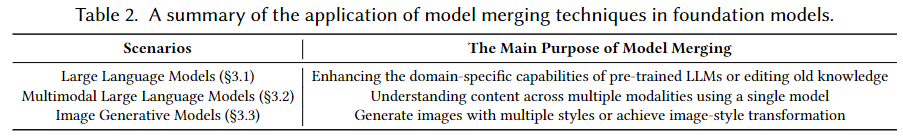

# Awesome-Model-Merging-Methods-Theories-Applications
[]()


A comprehensive list of papers about **'[Model Merging in LLMs, MLLMs, and Beyond: Methods, Theories, Applications and Opportunities](https://arxiv.org/pdf/2408.07666)'**.

## Abstract
> Model merging is an efficient empowerment technique in the machine learning community that does not require the collection of raw training data and does not require expensive computation. As model merging becomes increasingly prevalent across various fields, it is crucial to understand the available model merging techniques comprehensively. However, there is a significant gap in the literature regarding a systematic and thorough review of these techniques. To address this gap, this survey provides a comprehensive overview of model merging methods and theories, their applications in various domains and settings, and future research directions. Specifically, we first propose a new taxonomic approach that exhaustively discusses existing model merging methods. Secondly, we discuss the application of model merging techniques in large language models, multimodal large language models, and 10+ machine learning subfields, including continual learning, multi-task learning, few-shot learning, etc. Finally, we highlight the remaining challenges of model merging and discuss future research directions.

<center>

</center>

## Citation

If you find our paper or this resource helpful, please consider cite:
```
@article{Survery_ModelMerging_2024,
  title={Model Merging in LLMs, MLLMs, and Beyond: Methods, Theories, Applications and Opportunities},
  author={Enneng Yang; Li Shen; Guibing Guo; Xingwei Wang; Xiaochun Cao; Jie Zhang and Dacheng Tao},
  journal={arXiv preprint arXiv:2408.07666},
  year={2024}
}
```
Thanks!

******


## Framework
- [Awesome-Model-Merging-Methods-Theories-Applications](#awesome-model-merging-methods-theories-applications)
  * [Advanced Methods](#advanced-methods)
    + [Pre-Merging Methods](#pre-merging-methods)
      - [Linearization Fine-tuning](#linearization-fine-tuning)
      - [Architecture Transformation](#architecture-transformation)
      - [Weight Alignment](#weight-alignment)
    + [During Merging Methods](#during-merging-methods)
      - [Basic Merging Methods](#basic-merging-methods)
      - [Weighted-based Merging Methods](#weighted-based-merging-methods)
      - [Subspace-based Merging Methods](#subspace-based-merging-methods)
      - [Routing-based Merging Methods](#routing-based-merging-methods)
      - [Post-calibration based Methods](#post-calibration-based-methods)
    + [Theories and Analysis of Model Merging](#theories-and-analysis-of-model-merging)
  * [Application of Model Merging in Foundation Models](#application-of-model-merging-in-foundation-models)
    + [Model Merging in Large Language Model](#model-merging-in-large-language-model)
      - [Human Preference Alignment for LLMs](#human-preference-alignment-for-llms)
      - [Detoxifcation of LLMs](#detoxifcation-of-llms)
      - [Knowledge Unlearning of LLMs](#knowledge-unlearning-of-llms)
      - [Faster Training of LLMs](#faster-training-of-llms)
      - [Combine the Capabilities of Expert LLMs](#combine-the-capabilities-of-expert-llms)
    + [Model Merging in Multimodal Large Language Models](#model-merging-in-multimodal-large-language-models)
      - [Model Merging for Multimodal Fusion](#model-merging-for-multimodal-fusion)
      - [Model Merging for Cross-Modal Knowledge Transfer](#model-merging-for-cross-modal-knowledge-transfer)
    + [Model Merging in Image Generative Models](#model-merging-in-image-generative-models)
      - [Style Mixing in Generative Models](#style-mixing-in-generative-models)
      - [Reducing Training Cost of Generative Models](#reducing-training-cost-of-generative-models)
      - [Enhancing the Faithfulness of Diffusion Models](#enhancing-the-faithfulness-of-diffusion-models)
  * [Application of Model Merging in Different Machine Learning Subfields](#application-of-model-merging-in-different-machine-learning-subfields)
    + [Model Merging in Continual Learning](#model-merging-in-continual-learning)
      - [Model Merging to Mitigate Catastrophic Forgetting](#model-merging-to-mitigate-catastrophic-forgetting)
    + [Model Merging in Multi-Task/Multi-Objective/Multi-Domain/Auxiliary Learning](#model-merging-in-multi-task-multi-objective-multi-domain-auxiliary-learning)
      - [Knowledge Transfer in Multi-Task Learning](#knowledge-transfer-in-multi-task-learning)
      - [Knowledge Transfer in Multi-Objective Optimization](#knowledge-transfer-in-multi-objective-optimization)
      - [Knowledge Transfer in Multi-Domain Learning](#knowledge-transfer-in-multi-domain-learning)
      - [Knowledge Transfer in Auxiliary Learning](#knowledge-transfer-in-auxiliary-learning)
    + [Model Merging in Out-of-Distribution/Domain Generalization](#model-merging-in-out-of-distribution-domain-generalization)
      - [Model Merging for Better Out-of-Distribution Generalization](#model-merging-for-better-out-of-distribution-generalization)
      - [Model Merging for Better Domain Generalization](#model-merging-for-better-domain-generalization)
    + [Model Merging in Federated Learning](#model-merging-in-federated-learning)
      - [Model Merging for Local Knowledge Aggregation](#model-merging-for-local-knowledge-aggregation)
    + [Model Merging in Zero-shot/Few-shot Learning](#model-merging-in-zero-shot-few-shot-learning)
      - [Model Merging for Cross-task Generalization in Zero-shot Learning](#model-merging-for-cross-task-generalization-in-zero-shot-learning)
      - [Model Merging for Cross-task Generalization in Few-shot Learning](#model-merging-for-cross-task-generalization-in-few-shot-learning)
    + [Model Merging in Adversarial Learning](#model-merging-in-adversarial-learning)
      - [Model Merging as an Attack](#model-merging-as-an-attack)
      - [Model Merging as a Defense](#model-merging-as-a-defense)

## Advanced Methods
<center>

</center>

### Pre-Merging Methods

#### Linearization Fine-tuning
| **Paper Title** | **Year** | **Conference/Journal** |
| --------------- | :----: | :----: |
| [Extend Model Merging from Fine-Tuned to Pre-Trained Large Language Models via Weight Disentanglement](https://arxiv.org/pdf/2408.03092)| 2024 |  Arxiv |
| [Fine-Tuning Linear Layers Only Is a Simple yet Effective Way for Task Arithmetic](https://arxiv.org/pdf/2407.07089) | 2024 |  Arxiv |
| [Tangent Transformers for Composition,Privacy and Removal](https://openreview.net/pdf?id=VLFhbOCz5D) | 2024 |ICLR  |
| [Parameter Efficient Multi-task Model Fusion with Partial Linearization](https://openreview.net/pdf?id=iynRvVVAmH) |  2024 |ICLR  |
| [Task Arithmetic in the Tangent Space: Improved Editing of Pre-Trained Models](https://openreview.net/pdf?id=0A9f2jZDGW) | 2023 | NeurIPS |


#### Architecture Transformation
| **Paper Title** | **Year** | **Conference/Journal** |
| --------------- | :----: | :----: |
| [Knowledge fusion of large language models](https://openreview.net/pdf?id=jiDsk12qcz) | 2024 |  ICLR |
| [Knowledge Fusion of Chat LLMs: A Preliminary Technical Report](https://arxiv.org/pdf/2402.16107) | 2024 |Arxiv  |
| [Model fusion of heterogeneous neural networks via cross-layer alignment](https://arxiv.org/pdf/2110.15538) |2023  |ICASSP   |
| [GAN Cocktail: mixing GANs without dataset access](https://www.ecva.net/papers/eccv_2022/papers_ECCV/papers/136830207.pdf) | 2022 | ECCV |


#### Weight Alignment
| **Paper Title** | **Year** | **Conference/Journal** |
| --------------- | :----: | :----: |
| [Equivariant Deep Weight Space Alignment](https://openreview.net/pdf/6d437eeb362255b4b2d75a5c6847880fb4a00e3c.pdf) | 2024 | ICML  |
| [Harmony in diversity: Merging neural networks with canonical correlation analysis](https://openreview.net/pdf?id=XTr8vwAr2D) | 2024 | ICML |
| [Transformer fusion with optimal transport](https://arxiv.org/pdf/2310.05719) | 2024 | ICLR  |
| [Layerwise linear mode connectivity](https://openreview.net/pdf?id=LfmZh91tDI) | 2024 | ICLR |
| [Proving linear mode connectivity of neural networks via optimal transport](https://arxiv.org/pdf/2310.19103) | 2024 | AISTATS |
| [Training-Free Pretrained Model Merging](https://openaccess.thecvf.com/content/CVPR2024/papers/Xu_Training-Free_Pretrained_Model_Merging_CVPR_2024_paper.pdf) | 2024 |CVPR  |
| [C2M3: Cycle-Consistent Multi Model Merging](https://arxiv.org/pdf/2405.17897) | 2024 | Arxiv |
| [Git Re-Basin: Merging Models modulo Permutation Symmetries](https://arxiv.org/pdf/2209.04836) | 2023 | ICLR |
| [Re-basin via implicit Sinkhorn differentiation](https://openaccess.thecvf.com/content/CVPR2023/papers/Pena_Re-Basin_via_Implicit_Sinkhorn_Differentiation_CVPR_2023_paper.pdf) | 2023 | CVPR |
| [Going beyond linear mode connectivity: The layerwise linear feature connectivity](https://papers.nips.cc/paper_files/paper/2023/file/bf3ee5a5422b0e2a88b0c9c6ed3b6144-Paper-Conference.pdf) |  2023 |NeurIPS |
| [The role of permutation invariance in linear mode connectivity of neural networks](https://openreview.net/pdf?id=dNigytemkL) | 2022 | ICLR |
| [Linear Mode Connectivity and the Lottery Ticket Hypothesis](https://proceedings.mlr.press/v119/frankle20a/frankle20a.pdf) | 2020 | ICML |
| [Optimizing mode connectivity via neuron alignment](https://arxiv.org/pdf/2009.02439) | 2020 | NeurIPS |
| [Model fusion via optimal transport](https://proceedings.neurips.cc/paper/2020/file/fb2697869f56484404c8ceee2985b01d-Paper.pdf) | 2020  | NeurIPS |
| [Uniform convergence may be unable to explain generalization in deep learning](https://proceedings.neurips.cc/paper_files/paper/2019/file/05e97c207235d63ceb1db43c60db7bbb-Paper.pdf) |  2019 | NeurIPS |
| [Essentially no barriers in neural network energy landscape](https://proceedings.mlr.press/v80/draxler18a/draxler18a.pdf) | 2018 | ICML  |
| [Loss Surfaces, Mode Connectivity, and Fast Ensembling of DNNs](https://papers.nips.cc/paper_files/paper/2018/file/be3087e74e9100d4bc4c6268cdbe8456-Paper.pdf)|  2018 | NeurIPS |
| [REPAIR: REnormalizing Permuted Activations for Interpolation Repair](https://openreview.net/pdf?id=gU5sJ6ZggcX) |2023  | ICLR |


### During Merging Methods

#### Basic Merging Methods
| **Paper Title** | **Year** | **Conference/Journal** |
| --------------- | :----: | :----: |
| [Composing parameter-efficient modules with arithmetic operation](https://arxiv.org/pdf/2306.14870) | 2023 | NeurIPS |
| [Editing models with task arithmetic](https://openreview.net/pdf?id=6t0Kwf8-jrj) | 2023 | ICLR |
| [Model fusion via optimal transport](https://proceedings.neurips.cc/paper/2020/file/fb2697869f56484404c8ceee2985b01d-Paper.pdf) |2020  | NeurIPS |
| [Weight averaging for neural networks and local resampling schemes](https://citeseerx.ist.psu.edu/document?repid=rep1&type=pdf&doi=a34e789c0f76b860b6e3bc1b7fa04054ccb75c3b) | 1996 | AAAI Workshop  |

#### Weighted-based Merging Methods
| **Paper Title** | **Year** | **Conference/Journal** |
| --------------- | :----: | :----: |
| [Evolutionary optimization of model merging recipes](https://arxiv.org/pdf/2403.13187) | 2024 |Arxiv  |
| [Checkpoint Merging via Bayesian Optimization in LLM Pretraining](https://arxiv.org/pdf/2403.19390) |  2024 |Arxiv  |
| [MetaGPT: Merging Large Language Models Using Model Exclusive Task Arithmetic](https://arxiv.org/pdf/2406.11385) | 2024 |Arxiv  |
| [Knowledge Composition using Task Vectors with Learned Anisotropic Scaling](https://arxiv.org/pdf/2407.02880) | 2024 |Arxiv  |
| [Arcee’s MergeKit: A Toolkit for Merging Large Language Models](https://arxiv.org/pdf/2403.13257) | 2024 |Arxiv  |
| [AdaMerging: Adaptive Model Merging for Multi-Task Learning](https://openreview.net/pdf?id=nZP6NgD3QY) | 2024  | ICLR |
| [Model Merging by Uncertainty-Based Gradient Matching](https://openreview.net/pdf?id=D7KJmfEDQP) | 2024  | ICLR |
| [Merging by Matching Models in Task Subspaces](https://arxiv.org/pdf/2312.04339) | 2024  | TMLR |
| [ Fisher Mask Nodes for Language Model Merging](https://arxiv.org/pdf/2403.09891) | 2024 | LREC-COLING |
| [Dataless Knowledge Fusion by Merging Weights of Language Models](https://openreview.net/pdf?id=FCnohuR6AnM) | 2023  | ICLR |
| [Merging models with fisher-weighted averaging](https://openreview.net/pdf?id=LSKlp_aceOC) | 2022  | NeurIPS |


#### Subspace-based Merging Methods
| **Paper Title** | **Year** | **Conference/Journal** |
| --------------- | :----: | :----: |
| [Language Models are Super Mario: Absorbing Abilities from Homologous Models as a Free Lunch](https://arxiv.org/pdf/2311.03099) | 2024 | ICML  |
| [Localizing Task Information for Improved Model Merging and Compression](https://openreview.net/attachment?id=DWT9uiGjxT&name=pdf) | 2024 | ICML |
| [Resolving Interference When Merging Models](https://openreview.net/pdf?id=xtaX3WyCj1) | 2023  |  NeurIPS |
| [EMR-Merging: Tuning-Free High-Performance Model Merging](https://arxiv.org/pdf/2405.17461) |2024  |Arxiv  |
| [Model breadcrumbs: Scaling multi-task model merging with sparse masks](https://arxiv.org/pdf/2312.06795) |2023  |Arxiv  |
| [Concrete Subspace Learning based Interference Elimination for Multi-task Model Fusion](https://arxiv.org/pdf/2312.06173) | 2023  |Arxiv  |

#### Routing-based Merging Methods
| **Paper Title** | **Year** | **Conference/Journal** |
| --------------- | :----: | :----: |
| [Merging Multi-Task Models via Weight-Ensembling Mixture of Experts](https://openreview.net/pdf/2aee8072945cd0485e619dd88c35566610cd5042.pdf) |  2024| ICML |
| [Merge, Then Compress: Demystify Efficient SMoE with Hints from Its Routing Policy](https://arxiv.org/pdf/2310.01334) |2024  | ICLR |
| [Soft merging of experts with adaptive routing](https://arxiv.org/pdf/2306.03745) | 2024 | TMLR |
| [Twin-Merging: Dynamic Integration of Modular Expertise in Model Merging](https://arxiv.org/abs/2406.15479) |  2024 |Arxiv  |
| [Towards Efficient Pareto Set Approximation via Mixture of Experts Based Model Fusion](https://arxiv.org/pdf/2406.09770) |  2024 |Arxiv  |


#### Post-calibration based Methods
| **Paper Title** | **Year** | **Conference/Journal** |
| --------------- | :----: | :----: |
| [Representation Surgery for Multi-Task Model Merging](https://openreview.net/pdf/602906ec02919eb95d78d634321fcba1b68a2f03.pdf) |2024  | ICML |


### Theories and Analysis of Model Merging
| **Paper Title** | **Year** | **Conference/Journal** |
| --------------- | :----: | :----: |
| [On the Emergence of Cross-Task Linearity in Pretraining-Finetuning Paradigm](https://arxiv.org/pdf/2402.03660)| 2024 | ICML |
| [WASH: Train your Ensemble with Communication-Efficient Weight Shuffling, then Average](https://arxiv.org/pdf/2405.17517) |  | 2024 |Arxiv
| []() |  |  |
| [Diverse weight averaging for out-of-distribution generalization](https://proceedings.neurips.cc/paper_files/paper/2022/file/46108d807b50ad4144eb353b5d0e8851-Paper-Conference.pdf) | 2022 | NeurIPS |
| [Ensemble of averages: Improving model selection and boosting performance in domain generalization](https://arxiv.org/pdf/2110.10832) | 2022 | NeurIPS |
| [The role of permutation invariance in linear mode connectivity of neural networks](https://openreview.net/pdf?id=dNigytemkL) | 2022 | ICLR |
| [Swad: Domain generalization by seeking flat minima](https://openreview.net/pdf?id=zkHlu_3sJYU) | 2021 |  NeurIPS|
| [Linear Mode Connectivity and the Lottery Ticket Hypothesis](https://proceedings.mlr.press/v119/frankle20a/frankle20a.pdf) | 2020 | ICML |
| [Stochastic Weight Averaging in Parallel: Large-Batch Training That Generalizes](https://arxiv.org/pdf/2001.02312) |  2020 |  ICLR |
| [Optimizing mode connectivity via neuron alignment](https://arxiv.org/pdf/2009.02439) | 2020 |  NeurIPS |
| [Uniform convergence may be unable to explain generalization in deep learning](https://proceedings.neurips.cc/paper_files/paper/2019/file/05e97c207235d63ceb1db43c60db7bbb-Paper.pdf) |  2019 | NeurIPS |
| [Parallelizing stochastic gradient descent for least squares regression: mini-batching, averaging, and model misspecification](https://arxiv.org/pdf/1610.03774) | 2018 | JMLR |
| [Essentially no barriers in neural network energy landscape](https://proceedings.mlr.press/v80/draxler18a/draxler18a.pdf) | 2018 | ICML |
| [Averaging weights leads to wider optima and better generalization](https://auai.org/uai2018/proceedings/papers/313.pdf) | 2018 | UAI |
| [Train faster, generalize better: Stability of stochastic gradient descent](https://arxiv.org/pdf/1509.01240) | 2016 | ICML  |


## Application of Model Merging in Foundation Models
<center>

</center>

### Model Merging in Large Language Model
#### Human Preference Alignment for LLMs
| **Paper Title** | **Year** | **Conference/Journal** |
| --------------- | :----: | :----: |
| [Weak-to-strong extrapolation expedites alignment](https://arxiv.org/pdf/2404.16792) | 2024 | Arxiv  |
| [Online Merging Optimizers for Boosting Rewards and Mitigating Tax in Alignment](https://arxiv.org/pdf/2405.17931) |  2024 | Arxiv  |
| [Language Models are Homer Simpson! Safety Re-Alignment of Fine-tuned Language Models through Task Arithmetic](https://arxiv.org/pdf/2402.11746) | 2024 | Arxiv  |
| [Model Merging and Safety Alignment: One Bad Model Spoils the Bunch](https://arxiv.org/pdf/2406.14563) |  2024 | Arxiv  |
| [A safety realignment framework via subspace-oriented model fusion for large language models](https://arxiv.org/pdf/2405.09055) |  2024 | Arxiv  |
| [Rewarded soups: towards pareto-optimal alignment by interpolating weights fine-tuned on diverse rewards](https://arxiv.org/pdf/2306.04488) |2023  | NeurIPS |
| [Personalized soups: Personalized large language model alignment via post-hoc parameter merging](https://arxiv.org/pdf/2310.11564) | 2023 | Arxiv  |


#### Detoxifcation of LLMs
| **Paper Title** | **Year** | **Conference/Journal** |
| --------------- | :----: | :----: |
| [Fine-Grained Detoxification via Instance-Level Prefixes for Large Language Models](https://arxiv.org/pdf/2402.15202) | 2024 |  Arxiv |
| [Separate the Wheat from the Chaff: Model Deficiency Unlearning via Parameter-Efficient Module Operation](https://arxiv.org/pdf/2308.08090) | 2024 |  AAAI |
| [Composing Parameter-Efficient Modules with Arithmetic Operation](https://openreview.net/pdf?id=5r3e27I9Gy) | 2023 | NeurIPS  |
| [Editing models with task arithmetic](https://openreview.net/pdf?id=6t0Kwf8-jrj) | 2023 | ICLR |


#### Knowledge Unlearning of LLMs
| **Paper Title** | **Year** | **Conference/Journal** |
| --------------- | :----: | :----: |
| [Strong Copyright Protection for Language Models via Adaptive Model Fusion](https://openreview.net/pdf?id=vAG7GrZZUF) | 2024 |  ICML|
| [Avoiding Copyright Infringement via Machine Unlearning](https://arxiv.org/pdf/2406.10952v1) | 2024 |  Arxiv |
| [Towards Safer Large Language Models through Machine Unlearning](https://arxiv.org/pdf/2402.10058) | 2024 | ACL |
| [Editing models with task arithmetic](https://openreview.net/pdf?id=6t0Kwf8-jrj) | 2023 | ICLR |
| [Fuse to Forget: Bias Reduction and Selective Memorization through Model Fusion](https://arxiv.org/pdf/2311.07682) | 2023 | Arxiv |
| [Forgetting before Learning: Utilizing Parametric Arithmetic for Knowledge Updating in Large Language Model](https://arxiv.org/pdf/2311.08011) | 2023 | Arxiv |


#### Faster Training of LLMs
 | **Paper Title** | **Year** | **Conference/Journal** |
 | --------------- | :----: | :----: |
 | [Checkpoint Merging via Bayesian Optimization in LLM Pretraining](https://arxiv.org/pdf/2403.19390) | 2024 |  Arxiv |
  | [ColD Fusion: Collaborative Descent for Distributed Multitask Finetuning](https://aclanthology.org/2023.acl-long.46.pdf) |2023  |  ACL|
 | [Early Weight Averaging meets High Learning Rates for LLM Pre-training](https://arxiv.org/pdf/2306.03241) |  2023 |NeurIPS Workshop  |
 | [Stop wasting my time! saving days of imagenet and bert training with latest weight averaging](https://arxiv.org/pdf/2209.14981) | 2022 |NeurIPS Workshop  |
 | [Fusing finetuned models for better pretraining](https://arxiv.org/pdf/2204.03044) | 2022 |Arxiv  |

####  Combine the Capabilities of Expert LLMs
  | **Paper Title** | **Year** | **Conference/Journal** |
  | --------------- | :----: | :----: |
  | [Knowledge fusion of large language models](https://openreview.net/pdf?id=jiDsk12qcz) | 2024 |  ICLR |
  | [Language models are super mario: Absorbing abilities from homologous models as a free lunch](https://arxiv.org/pdf/2311.03099) | 2024 | ICML |
  | [Controlled Text Generation via Language Model Arithmetic](https://openreview.net/pdf?id=SLw9fp4yI6) | 2024 | ICML |
  | [Knowledge Fusion of Chat LLMs: A Preliminary Technical Report](https://arxiv.org/pdf/2402.16107) | 2024 |Arxiv  |
  | [Evolutionary optimization of model merging recipes](https://arxiv.org/pdf/2403.13187) | 2024 | Arxiv |
  | [MetaGPT: Merging Large Language Models Using Model Exclusive Task Arithmetic](https://arxiv.org/pdf/2406.11385) | 2024 | Arxiv |


### Model Merging in Multimodal Large Language Models
#### Model Merging for Multimodal Fusion
  | **Paper Title** | **Year** | **Conference/Journal** |
  | --------------- | :----: | :----: |
  | [Jointly training large autoregressive multimodal models](https://openreview.net/pdf?id=5jcav5RcKw) | 2024 | ICLR |
  | [Model Composition for Multimodal Large Language Models](https://arxiv.org/pdf/2402.12750) | 2024 |ACL  |
  | [An Empirical Study of Multimodal Model Merging](https://aclanthology.org/2023.findings-emnlp.105.pdf) | 2023  | EMNLP |
  | [UnIVAL: Unified Model for Image, Video, Audio and Language Tasks](https://arxiv.org/pdf/2307.16184) | 2023 |  TMLR |

#### Model Merging for Cross-Modal Knowledge Transfer
  | **Paper Title** | **Year** | **Conference/Journal** |
  | --------------- | :----: | :----: |
  | [Multimodal Attention Merging for Improved Speech Recognition and Audio Event Classification](https://arxiv.org/pdf/2312.14378) |  2024 | ICASSP Workshop  |


### Model Merging in Image Generative Models
#### Style Mixing in Generative Models
| **Paper Title** | **Year** | **Conference/Journal** |
| --------------- | :----: | :----: |
| [Merging loras](https://github.com/cloneofsimo/lora) | 2023  | - |
| [MoLE: Mixture of LoRA Experts](https://arxiv.org/pdf/2404.13628) |  2024| ICLR |
| [Diffusion Soup: Model Merging for Text-to-Image Diffusion Models](https://arxiv.org/pdf/2406.08431) | 2024 | Arxiv |
| [MaxFusion: Plug&Play Multi-Modal Generation in Text-to-Image Diffusion Models](https://arxiv.org/pdf/2404.09977) |  2024 | Arxiv |
| [ZipLoRA: Any Subject in Any Style by Effectively Merging LoRAs](https://arxiv.org/pdf/2311.13600) | 2023 | Arxiv |
| [GAN Cocktail: mixing GANs without dataset access](https://www.ecva.net/papers/eccv_2022/papers_ECCV/papers/136830207.pdf) | 2022 | ECCV |

<!-- | [Merging Improves Self-Critique Against Jailbreak Attacks]() |  2024 | Arxiv | -->

#### Reducing Training Cost of Generative Models
| **Paper Title** | **Year** | **Conference/Journal** |
| --------------- | :----: | :----: |
| [Linear Combination of Saved Checkpoints Makes Consistency and Diffusion Models Better](https://arxiv.org/pdf/2404.02241) | 2024 | Arxiv |

#### Enhancing the Faithfulness of Diffusion Models
| **Paper Title** | **Year** | **Conference/Journal** |
| --------------- | :----: | :----: |
| [SELMA: Learning and Merging Skill-Specific Text-to-Image Experts with Auto-Generated Data](https://arxiv.org/pdf/2403.06952) |  2024 | Arxiv |


## Application of Model Merging in Different Machine Learning Subfields
<center>

</center>


### Model Merging in Continual Learning
#### Model Merging to Mitigate Catastrophic Forgetting
  | **Paper Title** | **Year** | **Conference/Journal** |
  | --------------- | :----: | :----: |
  | [Model Tailor: Mitigating Catastrophic Forgetting in Multi-modal Large Language Models](https://arxiv.org/pdf/2402.12048) | 2024 |ICML  |
  | [Adaptive Discovering and Merging for Incremental Novel Class Discovery](https://arxiv.org/pdf/2403.03382) | 2024 |AAAI  |
  | [Mitigating Catastrophic Forgetting in Language Transfer via Model Merging](https://arxiv.org/pdf/2407.08699) |  2024 |  Arxiv |
  | [A Second-Order perspective on Compositionality and Incremental Learning](https://arxiv.org/pdf/2405.16350) | 2024 |  Arxiv |
  | [WARP: On the Benefits of Weight Averaged Rewarded Policies](https://arxiv.org/pdf/2406.16768) | 2024 | Arxiv |
  | [DAM: Dynamic Adapter Merging for Continual Video QA Learning](https://arxiv.org/pdf/2403.08755) |  2024 | Arxiv |
  | [MagMax: Leveraging Model Merging for Seamless Continual Learning](https://arxiv.org/pdf/2407.06322) | 2024 |  Arxiv |
  | [DynaMMo: Dynamic Model Merging for Efficient Class Incremental Learning for Medical Images](https://arxiv.org/abs/2404.14099) |  2024|  Arxiv |
  | [Tangent model composition for ensembling and continual fine-tuning](https://openaccess.thecvf.com/content/ICCV2023/papers/Liu_Tangent_Model_Composition_for_Ensembling_and_Continual_Fine-tuning_ICCV_2023_paper.pdf) |  2023| ICCV |
  | [Task Arithmetic with LoRA for Continual Learning](https://arxiv.org/pdf/2311.02428) |  2023 | NeurIPS Workshop |
  | [Lm-cocktail: Resilient tuning of language models via model merging](https://arxiv.org/pdf/2311.13534) |  2023 | Arxiv |


### Model Merging in Multi-Task/Multi-Objective/Multi-Domain/Auxiliary Learning

#### Knowledge Transfer in Multi-Task Learning
  | **Paper Title** | **Year** | **Conference/Journal** |
  | --------------- | :----: | :----: |
  | [Evolutionary optimization of model merging recipes](https://arxiv.org/pdf/2403.13187) | 2024 |Arxiv  |
  | [Language Models are Super Mario: Absorbing Abilities from Homologous Models as a Free Lunch](https://arxiv.org/pdf/2311.03099) | 2024 | ICML  |
  | [Representation Surgery for Multi-Task Model Merging](https://openreview.net/pdf/602906ec02919eb95d78d634321fcba1b68a2f03.pdf) |2024  | ICML |
  | [Merging Multi-Task Models via Weight-Ensembling Mixture of Experts](https://openreview.net/pdf/2aee8072945cd0485e619dd88c35566610cd5042.pdf) |  2024| ICML |
  | [ZipIt! Merging Models from Different Tasks without Training](https://openreview.net/pdf?id=LEYUkvdUhq) | 2024 |ICLR  |
  | [AdaMerging: Adaptive Model Merging for Multi-Task Learning](https://openreview.net/pdf?id=nZP6NgD3QY) | 2024  | ICLR |
  | [Resolving Interference When Merging Models](https://openreview.net/pdf?id=xtaX3WyCj1) | 2023  |  NeurIPS |
  | [Editing models with task arithmetic](https://openreview.net/pdf?id=6t0Kwf8-jrj) | 2023 | ICLR |


#### Knowledge Transfer in Multi-Objective Optimization
  | **Paper Title** | **Year** | **Conference/Journal** |
  | --------------- | :----: | :----: |
  | [Towards Efficient Pareto Set Approximation via Mixture of Experts Based Model Fusion](https://arxiv.org/pdf/2406.09770) |  2024 |Arxiv  |
  | [MAP: Low-compute Model Merging with Amortized Pareto Fronts via Quadratic Approximation](https://arxiv.org/pdf/2406.07529) | 2024 |Arxiv  |


#### Knowledge Transfer in Multi-Domain Learning
  | **Paper Title** | **Year** | **Conference/Journal** |
  | --------------- | :----: | :----: |
  | [Merging Vision Transformers from Different Tasks and Domains](https://arxiv.org/abs/2312.16240) | 2023 |Arxiv  |


#### Knowledge Transfer in Auxiliary Learning
  | **Paper Title** | **Year** | **Conference/Journal** |
  | --------------- | :----: | :----: |
  | [ForkMerge: Mitigating Negative Transfer in Auxiliary-Task Learning](https://openreview.net/pdf?id=vZHk1QlBQW) | 2024 | NeurIPS |


### Model Merging in Out-of-Distribution/Domain Generalization

#### Model Merging for Better Out-of-Distribution Generalization
| **Paper Title** | **Year** | **Conference/Journal** |
| --------------- | :----: | :----: |
| [Sparse Model Soups: A Recipe for Improved Pruning via Model Averaging](https://openreview.net/pdf?id=xx0ITyHp3u) |2024  |ICLR  |
| [Warm: On the benefits of weight averaged reward models](https://openreview.net/pdf?id=s7RDnNUJy6) |2024  | ICML  |
| [Population parameter averaging (papa)](https://arxiv.org/pdf/2304.03094) | 2024 | TMLR |
| [Adaptive Stochastic Weight Averaging](https://arxiv.org/pdf/2406.19092) | 2024 | JMLR
| [WARP: On the Benefits of Weight Averaged Rewarded Policies](https://arxiv.org/pdf/2406.16768) | 2024 | Arxiv |
| [WASH: Train your Ensemble with Communication-Efficient Weight Shuffling, then Average](https://arxiv.org/pdf/2405.17517) | 2024 | Arxiv |
| [Lookaround Optimizer: 𝑘 steps around, 1 step average](https://openreview.net/pdf?id=k1Xy5zCNOJ) | 2023 | NeurIPS |
| [Model Stock: All we need is just a few fine-tuned models](https://arxiv.org/pdf/2403.19522) |2024  | Arxiv |
| [Scalable Learned Model Soup on a Single GPU: An Efficient Subspace Training Strategy](https://arxiv.org/pdf/2407.03641) |2024  | Arxiv |
| [Model ratatouille: Recycling diverse models for out-of-distribution generalization](https://proceedings.mlr.press/v202/rame23a/rame23a.pdf) | 2023 | ICML |
| [Trainable Weight Averaging: Efficient Training by Optimizing Historical Solutions](https://openreview.net/pdf?id=8wbnpOJY-f) | 2023 | ICLR |
| [Lookaround Optimizer: k steps around, 1 step average](https://openreview.net/pdf?id=k1Xy5zCNOJ) |2023  |  NeurIPS|
| [AdapterSoup: Weight Averaging to Improve Generalization of Pretrained Language Models](https://arxiv.org/pdf/2302.07027) |  2023 |EACL
| [Dart: Diversify aggregate-repeat training improves generalization of neural networks](https://openaccess.thecvf.com/content/CVPR2023/papers/Jain_DART_Diversify-Aggregate-Repeat_Training_Improves_Generalization_of_Neural_Networks_CVPR_2023_paper.pdf) |2023  | CVPR |
| [When do flat minima optimizers work?](https://openreview.net/pdf?id=vDeh2yxTvuh) |  2022| NeurIPS |
| [Model soups: averaging weights of multiple fine-tuned models improves accuracy without increasing inference time](https://proceedings.mlr.press/v162/wortsman22a/wortsman22a.pdf) | 2022 | ICML |
| [Diverse weight averaging for out-of-distribution generalization](https://proceedings.neurips.cc/paper_files/paper/2022/file/46108d807b50ad4144eb353b5d0e8851-Paper-Conference.pdf) |  2022|NeurIPS  |
| [Robust fine-tuning of zero-shot models](https://openaccess.thecvf.com/content/CVPR2022/papers/Wortsman_Robust_Fine-Tuning_of_Zero-Shot_Models_CVPR_2022_paper.pdf) |2022  |CVPR  |
| [Neural networks with late-phase weights](https://arxiv.org/pdf/2007.12927) |  2021 | ICLR |
| [Stochastic Weight Averaging in Parallel: Large-Batch Training That Generalizes Well](https://arxiv.org/pdf/2001.02312) | 2020 | ICLR |
| [SWALP: Stochastic weight averaging in low precision training](https://proceedings.mlr.press/v97/yang19d/yang19d.pdf) |2019  | ICML |
| [Averaging weights leads to wider optima and better generalization](https://auai.org/uai2018/proceedings/papers/313.pdf) | 2018 | UAI |
| [Mean teachers are better role models: Weight-averaged consistency targets improve semi-supervised deep learning results](https://proceedings.neurips.cc/paper_files/paper/2017/file/68053af2923e00204c3ca7c6a3150cf7-Paper.pdf) |2017  | NeurIPS |

#### Model Merging for Better Domain Generalization

| **Paper Title** | **Year** | **Conference/Journal** |
| --------------- | :----: | :----: |
| [Ensemble of averages: Improving model selection and boosting performance in domain generalization](https://openreview.net/pdf?id=peZSbfNnBp4) | 2022 | NeurIPS |
| [Swad: Domain generalization by seeking flat minima](https://openreview.net/pdf?id=zkHlu_3sJYU) |  2021| NeurIPS |


### Model Merging in Federated Learning
####  Model Merging for Local Knowledge Aggregation
| **Paper Title** | **Year** | **Conference/Journal** |
| --------------- | :----: | :----: |
| [FedFisher: Leveraging Fisher Information for One-Shot Federated Learning](https://proceedings.mlr.press/v238/jhunjhunwala24a/jhunjhunwala24a.pdf) | 2024 | AISTATS |
| [Deep neural network fusion via graph matching with applications to model ensemble and federated learning](https://proceedings.mlr.press/v162/liu22k/liu22k.pdf) | 2022 |  ICML |
| [Federated Learning with Matched Averaging](https://openreview.net/pdf?id=BkluqlSFDS) |  2020 |  ICLR|
| [Tackling the objective inconsistency problem in heterogeneous federated optimization](https://arxiv.org/pdf/2007.07481) |2020  | NeurIPS |
| [Model fusion via optimal transport](https://proceedings.neurips.cc/paper/2020/file/fb2697869f56484404c8ceee2985b01d-Paper.pdf) |2020  |  NeurIPS|
| [Bayesian nonparametric federated learning of neural networks](https://proceedings.mlr.press/v97/yurochkin19a/yurochkin19a.pdf) | 2019 | ICML |
| [Learning private neural language modeling with attentive aggregation](https://arxiv.org/pdf/1812.07108) |2019  | IJCNN |
| [Communication-Efficient Learning of Deep Networks from Decentralized Data](https://proceedings.mlr.press/v54/mcmahan17a/mcmahan17a.pdf) | 2017 |  AISTATS |


### Model Merging in Zero-shot/Few-shot Learning
#### Model Merging for Cross-task Generalization in Zero-shot Learning
| **Paper Title** | **Year** | **Conference/Journal** |
| --------------- | :----: | :----: |
| [Chat Vector: A Simple Approach to Equip LLMs With New Language Chat Capabilities](https://arxiv.org/pdf/2310.04799) |2024  |ACL  |
| [Diffusion Soup: Model Merging for Text-to-Image Diffusion Models](https://arxiv.org/pdf/2406.08431) | 2024 | Arxiv |
| [MaxFusion: Plug&Play Multi-Modal Generation in Text-to-Image Diffusion Models](https://arxiv.org/pdf/2404.09977) | 2024 |Arxiv |
| [No Train but Gain: Language Arithmetic for training-free Language Adapters enhancement](https://arxiv.org/pdf/2404.15737) | 2024 |Arxiv |
| [AdaMergeX: Cross-Lingual Transfer with Large Language Models via Adaptive Adapter Merging](https://arxiv.org/pdf/2402.18913) | 2024 |Arxiv |
| [Model Composition for Multimodal Large Language Models](https://arxiv.org/pdf/2402.12750) |  2024 | Arxiv |
| [Language and Task Arithmetic with Parameter-Efficient Layers for Zero-Shot Summarization](https://arxiv.org/pdf/2311.09344) |  2023 | Arxiv |


#### Model Merging for Cross-task Generalization in Few-shot Learning
| **Paper Title** | **Year** | **Conference/Journal** |
| --------------- | :----: | :----: |
| [LoraHub: Efficient Cross-Task Generalization via Dynamic LoRA Composition](https://arxiv.org/pdf/2307.13269) | 2024 |  COLM |
| [LoraRetriever: Input-Aware LoRA Retrieval and Composition for Mixed Tasks in the Wild](https://arxiv.org/pdf/2402.09997)  | 2024 | ACL |
| [Does Combining Parameter-efficient Modules Improve Few-shot Transfer Accuracy?](https://arxiv.org/pdf/2402.15414) |   2024 |Arxiv |
| [MerA: Merging pretrained adapters for few-shot learning](https://arxiv.org/pdf/2308.15982) |2023  | Arxiv |

### Model Merging in Adversarial Learning
#### Model Merging as an Attack
| **Paper Title** | **Year** | **Conference/Journal** |
| --------------- | :----: | :----: |
| [LoRA-as-an-Attack! Piercing LLM Safety Under The Share-and-Play Scenario](https://arxiv.org/pdf/2403.00108) | 2024  | ACL |
| [BadMerging: Backdoor Attacks Against Model Merging](https://arxiv.org/pdf/2408.07362) | 2024  | CCS |

#### Model Merging as a Defense
| **Paper Title** | **Year** | **Conference/Journal** |
| --------------- | :----: | :----: |
| [Here’s a Free Lunch: Sanitizing Backdoored Models with Model Merge](https://arxiv.org/pdf/2402.19334) | 2024  | ACL |
| [Have You Merged My Model? On The Robustness of Large Language Model IP Protection Methods Against Model Merging](https://arxiv.org/pdf/2404.05188) |  2024 |  Arxiv|
| [Merging Improves Self-Critique Against Jailbreak Attacks](https://arxiv.org/pdf/2406.07188) | 2024 |  Arxiv|
| [Revisiting adapters with adversarial training](https://openreview.net/pdf?id=HPdxC1THU8T) |2023 |ICLR |
| [Seasoning model soups for robustness to adversarial and natural distribution shifts](https://openaccess.thecvf.com/content/CVPR2023/papers/Croce_Seasoning_Model_Soups_for_Robustness_to_Adversarial_and_Natural_Distribution_CVPR_2023_paper.pdf) |2023 | CVPR |


******
**Star History**

[](https://star-history.com/#EnnengYang/Awesome-Model-Merging-Methods-Theories-Applications&Date)


******


**Contact**

We welcome all researchers to contribute to this repository **'model merging in foundation models or machine learning'**.

If you have a related paper that was not added to the library, please contact us.

Email: ennengyang@stumail.neu.edu.cn / ennengyang@gmail.com
