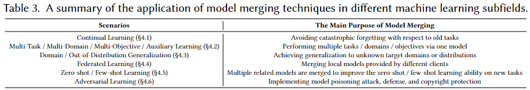

A comprehensive list of papers about **'[Model Merging in LLMs, MLLMs, and Beyond: Methods, Theories, Applications and Opportunities. Arxiv, 2024.](https://arxiv.org/pdf/2408.07666)'**.

---

> [!IMPORTANT]
> Contributions welcome:
>
> - If you have a relevant paper not included in the library, or have any clarification about the content of the [paper](https://arxiv.org/pdf/2408.07666), please [contact us](#contact)!  Or, you may also consider submitting 'Pull requests' directly, thank you!
>
> - If you think your paper is more suitable for another category, please [contact us](#contact) or submit 'Pull requests'.
>
> - If your paper is accepted, you may consider updating the relevant information.
>
> - Thank you!

---

## 💥 News 💥

- 🔥🔥🔥 We marked the papers that used model size **$\geq$ 7B** in experiments.

---

## Abstract
>
> Model merging is an efficient empowerment technique in the machine learning community that does not require the collection of raw training data and does not require expensive computation. As model merging becomes increasingly prevalent across various fields, it is crucial to understand the available model merging techniques comprehensively. However, there is a significant gap in the literature regarding a systematic and thorough review of these techniques. To address this gap, this survey provides a comprehensive overview of model merging methods and theories, their applications in various domains and settings, and future research directions. Specifically, we first propose a new taxonomic approach that exhaustively discusses existing model merging methods. Secondly, we discuss the application of model merging techniques in large language models, multimodal large language models, and 10+ machine learning subfields, including continual learning, multi-task learning, few-shot learning, etc. Finally, we highlight the remaining challenges of model merging and discuss future research directions.

<!-- 
<center>

</center>
-->

## Citation

If you find our paper or this resource helpful, please consider cite:

```
@article{Survery_ModelMerging_2024,
  title={Model Merging in LLMs, MLLMs, and Beyond: Methods, Theories, Applications and Opportunities},
  author={Yang, Enneng and Shen, Li and Guo, Guibing and Wang, Xingwei and Cao, Xiaochun and Zhang, Jie and Tao, Dacheng},
  journal={arXiv preprint arXiv:2408.07666},
  year={2024}
}
```

Thanks!

******

## Framework

- [💥 News 💥](#-news-)
- [Abstract](#abstract)
- [Citation](#citation)
- [Framework](#framework)
- [Survey](#survey)
- [Benchmark/Evaluation](#benchmarkevaluation)
- [Advanced Methods](#advanced-methods)
  - [Pre-Merging Methods](#pre-merging-methods)
    - [Better Fine-tuning](#better-fine-tuning)
      - [Linearization Fine-tuning](#linearization-fine-tuning)
      - [Subspace Fine-tuning](#subspace-fine-tuning)
      - [Sharpness-aware Fine-tuning](#sharpness-aware-fine-tuning)
    - [Architecture Transformation](#architecture-transformation)
    - [Weight Alignment](#weight-alignment)
  - [During Merging Methods](#during-merging-methods)
    - [Basic Merging Methods](#basic-merging-methods)
    - [Weighted-based Merging Methods](#weighted-based-merging-methods)
    - [Subspace-based Merging Method (Sparse or Low-rank Subspace)](#subspace-based-merging-method-sparse-or-low-rank-subspace)
    - [Routing-based Merging Methods (Dynamic Merging)](#routing-based-merging-methods-dynamic-merging)
    - [Post-calibration based Methods](#post-calibration-based-methods)
  - [Other Merging Methods](#other-merging-methods)
  - [Theories and Analysis of Model Merging](#theories-and-analysis-of-model-merging)
- [Application of Model Merging in Foundation Models](#application-of-model-merging-in-foundation-models)
  - [Model Merging in Large Language Models](#model-merging-in-large-language-models)
    - [Human Preference Alignment for LLMs](#human-preference-alignment-for-llms)
    - [Detoxification of LLMs](#detoxification-of-llms)
    - [Knowledge Editing/Unlearning of LLMs](#knowledge-editingunlearning-of-llms)
    - [Faster Training of LLMs](#faster-training-of-llms)
    - [Faster Reasoning of LLMs](#faster-reasoning-of-llms)
    - [Improving Computational Efficiency of MoE-based LLM](#improving-computational-efficiency-of-moe-based-llm)
    - [Combine the Capabilities of Expert LLMs](#combine-the-capabilities-of-expert-llms)
  - [Model Merging in Multimodal Large Language Models](#model-merging-in-multimodal-large-language-models)
    - [Model Merging for Multimodal Fusion](#model-merging-for-multimodal-fusion)
    - [Model Merging for Cross-Modal Knowledge Transfer](#model-merging-for-cross-modal-knowledge-transfer)
    - [Combine the Capabilities of Expert MLLMs](#combine-the-capabilities-of-expert-mllms)
  - [Model Merging in Image Generative Models](#model-merging-in-image-generative-models)
    - [Style Mixing in Generative Models](#style-mixing-in-generative-models)
    - [Reducing Training Cost of Generative Models](#reducing-training-cost-of-generative-models)
    - [Enhancing the Faithfulness (or Generation Quality) of Diffusion Models](#enhancing-the-faithfulness-or-generation-quality-of-diffusion-models)
    - [Deepfake Detection](#deepfake-detection)
  - [Model Merging in Video Generative Models](#model-merging-in-video-generative-models)
    - [Enhancing Motion Modeling](#enhancing-motion-modeling)
- [Application of Model Merging in Different Machine Learning Subfields](#application-of-model-merging-in-different-machine-learning-subfields)
  - [Model Merging in Continual Learning](#model-merging-in-continual-learning)
    - [Model Merging to Mitigate Catastrophic Forgetting](#model-merging-to-mitigate-catastrophic-forgetting)
  - [Model Merging in Multi-Task/Multi-Objective/Multi-Domain/Auxiliary Learning](#model-merging-in-multi-taskmulti-objectivemulti-domainauxiliary-learning)
    - [Model Merging for Knowledge Transfer in Multi-Task Learning](#model-merging-for-knowledge-transfer-in-multi-task-learning)
    - [Model Merging for Knowledge Transfer in Multi-Objective Optimization](#model-merging-for-knowledge-transfer-in-multi-objective-optimization)
    - [Model Merging for Knowledge Transfer in Multi-Domain Learning](#model-merging-for-knowledge-transfer-in-multi-domain-learning)
    - [Model Merging for Knowledge Transfer in Auxiliary Learning](#model-merging-for-knowledge-transfer-in-auxiliary-learning)
  - [Model Merging in Out-of-Distribution/Domain Generalization](#model-merging-in-out-of-distributiondomain-generalization)
    - [Model Merging for Better Out-of-Distribution Generalization](#model-merging-for-better-out-of-distribution-generalization)
    - [Model Merging for Better Domain Generalization or Domain Adaptation](#model-merging-for-better-domain-generalization-or-domain-adaptation)
  - [Model Merging in Federated Learning](#model-merging-in-federated-learning)
    - [Model Merging for Local Knowledge Aggregation](#model-merging-for-local-knowledge-aggregation)
  - [Model Merging in Zero-shot/Few-shot Learning](#model-merging-in-zero-shotfew-shot-learning)
    - [Model Merging for Cross-task Generalization in Zero-shot Learning](#model-merging-for-cross-task-generalization-in-zero-shot-learning)
    - [Model Merging for Cross-task Generalization in Few-shot Learning](#model-merging-for-cross-task-generalization-in-few-shot-learning)
  - [Model Merging in Adversarial Learning](#model-merging-in-adversarial-learning)
    - [Model Merging as an Attack](#model-merging-as-an-attack)
    - [Model Merging as a Defense or Intellectual Property Protection](#model-merging-as-a-defense-or-intellectual-property-protection)
- [Other Applications](#other-applications)
- [Contact](#contact)

----------

## Survey

| **Paper Title** | **Year** | **Conference/Journal** |
| --------------- | :----: | :----: |
| [Scaling Intelligence Through Model Merging: A Comprehensive Survey](https://d197for5662m48.cloudfront.net/documents/publicationstatus/290780/preprint_pdf/716bd23c7315eead7ee9fd24fa7b4290.pdf)| 2025 | Arxiv |
| [Democratizing AI Through Model Fusion: A Comprehensive Review and Future Directions](https://www.sciencedirect.com/science/article/pii/S295016012500049X)| 2025 | Arxiv |
| [From Task-Specific Models to Unified Systems: A Review of Model Merging Approaches](https://arxiv.org/pdf/2503.08998)| 2025 | Arxiv |
| [SoK: On Finding Common Ground in Loss Landscapes Using Deep Model Merging Techniques](https://arxiv.org/pdf/2410.12927)| 2024 | Arxiv |
| [Model Merging in LLMs, MLLMs, and Beyond: Methods, Theories, Applications and Opportunities](https://arxiv.org/abs/2408.07666)| 2024 | Arxiv |
| [A Survey on Model MoErging: Recycling and Routing Among Specialized Experts for Collaborative Learning](https://www.arxiv.org/pdf/2408.07057)| 2024 | Arxiv |
| [Merge, Ensemble, and Cooperate! A Survey on Collaborative Strategies in the Era of Large Language Models](https://arxiv.org/pdf/2407.06089)| 2024 | Arxiv |
| [Learn From Model Beyond Fine-Tuning: A Survey](https://arxiv.org/pdf/2310.08184)| 2023 | Arxiv |
| [Deep Model Fusion: A Survey](https://arxiv.org/pdf/2309.15698)| 2023 | Arxiv |

## Benchmark/Evaluation

| **Paper Title** | **Year** | **Conference/Journal** | **Remark** |
| --------------- | :----: | :----: | :----: |
| [An Empirical Survey of Model Merging Algorithms for Social Bias Mitigation](https://arxiv.org/pdf/2512.02689)| 2025 | Arxiv | LLAMA-2-7B, LLAMA-3-8B, LLAMA-3.1-8B, QWEN2-7B
| [A Systematic Study of Model Merging Techniques in Large Language Models](https://arxiv.org/pdf/2511.21437)| 2025 | Arxiv | Llama-3.2-3B-Instruct, Llama-3.1-8B-Instruct, Qwen3-4B, Qwen3-8B
| [FusionBench: A Comprehensive Benchmark of Deep Model Fusion](https://arxiv.org/pdf/2406.03280)| 2025 | JMLR | Mistral-7B-v0.1, MetaMath-Mistral-7B, dolphin-2.1-mistral-7b, speechless-code-mistral-7b-v1.0
| [Towards Performance Consistency in Multi-Level Model Collaboration](https://openaccess.thecvf.com/content/ICCV2025/papers/Li_Towards_Performance_Consistency_in_Multi-Level_Model_Collaboration_ICCV_2025_paper.pdf)| 2025 | ICCV |
| [Model Merging Scaling Laws in Large Language Models](https://arxiv.org/pdf/2509.24244)| 2025 | Arxiv | Qwen2.5 0.5, 1.5, 3, 7, 14, 32, 72B
| [FBMS: An R Package for Flexible Bayesian Model Selection and Model Averaging](https://arxiv.org/pdf/2509.00753)| 2025 | Arxiv |
| [Unifying Multimodal Large Language Model Capabilities and Modalities via Model Merging](https://arxiv.org/pdf/2505.19892)| 2025 | Arxiv | Qwen2-VL-7B-Base, Vicuna-7B-v1.5 |
| [MergeBench: A Benchmark for Merging Domain-Specialized LLMs](https://arxiv.org/pdf/2505.10833)| 2025 | Arxiv |Llama-3.2-3B, Llama3.1-8B, Gemma-2-2B and Gemma-2-9B |
| [Mergenetic: a Simple Evolutionary Model Merging Library](https://arxiv.org/pdf/2505.11427)| 2025 | System Demonstrations |Mistral-7B
| [Mix Data or Merge Models? Balancing the Helpfulness, Honesty, and  Harmlessness of Large Language Model via Model Merging](https://arxiv.org/pdf/2502.06876v1)| 2025 | Arxiv | Llama-3-8B-Instruct, Mistral-7B-Instruct-v0.2 |
| [How to Merge Your Multimodal Models Over Time?](https://arxiv.org/pdf/2412.06712)| 2024 | Arxiv |  
| [Mix Data or Merge Models? Optimizing for Diverse Multi-Task Learning](https://arxiv.org/pdf/2410.10801)| 2024 | Arxiv |  Aya 23 8B
| [A Unified View of Delta Parameter Editing in Post-Trained Large-Scale Models](https://arxiv.org/pdf/2410.13841)| 2024 | Arxiv | LLaMA3-8B-Instruct,  Qwen2-7B-Instruct, Mistral-7B-Instruct-v0.3,
| [Model-GLUE: Democratized LLM Scaling for A Large Model Zoo in the Wild](https://arxiv.org/pdf/2410.05357) |2024 | NeurIPS Track on Datasets and Benchmarks | Synthia-7B-v1.2, Llama-2-7b-evolcodealpaca, OpenHermes-7B, pygmalion-2-7b, Llama-2-7b-chat-hf, BeingWell_llama2_7b, MetaMath-7B-V1.0, vicuna-7b-v1.5, Platypus2-7B, GOAT-7B-Community, Llama-2-7b-WikiChat-fused, dolphin-llama2-7b, MetaMath-Llemma-7B, CodeLlama-7b-Instruct-hf, Magicoder-S-CL-7B, CrystalChat|
| [What Matters for Model Merging at Scale?](https://arxiv.org/pdf/2410.03617)| 2024 | Arxiv | PaLM-2 (1B, 8B, 24B, 64B), PaLM-2-IT (1B, 8B, 24B, 64B)|
| [Realistic Evaluation of Model Merging for Compositional Generalization](https://arxiv.org/pdf/2409.18314)| 2024 | Arxiv |
| [Fine-tuning large language models for domain adaptation: Exploration of training strategies, scaling, model merging and synergistic capabilities](https://arxiv.org/pdf/2409.03444) | 2024 | Arxiv |Llama-3.1-8B, Mistral-7B-v0.3|
| [Arcee's MergeKit: A Toolkit for Merging Large Language Models](https://arxiv.org/pdf/2403.13257)| 2024 | Arxiv | Llama2-7B-Chat, Meditron-7B|

## Advanced Methods

<center>

</center>

### Pre-Merging Methods

#### Better Fine-tuning

##### Linearization Fine-tuning

| **Paper Title** | **Year** | **Conference/Journal** | **Remark** |
| --------------- | :----: | :----: | :----: |
| [Fine-Tuning Attention Modules Only: Enhancing Weight Disentanglement in Task Arithmetic](https://openreview.net/pdf?id=dj0TktJcVI) | 2025 |  ICLR |
| [Tangent Transformers for Composition,Privacy and Removal](https://openreview.net/pdf?id=VLFhbOCz5D) | 2024 |ICLR  |
| [Parameter Efficient Multi-task Model Fusion with Partial Linearization](https://openreview.net/pdf?id=iynRvVVAmH) |  2024 |ICLR  |
| [Task Arithmetic in the Tangent Space: Improved Editing of Pre-Trained Models](https://openreview.net/pdf?id=0A9f2jZDGW) | 2023 | NeurIPS |

<!-- | [Fine-Tuning Linear Layers Only Is a Simple yet Effective Way for Task Arithmetic](https://arxiv.org/pdf/2407.07089) | 2024 |  Arxiv | -->


##### Subspace Fine-tuning

| **Paper Title** | **Year** | **Conference/Journal** | **Remark** |
| --------------- | :----: | :----: | :----: |
| [Unraveling LoRA Interference: Orthogonal Subspaces for Robust Model Merging](https://arxiv.org/pdf/2505.22934) | 2025 |  Arxiv | Llama3-8B |
| [Efficient Model Editing with Task-Localized Sparse Fine-tuning](https://arxiv.org/pdf/2504.02620) | 2025 | ICLR |

##### Sharpness-aware Fine-tuning

| **Paper Title** | **Year** | **Conference/Journal** | **Remark** |
| --------------- | :----: | :----: | :----: |
| [Mitigating Parameter Interference in Model Merging via Sharpness-Aware Fine-Tuning](https://arxiv.org/pdf/2504.14662) | 2025 | ICLR |

#### Architecture Transformation

| **Paper Title** | **Year** | **Conference/Journal** | **Remark** |
| --------------- | :----: | :----: | :----: |
| [Model Assembly Learning with Heterogeneous Layer Weight Merging](https://arxiv.org/pdf/2503.21657)| 2025 | ICLR Workshop |
| [Training-free Heterogeneous Model Merging](https://arxiv.org/pdf/2501.00061)| 2025 |Arxiv
| [Knowledge fusion of large language models](https://openreview.net/pdf?id=jiDsk12qcz) | 2024 |  ICLR | Llama-2 7B, OpenLLaMA 7B, MPT 7B |
| [Knowledge Fusion of Chat LLMs: A Preliminary Technical Report](https://arxiv.org/pdf/2402.16107) | 2024 |Arxiv  | NH2-Mixtral-8x7B, NH2-Solar-10.7B, and OpenChat-3.5-7B |
| [On Cross-Layer Alignment for Model Fusion of Heterogeneous Neural Networks](https://arxiv.org/pdf/2110.15538) |2023  |ICASSP   |
| [GAN Cocktail: mixing GANs without dataset access](https://www.ecva.net/papers/eccv_2022/papers_ECCV/papers/136830207.pdf) | 2022 | ECCV |

#### Weight Alignment

| **Paper Title** | **Year** | **Conference/Journal** | **Remark** |
| --------------- | :----: | :----: | :----: |
| [Symmetry-Aware Graph Metanetwork Autoencoders: Model Merging through Parameter Canonicalization](https://arxiv.org/pdf/2511.12601) | 2025 | TAG-DS |
| [Understanding Mode Connectivity via Parameter Space Symmetry](https://openreview.net/pdf?id=E8dMQGsKZv) | 2025 | ICML |
| [Update Your Transformer to the Latest Release: Re-Basin of Task Vectors](https://arxiv.org/pdf/2505.22697)| 2025 | ICML  |
| [Model Assembly Learning with Heterogeneous Layer Weight Merging](https://arxiv.org/pdf/2503.21657)| 2025 | ICLR Workshop |
| [Beyond the Permutation Symmetry of Transformers: The Role of Rotation for Model Fusion](https://arxiv.org/pdf/2502.00264)| 2025 | Arxiv |
| [The Non-Local Model Merging Problem: Permutation Symmetries and Variance Collapse](https://arxiv.org/pdf/2410.12766)| 2024 | Arxiv |
| [Equivariant Deep Weight Space Alignment](https://openreview.net/pdf/6d437eeb362255b4b2d75a5c6847880fb4a00e3c.pdf) | 2024 | ICML  |
| [Harmony in diversity: Merging neural networks with canonical correlation analysis](https://openreview.net/pdf?id=XTr8vwAr2D) | 2024 | ICML |
| [Transformer fusion with optimal transport](https://arxiv.org/pdf/2310.05719) | 2024 | ICLR  |
| [Layerwise linear mode connectivity](https://openreview.net/pdf?id=LfmZh91tDI) | 2024 | ICLR |
| [ZipIt! Merging Models from Different Tasks without Training](https://openreview.net/pdf?id=LEYUkvdUhq) | 2024 |ICLR  |
| [Proving linear mode connectivity of neural networks via optimal transport](https://arxiv.org/pdf/2310.19103) | 2024 | AISTATS |
| [Training-Free Pretrained Model Merging](https://openaccess.thecvf.com/content/CVPR2024/papers/Xu_Training-Free_Pretrained_Model_Merging_CVPR_2024_paper.pdf) | 2024 |CVPR  |
| [Merging LoRAs like Playing LEGO: Pushing the Modularity of LoRA to Extremes Through Rank-Wise Clustering](https://arxiv.org/pdf/2409.16167)| 2024 | Arxiv | Llama2-7b, Llama2-13b |
| [C2M3: Cycle-Consistent Multi Model Merging](https://arxiv.org/pdf/2405.17897) | 2024 | NeurIPS |
| [PLeaS--Merging Models with Permutations and Least Squares](https://arxiv.org/pdf/2407.02447)| 2024 | Arxiv |
| [Rethink Model Re-Basin and the Linear Mode Connectivity](https://arxiv.org/pdf/2402.05966) | 2024 | Arxiv |
| [Git Re-Basin: Merging Models modulo Permutation Symmetries](https://arxiv.org/pdf/2209.04836) | 2023 | ICLR |
| [Re-basin via implicit Sinkhorn differentiation](https://openaccess.thecvf.com/content/CVPR2023/papers/Pena_Re-Basin_via_Implicit_Sinkhorn_Differentiation_CVPR_2023_paper.pdf) | 2023 | CVPR |
| [Plateau in Monotonic Linear Interpolation--A "Biased" View of Loss Landscape for Deep Networks](https://arxiv.org/pdf/2210.01019)| 2023 | ICLR |
| [Linear Mode Connectivity of Deep Neural Networks via Permutation Invariance and Renormalization](https://openreview.net/pdf?id=gU5sJ6ZggcX)| 2023 | ICLR |
| [REPAIR: REnormalizing Permuted Activations for Interpolation Repair](https://openreview.net/pdf?id=gU5sJ6ZggcX) |2023  | ICLR |
| [Going beyond linear mode connectivity: The layerwise linear feature connectivity](https://papers.nips.cc/paper_files/paper/2023/file/bf3ee5a5422b0e2a88b0c9c6ed3b6144-Paper-Conference.pdf) |  2023 |NeurIPS |
| [The role of permutation invariance in linear mode connectivity of neural networks](https://openreview.net/pdf?id=dNigytemkL) | 2022 | ICLR |
| [What can linear interpolation of neural network loss landscapes tell us?](https://arxiv.org/pdf/2106.16004) |2022 | ICML |
| [Loss Surface Simplexes for Mode Connecting Volumes and Fast Ensembling](https://proceedings.mlr.press/v139/benton21a/benton21a.pdf) | 2021 | ICML |
| [Analyzing Monotonic Linear Interpolation in Neural Network Loss Landscapes](https://proceedings.mlr.press/v139/lucas21a/lucas21a.pdf) | 2021 | ICML |
| [Geometry of the Loss Landscape in Overparameterized Neural Networks: Symmetries and Invariances](https://proceedings.mlr.press/v139/simsek21a/simsek21a.pdf)| 2021 | ICML |
| [Linear Mode Connectivity and the Lottery Ticket Hypothesis](https://proceedings.mlr.press/v119/frankle20a/frankle20a.pdf) | 2020 | ICML |
| [Optimizing mode connectivity via neuron alignment](https://arxiv.org/pdf/2009.02439) | 2020 | NeurIPS |
| [Model fusion via optimal transport](https://proceedings.neurips.cc/paper/2020/file/fb2697869f56484404c8ceee2985b01d-Paper.pdf) | 2020  | NeurIPS |
| [Uniform convergence may be unable to explain generalization in deep learning](https://proceedings.neurips.cc/paper_files/paper/2019/file/05e97c207235d63ceb1db43c60db7bbb-Paper.pdf) |  2019 | NeurIPS |
| [Explaining landscape connectivity of low-cost solutions for multilayer nets](https://proceedings.neurips.cc/paper_files/paper/2019/file/46a4378f835dc8040c8057beb6a2da52-Paper.pdf)|  2019 | NeurIPS |
| [Essentially no barriers in neural network energy landscape](https://proceedings.mlr.press/v80/draxler18a/draxler18a.pdf) | 2018 | ICML  |
| [Loss Surfaces, Mode Connectivity, and Fast Ensembling of DNNs](https://papers.nips.cc/paper_files/paper/2018/file/be3087e74e9100d4bc4c6268cdbe8456-Paper.pdf)|  2018 | NeurIPS |

### During Merging Methods

#### Basic Merging Methods

| **Paper Title** | **Year** | **Conference/Journal** | **Remark** |
| --------------- | :----: | :----: | :----: |
| [Composing parameter-efficient modules with arithmetic operation](https://arxiv.org/pdf/2306.14870) | 2023 | NeurIPS |
| [Editing models with task arithmetic](https://openreview.net/pdf?id=6t0Kwf8-jrj) | 2023 | ICLR |
| [Model fusion via optimal transport](https://proceedings.neurips.cc/paper/2020/file/fb2697869f56484404c8ceee2985b01d-Paper.pdf) |2020  | NeurIPS |
| [Weight averaging for neural networks and local resampling schemes](https://citeseerx.ist.psu.edu/document?repid=rep1&type=pdf&doi=a34e789c0f76b860b6e3bc1b7fa04054ccb75c3b) | 1996 | AAAI Workshop  |
| [Acceleration of stochastic approximation by averaging](https://epubs.siam.org/doi/abs/10.1137/0330046?journalCode=sjcodc)| 1992 | IAM Journal on Control and Optimization
| [Animating rotation with quaternion curves (Spherical Linear Interpolation (SLERP) Model Merging)](https://dl.acm.org/doi/pdf/10.1145/325165.325242) | 1985 | SIGGRAPH Computer Graphics |

#### Weighted-based Merging Methods

| **Paper Title** | **Year** | **Conference/Journal** | **Remark** |
| --------------- | :----: | :----: | :----: |
| [Souper-Model: How Simple Arithmetic Unlocks State-of-the-Art LLM Performance](https://arxiv.org/pdf/2511.13254v1)| 2025 | Arxiv | xLAM-2-70b, CoALM-70B, watt-tool-70B, functionary-medium-70B, xLAM-2-8b, ToolACE-2-8B, watt-tool-8B, BitAgent-8B, CoALM-8B | 
| [Superpose Task-specific Features for Model Merging](https://aclanthology.org/2025.emnlp-main.210.pdf)| 2025 | EMNLP | Llama-2-7B
| [T3: Test-Time Model Merging in VLMs for Zero-Shot Medical Imaging Analysis](https://arxiv.org/pdf/2510.27265)| 2025 | Arxiv |
| [Weight Weaving: Parameter Pooling for Data-Free Model Merging](https://arxiv.org/pdf/2510.13921)| 2025 | Arxiv |
| [Expert Merging: Model Merging with Unsupervised Expert Alignment and Importance-Guided Layer Chunking](https://arxiv.org/pdf/2509.25712)| 2025 | Arxiv |Mistral-7B, InternVL, Qwen2-VL
| [Variational Task Vector Composition](https://arxiv.org/pdf/2509.18208)| 2025 |NeurIPS  |
| [RegMean++: Enhancing Effectiveness and Generalization of Regression Mean for Model Merging](https://arxiv.org/pdf/2508.03121)| 2025 |Arxiv  |
| [StatsMerging: Statistics-Guided Model Merging via Task-Specific Teacher Distillation](https://arxiv.org/pdf/2506.04567)| 2025 |Arxiv  |
| [SeMe: Training-Free Language Model Merging via Semantic Alignment](https://arxiv.org/pdf/2505.20144)| 2025 |Arxiv  |
| [NAN: A Training-Free Solution to Coefficient Estimation in Model Merging](https://arxiv.org/pdf/2505.16148)| 2025 |Arxiv  |LLaMA2-13B, WizardLM-13B, WizardMath-13B, LLaVA-v1.5-13B, LLaVA-1.6-13B, Math-LLaVA|
| [Leveraging Submodule Linearity Enhances Task Arithmetic Performance in LLMs](https://openreview.net/pdf?id=irPcM6X5FV)| 2025 |ICLR  | Llama-2-7B and Llama-2-13B
| [Layer-Aware Task Arithmetic: Disentangling Task-Specific and Instruction-Following Knowledge](https://arxiv.org/pdf/2502.20186)| 2025 |Arxiv  | Gemma-2-9B, Llama-3-8B |
| [Sens-Merging: Sensitivity-Guided Parameter Balancing for Merging Large Language Models](https://arxiv.org/pdf/2502.12420v1)| 2025 |Arxiv  | LLaMA-2 7B series, Mistral 7B series, LLaMA-2 13B series |
| [RankMean: Module-Level Importance Score for Merging Fine-tuned Large Language Models](https://aclanthology.org/2024.findings-acl.104.pdf)| 2024 | ACL  |
| [Non-Uniform Parameter-Wise Model Merging](https://arxiv.org/pdf/2412.15467)| 2024 |Arxiv  |
| [How to Weight Multitask Finetuning? Fast Previews via Bayesian Model-Merging](https://arxiv.org/pdf/2412.08147)| 2024 |Arxiv  |
| [LiNeS: Post-training Layer Scaling Prevents Forgetting and Enhances Model Merging](https://arxiv.org/pdf/2410.17146)| 2024 |Arxiv  |
| [Merging in a Bottle: Differentiable Adaptive Merging (DAM) and the Path from Averaging to Automation](https://arxiv.org/pdf/2410.08371)| 2024 |Arxiv  |shisa-gamma-7b, WizardMath-7B-V1.1, Abel-7B-002, Llama-3-SauerkrautLM-8b-Instruct, Llama-3-Open-Ko-8B, llama-3-sqlcoder-8b, Meta-Llama-3-8B |
| [Knowledge Composition using Task Vectors with Learned Anisotropic Scaling](https://arxiv.org/pdf/2407.02880) | 2024 |Arxiv  |
| [MetaGPT: Merging Large Language Models Using Model Exclusive Task Arithmetic](https://aclanthology.org/2024.emnlp-main.102.pdf) | 2024 |EMNLP  | LLaMA-2-7B, Mistral-7B, LLaMA-2-13B |
| [Checkpoint Merging via Bayesian Optimization in LLM Pretraining](https://arxiv.org/pdf/2403.19390) |  2024 |Arxiv  | Baichuan2-220B, Baichuan2-440B, Baichuan2-660B, Baichuan2-1540B, Baichuan2-1760B, Baichuan2-1980B, Baichuan2-2200B, Baichuan2-2420B, DeepSeek-1400B, DeepSeek-1600B, DeepSeek-1800B, DeepSeek-2000B |
| [Arcee’s MergeKit: A Toolkit for Merging Large Language Models](https://arxiv.org/pdf/2403.13257) | 2024 |Arxiv  | Llama2-7B-Chat, Meditron-7B|
| [Evolutionary optimization of model merging recipes](https://arxiv.org/pdf/2403.13187) | 2024 |Arxiv  | shisa-gamma-7b-v1, WizardMath-7B-V1.1, Arithmo2-Mistral-7B, Abel-7B-002, Mistral-7B-v0.1, LLaVA-1.6-Mistral-7B|
| [XFT: Unlocking the Power of Code Instruction Tuning by Simply Merging Upcycled Mixture-of-Experts](https://aclanthology.org/2024.acl-long.699.pdf)| 2024 | ACL |
| [AdaMerging: Adaptive Model Merging for Multi-Task Learning](https://openreview.net/pdf?id=nZP6NgD3QY) | 2024  | ICLR |
| [Model Merging by Uncertainty-Based Gradient Matching](https://openreview.net/pdf?id=D7KJmfEDQP) | 2024  | ICLR |
| [Merging by Matching Models in Task Subspaces](https://arxiv.org/pdf/2312.04339) | 2024  | TMLR |
| [Fisher Mask Nodes for Language Model Merging](https://arxiv.org/pdf/2403.09891) | 2024 | LREC-COLING |
| [Erasure Coded Neural Network Inference via Fisher Averaging](https://shiqiang.wang/papers/DJ_ISIT2024.pdf)| 2024 | ISIT |
| [Dataless Knowledge Fusion by Merging Weights of Language Models](https://openreview.net/pdf?id=FCnohuR6AnM) | 2023  | ICLR |
| [Merging models with fisher-weighted averaging](https://openreview.net/pdf?id=LSKlp_aceOC) | 2022  | NeurIPS |

#### Subspace-based Merging Method (Sparse or Low-rank Subspace)

| **Paper Title** | **Year** | **Conference/Journal** | **Remark** |
| --------------- | :----: | :----: |:----: |
| [Stay Unique, Stay Efficient: Preserving Model Personality in Multi-Task Merging](https://arxiv.org/pdf/2512.01461) | 2025 | Arxiv |  Qwen-14B
| [Towards Reversible Model Merging For Low-rank Weights](https://arxiv.org/pdf/2510.14163) | 2025 | Arxiv |
| [Purifying Task Vectors in Knowledge-Aware Subspace for Model Merging](https://arxiv.org/pdf/2510.14697)| 2025 | Arxiv | LLaMA-2-7B
| [Accurate and Efficient Low-Rank Model Merging in Core Space](https://arxiv.org/pdf/2509.17786)| 2025 | NeurIPS |
| [Efficient Multi-Source Knowledge Transfer by Model Merging](https://arxiv.org/pdf/2508.19353)| 2025 | Arxiv |
| [One Size Does Not Fit All: A Distribution-Aware Sparsification for More Precise Model Merging](https://arxiv.org/pdf/2508.06163)| 2025 | Arxiv |
| [NegMerge: Sign-Consensual Weight Merging for Machine Unlearning](https://openreview.net/pdf?id=ZbWXovStjD)| 2025 | ICML |
| [Subspace-Boosted Model Merging](https://arxiv.org/pdf/2506.16506)| 2025 | Arxiv |
| [Training-free LLM Merging for Multi-task Learning](https://arxiv.org/pdf/2506.12379)| 2025 | Arxiv |
| [Merging Smarter, Generalizing Better: Enhancing Model Merging on OOD Data](https://arxiv.org/pdf/2506.09093)| 2025 | Arxiv |
| [Locate-then-Merge: Neuron-Level Parameter Fusion for Mitigating Catastrophic Forgetting in Multimodal LLMs](https://arxiv.org/pdf/2505.16703)| 2025 | Arxiv | Mistral-7B, Llama3-8B |
| [CALM: Consensus-Aware Localized Merging for Multi-Task Learning](https://arxiv.org/pdf/2506.13406)| 2025 |ICML  |
| [Merge-Friendly Post-Training Quantization for Multi-Target Domain Adaptation](https://arxiv.org/pdf/2505.23651)| 2025 | ICML |
| [Adaptive LoRA Merge with Parameter Pruning for Low-Resource Generation](https://arxiv.org/pdf/2505.24174)| 2025 | ACL | Llama-3-8B-Instruct
| [Decom-Renorm-Merge: Model Merging on the Right Space Improves Multitasking](https://arxiv.org/pdf/2505.23117)| 2025 | Arxiv | LLaMA3.1-8B
| [CAT Merging: A Training-Free Approach for Resolving Conflicts in Model Merging](https://arxiv.org/pdf/2505.06977)| 2025 | Arxiv |
| [LoRI: Reducing Cross-Task Interference in Multi-Task LowRank Adaptation](https://arxiv.org/pdf/2504.07448)| 2025 | Arxiv | Llama-3-8B and Mistral-7B |
| [AdaRank: Adaptive Rank Pruning for Enhanced Model Merging](https://arxiv.org/pdf/2503.22178)| 2025 | Arxiv |
| [Task Vector Quantization for Memory-Efficient Model Merging](https://arxiv.org/pdf/2503.06921)| 2025 | Arxiv |
| [Disentangling Task Interference within Neurons: Model Merging in Alignment with Neuronal Mechanisms](https://arxiv.org/pdf/2503.05320)| 2025 | Arxiv | Llama-2-7b |
| [Exploring Sparse Adapters for Scalable Merging of Parameter Efficient Experts](https://openreview.net/pdf?id=8wt2eKkVe6) | 2025 | ICLR 2025 Workshop |
| [LEWIS (LayEr WIse Sparsity) -- A Training Free Guided Model Merging Approach](https://arxiv.org/pdf/2503.03874)| 2025 | ICLR 2025 Workshop |Gemma-9b, LLaMA 3.1 8b |
| [CABS: Conflict-Aware and Balanced Sparsification for Enhancing Model Merging](https://arxiv.org/pdf/2503.01874)| 2025 | Arxiv |Mistral-7b-v0.1, WildMarcoroni-Variant1-7B and WestSeverus-7B-DPO-v2 |
| [Low-Rank and Sparse Model Merging for Multi-Lingual Speech Recognition and Translation](https://arxiv.org/pdf/2502.17380)| 2025 | Arxiv |
| [LED-Merging: Mitigating Safety-Utility Conflicts in Model Merging with Location-Election-Disjoint](https://arxiv.org/pdf/2502.16770)| 2025 | Arxiv |Llama-3- 8B, Mistral-7B, and Llama2-13B |
| [Parameter Efficient Merging for Multimodal Large Language Models with Complementary Parameter Adaptation](https://arxiv.org/pdf/2502.17159)| 2025 | Arxiv |
| [Optimal Brain Iterative Merging: Mitigating Interference in LLM Merging](https://arxiv.org/pdf/2502.12217)| 2025 | Arxiv | Llama-2-13b, WizardMath-13B-V1.0, WizardLM13B-V1.2, llama-2-13b-codealpaca
| [Superpose Singular Features for Model Merging](https://arxiv.org/pdf/2502.10698)| 2025 | Arxiv | Llama-2-7B
| [STAR: Spectral Truncation and Rescale for Model Merging](https://arxiv.org/pdf/2502.10339)| 2025 | NAACL |  Mistral-7B-Instruct|
| [No Task Left Behind: Isotropic Model Merging with Common and Task-Specific Subspaces](https://arxiv.org/pdf/2502.04959)| 2025 | Arxiv |  
| [Merging Models on the Fly Without Retraining: A Sequential Approach to Scalable Continual Model Merging](https://arxiv.org/pdf/2501.09522)| 2025  |NeurIPS  | |
| [Modeling Multi-Task Model Merging as Adaptive Projective Gradient Descent](https://arxiv.org/pdf/2501.01230)| 2025 | Arxiv |  
| [Revisiting Weight Averaging for Model Merging](https://arxiv.org/pdf/2412.12153)| 2024  |Arxiv  | |
| [Task Singular Vectors: Reducing Task Interference in Model Merging](https://arxiv.org/pdf/2412.00081) | 2025  |CVPR  | |
| [Less is More: Efficient Model Merging with Binary Task Switch](https://arxiv.org/pdf/2412.00054)|  2024 |Arxiv  |
| [FREE-Merging: Fourier Transform for Model Merging with Lightweight Experts](https://arxiv.org/pdf/2411.16815)|2024  |Arxiv  | Qwen-14B (LoRA),  LLaMa2-13B, WizardLM-13B, WizardMath-13B, WizardCoderPython-13B |
| [Beyond Task Vectors: Selective Task Arithmetic Based on Importance Metrics](https://arxiv.org/pdf/2411.16139)|2024  |Arxiv  | |
| [Parameter Competition Balancing for Model Merging](https://arxiv.org/pdf/2410.02396v1)| 2024 | NeurIPS  | Llama-2-7b |
| [Language Models are Super Mario: Absorbing Abilities from Homologous Models as a Free Lunch](https://arxiv.org/pdf/2311.03099) | 2024 | ICML  | WizardLM-13B, WizardMath-13B, and llama-2-13b-codealpaca, Mistral-7B|
| [Localizing Task Information for Improved Model Merging and Compression](https://openreview.net/attachment?id=DWT9uiGjxT&name=pdf) | 2024 | ICML | |
| [Sparse Model Soups: A Recipe for Improved Pruning via Model Averaging](https://openreview.net/pdf?id=xx0ITyHp3u) |2024  |ICLR  | |
| [Model merging with svd to tie the knots](https://arxiv.org/pdf/2410.19735)|2024  |Arxiv  |Llama3-8B |
| [NegMerge: Consensual Weight Negation for Strong Machine Unlearning](https://arxiv.org/pdf/2410.05583)|2024  |Arxiv  | |
| [Localize-and-Stitch: Efficient Model Merging via Sparse Task Arithmetic](https://arxiv.org/pdf/2408.13656)|2024  |Arxiv  | |
| [Activated Parameter Locating via Causal Intervention for Model Merging](https://arxiv.org/pdf/2408.09485)|2024  |Arxiv  | Llama-2-chat-7B|
| [PAFT: A Parallel Training Paradigm for Effective LLM Fine-Tuning](https://arxiv.org/pdf/2406.17923)| 2024 | Arxiv  |Mistral-7B-v0.1, Llama-3-8B, Neurotic-7B, MoMo-70B|
| [DELLA-Merging: Reducing Interference in Model Merging through Magnitude-Based Sampling](https://arxiv.org/pdf/2406.11617)|2024  |Arxiv  |Llama-2-13b-code-alpaca, WizardLM, Wizard-Math, WizardCoder-Python|
| [EMR-Merging: Tuning-Free High-Performance Model Merging](https://arxiv.org/pdf/2405.17461) |2024  |NeurIPS  | |
| [DPPA: Pruning Method for Large Language Model to Model Merging](https://arxiv.org/pdf/2403.02799) |2024  |Arxiv  | LLaMa 2 |
| [Model breadcrumbs: Scaling multi-task model merging with sparse masks](https://arxiv.org/pdf/2312.06795) |2023  |Arxiv  | |
| [Concrete Subspace Learning based Interference Elimination for Multi-task Model Fusion](https://arxiv.org/pdf/2312.06173) | 2023  |Arxiv  | |
| [ComPEFT: Compression for Communicating Parameter Efficient Updates via Sparsification and Quantization](https://arxiv.org/pdf/2311.13171) | 2023  |Arxiv  | LLaMA 7B, 13B, 33B, and 65B|
| [Effective and ParameterEfficient Reusing Fine-Tuned Models](https://openreview.net/pdf?id=13D1zn0mpd) | 2023 | Openreview |
| [Resolving Interference When Merging Models](https://openreview.net/pdf?id=xtaX3WyCj1) | 2023  |  NeurIPS | |
| [Task-Specific Skill Localization in Fine-tuned Language Model](https://arxiv.org/pdf/2302.06600)|  2023| ICML | |

#### Routing-based Merging Methods (Dynamic Merging)

| **Paper Title** | **Year** | **Conference/Journal** | **Remark** |
| --------------- | :----: | :----: | :----: |
| [MIN-Merging: Merge the Important Neurons for Model Merging](https://arxiv.org/pdf/2510.17890) | 2025 | Arxiv |
| [SE-Merging: A Self-Enhanced Approach for Dynamic Model Merging](https://arxiv.org/pdf/2506.18135) | 2025 | Arxiv |
| [Adaptive Task Vectors for Large Language Models](https://arxiv.org/pdf/2506.03426) | 2025 | Arxiv |LLaMA3-8B and Mistral-7B |
| [Dynamic Fisher-weighted Model Merging via Bayesian Optimization](https://arxiv.org/pdf/2504.18992)| 2025 | Arxiv |
| [Data-Adaptive Weight-Ensembling for Multi-task Model Fusion](https://link.springer.com/article/10.1007/s11263-025-02434-2)| 2025 | IJCV |
| [MASS: MoErging through Adaptive Subspace Selection](https://arxiv.org/pdf/2504.05342)| 2025 | Arxiv |
| [Dynamic Model Merging with Mixture of Weights](https://ieeexplore.ieee.org/abstract/document/10900479/)| 2025 | TCSVT |
| [CAMEx: Curvature-aware Merging of Experts](https://arxiv.org/pdf/2502.18821)| 2025 | ICLR |
| [1bit-Merging: Dynamic Quantized Merging for Large Language Models](https://arxiv.org/pdf/2502.10743)| 2025 | Arxiv | LLaMA-2 7B, Mistral 7B, and LLaMA-2 13B |
| [MergeME: Model Merging Techniques for Homogeneous and Heterogeneous MoEs](https://papers-pdfs.assets.alphaxiv.org/2502.00997v3.pdf)| 2025 | Arxiv |
| [Mediator: Memory-efficient LLM Merging with Less Parameter Conflicts and Uncertainty Based Routing](https://arxiv.org/pdf/2502.04411)|  2025 |Arxiv  | Qwen-2.5-7B, LLaMA-3.2-8B |
| [Adapting Foundation Models via Training-free Dynamic Weight Interpolation](https://openreview.net/pdf?id=yyv54uPM0z)|  2024 | NeurIPS 2024 Workshop  |
| [Efficient and Effective Weight-Ensembling Mixture of Experts for Multi-Task Model Merging](https://arxiv.org/pdf/2410.21804) |  2024 |Arxiv  |
| [DaWin: Training-free Dynamic Weight Interpolation for Robust Adaptation](https://arxiv.org/pdf/2410.03782) | 2024 | NeurIPS 2024 Workshop |
| [Merging Multi-Task Models via Weight-Ensembling Mixture of Experts](https://openreview.net/pdf/2aee8072945cd0485e619dd88c35566610cd5042.pdf) |  2024| ICML |
| [Learning to Route Among Specialized Experts for Zero-Shot Generalization](https://arxiv.org/pdf/2402.05859)|2024  | ICML  |
| [Merge, Then Compress: Demystify Efficient SMoE with Hints from Its Routing Policy](https://arxiv.org/pdf/2310.01334) |2024  | ICLR |
| [Soft merging of experts with adaptive routing](https://arxiv.org/pdf/2306.03745) | 2024 | TMLR |
| [SMILE: Zero-Shot Sparse Mixture of Low-Rank Experts Construction From Pre-Trained Foundation Models](https://arxiv.org/pdf/2408.10174) |2024 |Arxiv  | Mistral-7B-v0.1, MetaMath-Mistral-7B, dolphin-2.1-mistral-7b, speechless-code-mistral-7b-v1.0|
| [Twin-Merging: Dynamic Integration of Modular Expertise in Model Merging](https://arxiv.org/pdf/2406.15479) |  2024 | NeurIPS  |Qwen-14B|
| [Self-MoE: Towards Compositional Large Language Models with Self-Specialized Experts](https://arxiv.org/pdf/2406.12034) |2024 |Arxiv  |Gemma-7B, LLaMA-2 7B & 13B, Mistral 7B,  LLaMA-3 8B|
| [Towards Efficient Pareto Set Approximation via Mixture of Experts Based Model Fusion](https://arxiv.org/pdf/2406.09770) |  2024 |Arxiv  |
| [Sparse Upcycling: Training Mixture-of-Experts from Dense Checkpoints](http://arxiv.org/abs/2212.05055) | 2023 | ICLR |

<!-- | [Branch-Train-MiX: Mixing Expert LLMs into a Mixture-of-Experts LLM](https://arxiv.org/pdf/2403.07816) |  2024 |Arxiv  | -->

#### Post-calibration based Methods

| **Paper Title** | **Year** | **Conference/Journal** | **Remark** |
| --------------- | :----: | :----: | :----: |
| [Towards Minimizing Feature Drift in Model Merging: Layer-wise Task Vector Fusion for Adaptive Knowledge Integration](https://arxiv.org/pdf/2505.23859)| 2025 |NeurIPS  |
| [Multi-Task Model Fusion via Adaptive Merging](https://ieeexplore.ieee.org/stamp/stamp.jsp?tp=&arnumber=10887718)|2025  | ICASSP |
| [Representation Surgery in Model Merging with Probabilistic Modeling](https://openreview.net/pdf?id=a02CH43z1G)|2025  | ICML |
| [Parameter-Efficient Interventions for Enhanced Model Merging](https://arxiv.org/pdf/2412.17023)|2024  | Arxiv |
| [Tint Your Models Task-wise for Improved Multi-task Model Merging](https://arxiv.org/pdf/2412.13526)|2024  | Arxiv |
| [SurgeryV2: Bridging the Gap Between Model Merging and Multi-Task Learning with Deep Representation Surgery](https://arxiv.org/pdf/2410.14389)|2024  | Arxiv |
| [Representation Surgery for Multi-Task Model Merging](https://openreview.net/pdf/602906ec02919eb95d78d634321fcba1b68a2f03.pdf) |2024  | ICML |

### Other Merging Methods

| **Paper Title** | **Year** | **Conference/Journal** | **Remark** |
| --------------- | :----: | :----: | :----: |
| [From Coefficients to Directions: Rethinking Model Merging with Directional Alignment](https://arxiv.org/pdf/2512.00391)| 2025 | Arxiv  |
| [Escaping Optimization Stagnation: Taking Steps Beyond Task Arithmetic via Difference Vectors](https://arxiv.org/pdf/2511.17987)| 2025 | Arxiv  |
| [Model Merging with Functional Dual Anchors](https://arxiv.org/pdf/2510.21223)| 2025 | Arxiv  |
| [Black-box Model Merging for Language-Model-as-a-Service with Massive Model Repositories](https://arxiv.org/pdf/2509.12951)| 2025 | Arxiv  |
| [Rethinking Layer-wise Model Merging through Chain of Merges](https://arxiv.org/pdf/2508.21421v1)| 2025 | Arxiv  |Llama 3-8B
| [Competition and Attraction Improve Model Fusion](https://arxiv.org/pdf/2508.16204)| 2025 | Arxiv  | WizardMath 7B v1.0, AgentEvol 7B
| [PSO-Merging: Merging Models Based on Particle Swarm Optimization](https://arxiv.org/pdf/2508.19839)| 2025 | Arxiv  | Llama-3-8B, Llama-2-13B, and Mistral-7B-v0.3 | 
| [DisTaC: Conditioning Task Vectors via Distillation for Robust Model Merging](https://arxiv.org/pdf/2508.01148)| 2025 | Arxiv  |
| [Navigating the Accuracy-Size Trade-Off with Flexible Model Merging](https://arxiv.org/pdf/2505.23209)| 2025 | Arxiv  |
| [Efficient Multi-Task Inferencing: Model Merging with Gromov-Wasserstein Feature Alignment](https://arxiv.org/pdf/2503.09774?)| 2025 | Arxiv  |
| [Reinforced Model Merging](https://arxiv.org/pdf/2503.21272)| 2025 | Arxiv  |
| [FW-Merging: Scaling Model Merging with Frank-Wolfe Optimization](https://arxiv.org/pdf/2503.12649)| 2025 | Arxiv  | LLaMA2-7B
| [Whoever Started the Interference Should End It: Guiding Data-Free Model Merging via Task Vectors](https://arxiv.org/pdf/2503.08099)| 2025 | Arxiv  | WizardLM-13B (LM), WizardMath-13B (Math), and llama-2-13bcodealpaca (Code) |
| [GNNMERGE: Merging of GNN Models Without Accessing Training Data](https://arxiv.org/pdf/2503.03384)| 2025 | Arxiv  |
| [MERGE3: Efficient Evolutionary Merging on Consumer-grade GPUs](https://arxiv.org/pdf/2502.10436)| 2025 | ICML  | Mistral-7B
| [Activation-Informed Merging of Large Language Models](https://arxiv.org/pdf/2502.02421?)| 2025 | Arxiv | Llama-2-13b, WizardLM-13B, WizardMath-13B, llama-2-13b-code-alpaca
| [Scalable Model Merging with Progressive Layer-wise Distillation](https://arxiv.org/pdf/2502.12706)| 2025 | Arxiv | WizardLM-13B, WizardMath-13B and llama-2-13b-code-alpaca
| [Fine, I’ll Merge It Myself: A Multi-Fidelity Framework for Automated Model Merging](https://arxiv.org/pdf/2502.04030)| 2025 | Arxiv |  Llama-2-13, WizardLM13B, WizardMath-13, llama-2-13b-code-alpaca |
| [Task Arithmetic in Trust Region: A Training-Free Model Merging Approach to Navigate Knowledge Conflicts](https://arxiv.org/pdf/2501.15065)| 2025 | ICLR |  
| [Fine-tuning Aligned Classifiers for Merging Outputs: Towards a Superior Evaluation Protocol in Model Merging](https://arxiv.org/abs/2412.13526)| 2024 | Arxiv |
| [Multi-Task Model Merging via Adaptive Weight Disentanglement](https://arxiv.org/pdf/2411.18729)| 2024 | Arxiv |
| [Rethinking Weight-Averaged Model-merging](https://arxiv.org/pdf/2411.09263)| 2024 | Arxiv |
| [ATM: Improving Model Merging by Alternating Tuning and Merging](https://arxiv.org/pdf/2411.03055)| 2024 | Arxiv |
| [HM3: Hierarchical Multi-Objective Model Merging for Pretrained Models](https://arxiv.org/pdf/2409.18893) | 2024 | Arxiv | Llama-2-7B-Chat, WizardMath-7B, CodeLlama-7B|
| [Weight Scope Alignment: A Frustratingly Easy Method for Model Merging](https://arxiv.org/pdf/2408.12237) | 2024 | Arxiv |
| [It’s Morphing Time: Unleashing the Potential of Multiple LLMs via Multi-objective Optimization](https://arxiv.org/pdf/2407.00487) | 2024 | Arxiv | Qwen1.5-7B-Chat, Liberated-Qwen1.5-7B, firefly-qwen1.5-en-7B |
| [Toward Data Efficient Model Merging between Different Datasets without Performance Degradation](https://arxiv.org/pdf/2306.05641v2)| 2024 | JMLR |
| [SOLAR 10.7B: Scaling Large Language Models with Simple yet Effective Depth Up-Scaling](http://arxiv.org/abs/2312.15166) | 2023 | Arxiv |SOLAR 10.7B, SOLAR 10.7B-Instruct|

### Theories and Analysis of Model Merging

| **Paper Title** | **Year** | **Conference/Journal** | **Remark** |
| --------------- | :----: | :----: | :----: |
| [How does the optimizer implicitly bias the model merging loss landscape?](https://arxiv.org/pdf/2510.04686)| 2025 | Arxiv |
| [On Task Vectors and Gradients](https://www.arxiv.org/pdf/2508.16082)| 2025 | Arxiv |
| [WSM: Decay-Free Learning Rate Schedule via Checkpoint Merging for LLM Pre-training](https://arxiv.org/pdf/2507.17634) | 2025 | Arxiv | Ling-mini-16B
| [Why Do More Experts Fail? A Theoretical Analysis of Model Merging](https://arxiv.org/pdf/2505.21226) | 2025 | Arxiv |
| [When is Task Vector Provably Effective for Model Editing? A Generalization Analysis of Nonlinear Transformers](https://openreview.net/pdf?id=iX7eHHE5Tx) | 2025 | ICLR |
| [Multi-Level Collaboration in Model Merging](https://arxiv.org/pdf/2503.01268) | 2025 | Arxiv |
| [Low-rank bias, weight decay, and model merging in neural networks](https://arxiv.org/pdf/2502.17340)| 2025 | Arxiv |
| [Understanding SGD with Exponential Moving Average: A Case Study in Linear Regression](https://arxiv.org/pdf/2502.14123)| 2025 | Arxiv |
| [SeWA: Selective Weight Average via Probabilistic Masking](https://arxiv.org/pdf/2502.10119)| 2025 | Arxiv |
| [Efficient Model Editing with Task Vector Bases: A Theoretical Framework and Scalable Approach](https://arxiv.org/pdf/2502.01015)|  2025 |Arxiv |
| [Task Arithmetic Through The Lens Of One-Shot Federated Learning](https://arxiv.org/pdf/2411.18607)|  2024 |Arxiv | WizardLM-13B, WizardMath-13B, Llama-2-13B-Code-Alpaca, Llama2-13B|
| [A Unified Analysis for Finite Weight Averaging](https://arxiv.org/pdf/2411.13169v1)|  2024 |Arxiv |
| [WASH: Train your Ensemble with Communication-Efficient Weight Shuffling, then Average](https://arxiv.org/pdf/2405.17517) |  2024 |Arxiv |
| [On the Emergence of Cross-Task Linearity in Pretraining-Finetuning Paradigm](https://arxiv.org/pdf/2402.03660)| 2024 | ICML |
| [Generalization Analysis of Stochastic Weight Averaging with General Sampling](https://proceedings.mlr.press/v235/wang24bl.html)| 2024 | ICML |
| [Diverse weight averaging for out-of-distribution generalization](https://proceedings.neurips.cc/paper_files/paper/2022/file/46108d807b50ad4144eb353b5d0e8851-Paper-Conference.pdf) | 2022 | NeurIPS |
| [Ensemble of averages: Improving model selection and boosting performance in domain generalization](https://arxiv.org/pdf/2110.10832) | 2022 | NeurIPS |
| [Stability analysis and generalization bounds of adversarial training](https://arxiv.org/pdf/2210.00960)| 2022 | NeurIPS |
| [The role of permutation invariance in linear mode connectivity of neural networks](https://openreview.net/pdf?id=dNigytemkL) | 2022 | ICLR |
| [Swad: Domain generalization by seeking flat minima](https://openreview.net/pdf?id=zkHlu_3sJYU) | 2021 |  NeurIPS|
| [Linear Mode Connectivity and the Lottery Ticket Hypothesis](https://proceedings.mlr.press/v119/frankle20a/frankle20a.pdf) | 2020 | ICML |
| [Stochastic Weight Averaging in Parallel: Large-Batch Training That Generalizes](https://arxiv.org/pdf/2001.02312) |  2020 |  ICLR |
| [Optimizing mode connectivity via neuron alignment](https://arxiv.org/pdf/2009.02439) | 2020 |  NeurIPS |
| [Uniform convergence may be unable to explain generalization in deep learning](https://proceedings.neurips.cc/paper_files/paper/2019/file/05e97c207235d63ceb1db43c60db7bbb-Paper.pdf) |  2019 | NeurIPS |
| [Parallelizing stochastic gradient descent for least squares regression: mini-batching, averaging, and model misspecification](https://arxiv.org/pdf/1610.03774) | 2018 | JMLR |
| [Iterate averaging as regularization for stochastic gradient descent](https://arxiv.org/pdf/1802.08009) | 2018 | Arxiv |
| [Essentially no barriers in neural network energy landscape](https://proceedings.mlr.press/v80/draxler18a/draxler18a.pdf) | 2018 | ICML |
| [Averaging weights leads to wider optima and better generalization](https://auai.org/uai2018/proceedings/papers/313.pdf) | 2018 | UAI |
| [Train faster, generalize better: Stability of stochastic gradient descent](https://arxiv.org/pdf/1509.01240) | 2016 | ICML  |

----------

## Application of Model Merging in Foundation Models

<center>

</center>

### Model Merging in Large Language Models

#### Human Preference Alignment for LLMs

| **Paper Title** | **Year** | **Conference/Journal** | **Remark** |
| --------------- | :----: | :----: | :----: |
| [Navigating the Alignment-Calibration Trade-off: A Pareto-Superior Frontier via Model Merging](https://arxiv.org/pdf/2510.17426)| 2025 | Arxiv  | Gemma-3-12B, Gemma-3-27B, Qwen2.5-7B |
| [BILLY: Steering Large Language Models via Merging Persona Vectors for Creative Generation](https://arxiv.org/pdf/2510.10157)| 2025 | Arxiv  |Qwen-2.5-7B-Instruct, Llama-3.1-8B-Instruct |
| [Personality Vector: Modulating Personality of Large Language Models by Model Merging](https://arxiv.org/pdf/2509.19727)| 2025 | EMNLP  | Llama-3.1-8B-Instruct, Qwen2.5-7B-Instruct |
| [SafeMERGE: Preserving Safety Alignment in Fine-Tuned LLMs via Selective Layer-Wise Model Merging](https://arxiv.org/pdf/2503.17239v1)| 2025 | Arxiv  |Llama-2-7B-Chat, Qwen-2-7B-Instruct |
| [Bone Soups: A Seek-and-Soup Model Merging Approach for Controllable Multi-Objective Generation](https://arxiv.org/pdf/2502.10762)| 2025 | Arxiv  |LLaMA-2 7B
| [Model soup for better rlhf: Weight space averaging to improve alignment in llms](https://openreview.net/forum?id=QNW3Z3f5SD)| 2024 | NeurIPS 2024 Workshop  | Llama2-7B, Mistral-7B, Gemma-2B |
| [Safeguard Fine-Tuned LLMs Through Pre- and Post-Tuning Model Merging](https://arxiv.org/pdf/2412.19512)| 2024 | Arxiv  | Llama-3-8B-Instruct
| [SafetyDPO: Scalable Safety Alignment for Text-to-Image Generation](https://arxiv.org/pdf/2412.10493)| 2024 | Arxiv  |
| [H3Fusion: Helpful, Harmless, Honest Fusion of Aligned LLMs](https://arxiv.org/pdf/2411.17792)| 2024 | Arxiv  |LLaMA-2 7B
| [Baichuan Alignment Technical Report](https://arxiv.org/pdf/2410.14940)| 2024 | Arxiv  | Qwen2-Nova-72B, Llama3-PBM-Nova-70B |
| [Conditioned Language Policy: A General Framework for Steerable Multi-Objective Finetuning](https://arxiv.org/pdf/2407.15762)| 2024 | Arxiv  |
| [DogeRM: Equipping Reward Models with Domain Knowledge through Model Merging](https://arxiv.org/pdf/2407.01470)| 2024 | Arxiv  | MetaMath-7B, MAmmoTH-7B, LLaMA2-7B|
| [PAFT: A Parallel Training Paradigm for Effective LLM Fine-Tuning](https://arxiv.org/pdf/2406.17923)| 2024 | Arxiv  |Mistral-7B-v0.1, Llama-3-8B|
| [Model Merging and Safety Alignment: One Bad Model Spoils the Bunch](https://arxiv.org/pdf/2406.14563) |  2024 | Arxiv  | Mistral-0.2-7B-Instruct, LLaMA-3-8B-Instruct, OpenBioLLM-8B, MAmmoTH2-7B, WizardMath-1.1-7B|
| [Towards Comprehensive Post Safety Alignment of Large Language Models via Safety Patching](https://arxiv.org/pdf/2405.13820)|  2024 | Arxiv  |LLaMA-2-7B-Chat, LLaMA-3-8B-Instruct, Mistral7B-Instruct-v0.1 and Gemma1.1-7B-it|
| [Disperse-Then-Merge: Pushing the Limits of Instruction Tuning via Alignment Tax Reduction](https://arxiv.org/pdf/2405.13432)| 2024 | Arxiv  | Llama-2-7b |
| [Online Merging Optimizers for Boosting Rewards and Mitigating Tax in Alignment](https://arxiv.org/pdf/2405.17931) |  2024 | Arxiv  | Qwen1.5-7B, LLaMa3-8B |
| [A safety realignment framework via subspace-oriented model fusion for large language models](https://arxiv.org/pdf/2405.09055) |  2024 | Arxiv  | WizardLM-7B |
| [Weak-to-strong extrapolation expedites alignment](https://arxiv.org/pdf/2404.16792) | 2024 | Arxiv  | zephyr-7b, starling-7b, snorkel-7b, llama3-8b, internlm2-7b, internlm2-20b, tulu-2-dpo-7b, tulu-2-dpo-13b, tulu-2-dpo-70b|
| [Language Models are Homer Simpson! Safety Re-Alignment of Fine-tuned Language Models through Task Arithmetic](https://arxiv.org/pdf/2402.11746) | 2024 | Arxiv  | Llama-2-7BChat |
| [Rewarded soups: towards pareto-optimal alignment by interpolating weights fine-tuned on diverse rewards](https://arxiv.org/pdf/2306.04488) |2023  | NeurIPS |  LLaMA-7b|
| [Personalized soups: Personalized large language model alignment via post-hoc parameter merging](https://arxiv.org/pdf/2310.11564) | 2023 | Arxiv  |Tulu-7B LM|

<!-- | [Safety Arithmetic: A Framework for Test-time Safety Alignment of Language Models by Steering Parameters and Activations](https://arxiv.org/pdf/2406.11801) | 2024 | Arxiv  | llama2-7b-chat-hf, mistral-7b-instruct-v0.2, WIZARDMATH-7B, Llama Math, Llama-2-7b-evolcodealpaca|-->

#### Detoxification of LLMs

| **Paper Title** | **Year** | **Conference/Journal** | **Remark** |
| --------------- | :----: | :----: | :----: |
| [Surgical, Cheap, and Flexible: Mitigating False Refusal in Language Models via Single Vector Ablation](https://arxiv.org/abs/2410.03415) | 2025 |  ICLR | GEMMA-7B-IT, LLAMA2-7B/13B/70B-CHAT, LLAMA3-8B-INST | 
| [3DM: Distill, Dynamic Drop, and Merge for Debiasing Multi-modal Large Language Models](https://aclanthology.org/2025.findings-acl.722.pdf) | 2025 |  ACL | LLaVA-1.5-7b, InternVL-2.5-8b, LLaVA-1.5-7b and ChatGLM4-9b |
| [Expanding before Inferring: Enhancing Factuality in Large Language Models through Premature Layers Interpolation](https://arxiv.org/pdf/2506.02973) | 2025 |  Arxiv | LLAMA3-8B-Instruct, Mistral-7B-Instruct-v0.2 |
| [Bias Vector: Mitigating Biases in Language Models with Task Arithmetic Approach](https://arxiv.org/pdf/2412.11679) | 2024 |  Arxiv |
| [Separate the Wheat from the Chaff: Model Deficiency Unlearning via Parameter-Efficient Module Operation](https://arxiv.org/pdf/2308.08090) | 2024 |  AAAI | LLaMA-7B  |
| [Mitigating Social Biases in Language Models through Unlearning](https://arxiv.org/pdf/2406.13551) | 2024 |  Arxiv | LLaMA-2 7B |
| [Fine-Grained Detoxification via Instance-Level Prefixes for Large Language Models](https://arxiv.org/pdf/2402.15202) | 2024 |  Arxiv | Llama-2-7B, Llama-2-chat-7B, Vicuna-7B, Llama-2-13B|
| [Composing Parameter-Efficient Modules with Arithmetic Operation](https://openreview.net/pdf?id=5r3e27I9Gy) | 2023 | NeurIPS  |
| [Editing models with task arithmetic](https://openreview.net/pdf?id=6t0Kwf8-jrj) | 2023 | ICLR |
| [Elastic Weight Removal for Faithful and Abstractive Dialogue Generation](https://arxiv.org/pdf/2303.17574) | 2023 |  Arxiv |

#### Knowledge Editing/Unlearning of LLMs

| **Paper Title** | **Year** | **Conference/Journal** | **Remark** |
| --------------- | :----: | :----: | :----: |
| [Model Merging for Knowledge Editing](https://arxiv.org/pdf/2506.12384)| 2025  | ACL | Qwen2.5-7B-Instruct
| [Exact Unlearning of Finetuning Data via Model Merging at Scale](https://arxiv.org/pdf/2504.04626) | 2025  | Arxiv |
| [ZJUKLAB at SemEval-2025 Task 4: Unlearning via Model Merging](https://arxiv.org/pdf/2503.21088) | 2025  | Arxiv | OLMo-7B-0724-Instruct
| [Exact Unlearning of Finetuning Data via Model Merging at Scale](https://openreview.net/pdf?id=u89LDBIyDe)|2025  |ICLR 2025 Workshop MCDC  | |
| [NegMerge: Consensual Weight Negation for Strong Machine Unlearning](https://arxiv.org/pdf/2410.05583)|2024  |Arxiv  | |
| [Split, Unlearn, Merge: Leveraging Data Attributes for More Effective Unlearning in LLMs](https://arxiv.org/abs/2406.11780)|2024  |Arxiv  | ZEPHYR-7B-BETA, LLAMA2-7B|
| [Towards Safer Large Language Models through Machine Unlearning](https://arxiv.org/pdf/2402.10058) | 2024 | ACL | LLAMA2-7B, LLAMA2-13B |
| [Editing models with task arithmetic](https://openreview.net/pdf?id=6t0Kwf8-jrj) | 2023 | ICLR |
| [Forgetting before Learning: Utilizing Parametric Arithmetic for Knowledge Updating in Large Language Model](https://arxiv.org/pdf/2311.08011) | 2023 | Arxiv | LLAMA2-7B, LLAMA-7B, BLOOM-7B|
| [Fuse to Forget: Bias Reduction and Selective Memorization through Model Fusion](https://arxiv.org/pdf/2311.07682) | 2023 | Arxiv |

#### Faster Training of LLMs

 | **Paper Title** | **Year** | **Conference/Journal** | **Remark** |
 | --------------- | :----: | :----: | :----: |
 | [Soup-of-Experts: Pretraining Specialist Models via Parameters Averaging](https://openreview.net/forum?id=MFNIka7nx0)| 2025 |  ICML |
 | [Local Mixtures of Experts: Essentially Free Test-Time Training via Model Merging](https://arxiv.org/pdf/2505.14136)| 2025 |  Arxiv |
 | [Merge to Mix: Mixing Datasets via Model Merging](https://arxiv.org/pdf/2505.16066)| 2025 |  Arxiv | Llama-3-8B-Instruct
 | [Model Merging in Pre-training of Large Language Models](https://arxiv.org/pdf/2505.12082)| 2025 |  Arxiv |Seed-MoE-1.3B/13B, SeedMoE-10B/100B, Seed-MoE-15B/150B |
 | [Parameter-Efficient Checkpoint Merging via Metrics-Weighted Averaging](https://arxiv.org/pdf/2504.18580) | 2025 |  Arxiv |
 | [DEM: Distribution Edited Model for Training with Mixed Data Distributions](https://arxiv.org/pdf/2406.15570) | 2024 |  Arxiv |  OpenLLaMA  7B and 13B|
 | [Checkpoint Merging via Bayesian Optimization in LLM Pretraining](https://arxiv.org/pdf/2403.19390) | 2024 |  Arxiv | Baichuan2-220B, Baichuan2-440B, Baichuan2-660B, Baichuan2-1540B, Baichuan2-1760B, Baichuan2-1980B, Baichuan2-2200B, Baichuan2-2420B, DeepSeek-1400B, DeepSeek-1600B, DeepSeek-1800B, DeepSeek-2000B|
 | [ColD Fusion: Collaborative Descent for Distributed Multitask Finetuning](https://aclanthology.org/2023.acl-long.46.pdf) |2023  |  ACL|
 | [Early Weight Averaging meets High Learning Rates for LLM Pre-training](https://arxiv.org/pdf/2306.03241) |  2023 |NeurIPS Workshop  |
 | [Stop wasting my time! saving days of imagenet and bert training with latest weight averaging](https://arxiv.org/pdf/2209.14981) | 2022 |NeurIPS Workshop  |
 | [Fusing finetuned models for better pretraining](https://arxiv.org/pdf/2204.03044) | 2022 |Arxiv  |

#### Faster Reasoning of LLMs
 | **Paper Title** | **Year** | **Conference/Journal** | **Remark** |
 | --------------- | :----: | :----: | :----: |
 | [Revisiting Model Interpolation for Efficient Reasoning](https://arxiv.org/abs/2510.10977) | 2025 | Arxiv | Qwen3-4B
 | [Unlocking Efficient Long-to-Short LLM Reasoning with Model Merging](https://arxiv.org/pdf/2503.20641)| 2025 |Arxiv  | Qwen2.5-32B, DeepSeek-R1-32B |
  
#### Improving Computational Efficiency of MoE-based LLM

 | **Paper Title** | **Year** | **Conference/Journal** | **Remark** |
 | --------------- | :----: | :----: | :----: |
 | [Upcycled and Merged MoE Reward Model for Mitigating Reward Hacking](https://arxiv.org/pdf/2512.00724)| 2025 | Arxiv  |
 | [PuzzleMoE: Efficient Compression of Large Mixture-of-Experts Models via Sparse Expert Merging and Bit-packed inference](https://arxiv.org/pdf/2511.04805)| 2025 | Arxiv  | Mixtral-8x7B, Deepseek-MoE
 | [Enhanced Expert Merging for Mixture-of-Experts in Graph Foundation Models](https://openreview.net/pdf?id=fyqqd1lHDb) | 2025 | Arxiv  | LLaMA-3.1-8B
 | [Expert Merging in Sparse Mixture of Experts with Nash Bargaining](https://arxiv.org/pdf/2510.16138)| 2025 |Arxiv  |Qwen1.5-MoE-14B, DeepSeek-MoE-16B |
 | [MergeMoE: Efficient Compression of MoE Models via Expert Output Merging](https://arxiv.org/pdf/2510.14436)| 2025 |Arxiv  | DeepSeekMoE, Qwen1.5-MoE-A2.7B, and Qwen3-30B-A3B |
 | [Faster, Smaller, and Smarter: Task-Aware Expert Merging for Online MoE Inference](https://arxiv.org/pdf/2509.21966)| 2025 |Arxiv  | 
 | [Sub-MoE: Efficient Mixture-of-Expert LLMs Compression via Subspace Expert Merging](https://arxiv.org/pdf/2506.23266) | 2025 |Arxiv  | Mixtral 8x7B, Qwen3- 235B-A22B, Qwen1.5-MoE-A2.7B, and DeepSeekMoE-16B-Base
 | [Merging Experts into One: Improving Computational Efficiency of Mixture of Experts](https://aclanthology.org/2023.emnlp-main.907.pdf) | 2023 |EMNLP  | 

 
#### Combine the Capabilities of Expert LLMs

  | **Paper Title** | **Year** | **Conference/Journal** | **Remark** |
  | --------------- | :----: | :----: | :----: |
  | [RCP-Merging: Merging Long Chain-of-Thought Models with Domain-Specific Models by Considering Reasoning Capability as Prior](https://arxiv.org/pdf/2508.03140) | 2026 |  AAAI | Qwen2.5-7B, Llama3.1-8B
  | [Souper-Model: How Simple Arithmetic Unlocks State-of-the-Art LLM Performance](https://arxiv.org/pdf/2511.13254v1)| 2025 | Arxiv | xLAM-2-70b, CoALM-70B, watt-tool-70B, functionary-medium-70B, xLAM-2-8b, ToolACE-2-8B, watt-tool-8B, BitAgent-8B, CoALM-8B | 
  | [SPEAR-MM: Selective Parameter Evaluation and Restoration via Model Merging for Efficient Financial LLM Adaptation](https://arxiv.org/pdf/2511.08500)| 2025 | Arxiv |
  | [Merging Continual Pretraining Models for Domain-Specialized LLMs: A Case Study in Finance](https://arxiv.org/pdf/2511.02451)| 2025 | Arxiv | Llama-3-8B, Llama-2-7B 
  | [Extracting and Combining Abilities For Building Multi-lingual Ability-enhanced Large Language Models](https://aclanthology.org/2025.emnlp-main.887.pdf)| 2025 | EMNLP | LLaMA-3 8B
  | [Bridging Dialectal Gaps in Arabic Medical LLMs through Model Merging](https://aclanthology.org/2025.arabicnlp-main.27.pdf)| 2025 | arabicnlp | 
  | [Adapting Multilingual Models to Code-Mixed Tasks via Model Merging](https://arxiv.org/pdf/2510.19782)| 2025 | Arxiv |
  | [Harmonizing Diverse Models: A Layer-wise Merging Strategy for Consistent Generation](https://arxiv.org/pdf/2510.14915)| 2025 | Arxiv | Llama-3.1-8B-Instruct and Gemma-3-12B-Instruct
  | [ABC: Towards a Universal Code Styler through Model Merging](https://dl.acm.org/doi/pdf/10.1145/3763104)| 2025 | ACM on Programming Languages | Qwen2.5-Coder, Deepseek-Coder |
  | [Family Matters: Language Transfer and Merging for Adapting Small LLMs to Faroese](https://arxiv.org/pdf/2510.00810)| 2025 | Arxiv |
  | [Expert Merging: Model Merging with Unsupervised Expert Alignment and Importance-Guided Layer Chunking](https://arxiv.org/pdf/2509.25712)| 2025 | Arxiv |Mistral-7B, InternVL, Qwen2-VL
  | [The Thinking Spectrum: An Empirical Study of Tunable Reasoning in LLMs through Model Merging](https://arxiv.org/pdf/2509.22034)| 2025 | Arxiv | Qwen3-30B-A3B-Thinking-2507, Qwen3-30B-A3B-Instruct-2507 |
  | [Model Merging Scaling Laws in Large Language Models](https://arxiv.org/pdf/2509.24244)| 2025 | Arxiv | Qwen2.5 0.5, 1.5, 3, 7, 14, 32, 72B
  | [Harnessing Optimization Dynamics for Curvature-Informed Model Merging](https://arxiv.org/pdf/2509.11167)| 2025 |  Arxiv | Llama-3.1-8B
  | [Kwai Keye-VL 1.5 Technical Report](https://arxiv.org/pdf/2509.01563)| 2025 |  Arxiv |Keye-VL-8B
  | [Reasoning Vectors: Transferring Chain-of-Thought Capabilities via Task Arithmetic](https://arxiv.org/pdf/2509.01363)| 2025 |  Arxiv | QWEN2.5-7B|
  | [Surrogate Benchmarks for Model Merging Optimization](https://arxiv.org/pdf/2509.02555)| 2025 |  Arxiv| EvoLLM-JP-v1-7B, shisa-gamma-7b-v1 |
  | [Tensorized Clustered LoRA Merging for Multi-Task Interference](https://arxiv.org/pdf/2508.03999)| 2025 |  Arxiv| Mistral-7B
  | [Efficient Compositional Multi-tasking for On-device Large Language Models](https://arxiv.org/pdf/2507.16083)| 2025 |  Arxiv|  Llama 3.1 70B
  | [HydraOpt: Navigating the Efficiency-Performance Trade-off of Adapter Merging](https://arxiv.org/pdf/2507.17706)| 2025 |  Arxiv|
  | [Exploring Sparse Adapters for Scalable Merging of Parameter Efficient Experts](https://arxiv.org/pdf/2507.07140)| 2025 |  Arxiv|
  | [Merging Large Language Models for Enhanced Code Generation: A Comparative Study of Model Merging Techniques Across Programming Languages](https://www.diva-portal.org/smash/get/diva2:1973270/FULLTEXT01.pdf)| 2025 |  Open Access in DiVA |CodeQwen1.5-7B, DeepSeek-Coder-6.7b-Base, CodeLlama-34B |
  | [On Fairness of Task Arithmetic: The Role of Task Vectors](https://arxiv.org/pdf/2505.24262)| 2025 |  Arxiv| LLaMA2-7B
  | [The Unreasonable Effectiveness of Model Merging for Cross-Lingual Transfer in LLMs](https://arxiv.org/pdf/2505.18356)| 2025 |  Arxiv|FALCON 3 7B, QWEN2.5 7B Instruct, LLAMA 3.1 8B Instruct, AYA Expanse 8B
  | [Model Merging is Secretly Certifiable: Non-Vacuous Generalisation Bounds for Low-Shot Learning](https://arxiv.org/pdf/2505.15798)| 2025 |  Arxiv|MetaMath-Mistral-7B, Dolphin-2.1-Mistral-7B and Speechless-Code-Mistral-7Bv1.0
  | [Training-free LLM Merging for Multi-task Learning](https://openreview.net/pdf?id=m6A6HoCKvt)| 2025 |ACL  | Echelon-AI/Med-Qwen2-7B, shtdbb/qwen2-7b-med, Qwen2-Instruct |
  | [ParamΔ for Direct Weight Mixing: Post-Train Large Language Model at Zero Cost](https://arxiv.org/pdf/2504.21023)| 2025 |Arxiv  | Llama3-inst-70B, Llama3-base-70B, Llama3.1-base-70B |
  | [Beyond ‘Aha!’: Toward Systematic Meta-Abilities Alignment in Large Reasoning Models](https://arxiv.org/pdf/2505.10554)| 2025 |Arxiv  |Qwen2.5-7B, Qwen2.5-32B|
  | [Unified Multi-Task Learning & Model Fusion for Efficient Language Model Guardrailing](https://arxiv.org/pdf/2504.19333)| 2025 |Arxiv  |
  | [Adapting Language-Specific LLMs to a Reasoning Model in One Day via Model Merging -- An Open Recipe](https://arxiv.org/pdf/2502.09056)| 2025 |Arxiv  | Typhoon2 R1 70B, Deepseek R1 70B |
  | [Efficient Model Development through Fine-tuning Transfer](https://arxiv.org/pdf/2503.20110v1)| 2025 |Arxiv  | Llama 3.1 8B
  | [Command A: An Enterprise-Ready Large Language Model](https://arxiv.org/pdf/2504.00698v1)| 2025 |Arxiv  | Command R7B
  | [Extrapolation Merging: Keep Improving With Extrapolation and Merging](https://arxiv.org/pdf/2503.04834)| 2025 |Arxiv  |Qwen2-7B, Meta-Llama-3-8B, Mistral-Nemo-Base-2407-12B, Qwen1.5-14B |
  | [Light-R1: Curriculum SFT, DPO and RL for Long COT from Scratch and Beyond](https://arxiv.org/pdf/2503.10460)| 2025 |Arxiv  |Light-R1-32B|
  | [FuseChat-3.0: Preference Optimization Meets Heterogeneous Model Fusion](https://arxiv.org/pdf/2503.04222v1)| 2025 |Arxiv  |Gemma-2-27B-it, Mistral-Large-Instruct-2407, Qwen-2.5-72B-Instruct, and Llama-3.1-70B-Instruct |
  | [Superficial Self-Improved Reasoners Benefit from Model Merging](https://arxiv.org/pdf/2503.02103)| 2025 |Arxiv  |Llama2-7B
  | [Nature-Inspired Population-Based Evolution of Large Language Models](https://arxiv.org/pdf/2503.01155)| 2025 |Arxiv  |
  | [Layer-Aware Task Arithmetic: Disentangling Task-Specific and Instruction-Following Knowledge](https://arxiv.org/pdf/2502.20186)| 2025 |Arxiv  | Gemma-2-9B, Llama-3-8B |
  | [Mixup Model Merge: Enhancing Model Merging Performance through Randomized Linear Interpolation](https://arxiv.org/pdf/2502.15434)| 2025 | Arxiv | WizardLM-13B, WizardMath-13B, llama-2-13b-code-alpaca
  | [LoRE-Merging: Exploring Low-Rank Estimation For Large Language Model Merging](https://arxiv.org/pdf/2502.10749)| 2025 | Arxiv | NuminaMath-7B, DeepSeek-Math-7B-Base, LLaMA-series models, WizardMath-13B
  | [Merging Language and Domain Specific Models: The Impact on Technical Vocabulary Acquisition](https://arxiv.org/pdf/2502.12001)| 2025 | Arxiv | ContactDoctor-8B
  | [Transferring Textual Preferences to Vision-Language Understanding through Model Merging](https://arxiv.org/pdf/2502.13487)| 2025 | Arxiv | Llama-3.2-11B-Vision -Instruct, Llama-3.1-Tulu-2-8B-uf-mean-rm, Llama-3.1-Tulu-3-8B-RM
  | [Optimal Brain Iterative Merging: Mitigating Interference in LLM Merging](https://arxiv.org/pdf/2502.12217)| 2025 | Arxiv | Llama-2-13b, WizardMath-13B-V1.0, WizardLM13B-V1.2, llama-2-13b-codealpaca
  | [An Open Recipe: Adapting Language-Specific LLMs to a Reasoning Model in One Day via Model Merging](https://arxiv.org/pdf/2502.09056)| 2025 | Arxiv |Typhoon2 70B Instruct, DeepSeek R1 70B Distill, Llama 3.1 70B, Llama 3.3 70B |
  | [Fine, I’ll Merge It Myself: A Multi-Fidelity Framework for Automated Model Merging](https://arxiv.org/pdf/2502.04030)| 2025 | Arxiv | WizardLM-13B, WizardMath-13B, and llama-2-13b-code-alpaca |
  | [Skill Expansion and Composition in Parameter Space](https://arxiv.org/pdf/2502.05932)| 2025 | Arxiv
  | [InfiFusion: A Unified Framework for Enhanced Cross-Model Reasoning via LLM Fusion](https://arxiv.org/pdf/2501.02795)| 2025 | Arxiv | Qwen2.5-Coder-14B-Instruct, Qwen2.5-14B-Instruct, and Mistral-Small-24B-Instruct-2501 |
  | [Channel Merging: Preserving Specialization for Merged Experts](https://arxiv.org/pdf/2412.15283)|2025 |AAAI | Dolphin-2.2.1-Mistral-7B, Speechless-Code-Mistral-7B, MetaMathMistral-7B, Chinese-Mistral-7BInstruct-v0.1 |
  | [Weighted-reward preference optimization for implicit model fusion](https://arxiv.org/pdf/2412.03187)| 2025 | ICLR  | LLaMA3-8B-Instruct |
  | [Enhancing Perception Capabilities of Multimodal LLMs with Training-Free Fusion](https://arxiv.org/pdf/2412.01289)|2024 |Arxiv | MiniGemini-8B and SLIME-8B |
  | [AgentMerge: Enhancing Generalization in Fine-Tuned LLM Agents](https://openreview.net/pdf?id=nZmAwmi2gr)|2024 |Arxiv | Llama3.1-8B |
  | [JRadiEvo: A Japanese Radiology Report Generation Model Enhanced by Evolutionary Optimization of Model Merging](https://arxiv.org/pdf/2411.09933) |2024 |Arxiv |Bunny-v1_1-Llama-3-8B-V, MMed-Llama-3-8B-EnIns, OpenBioLLM-Llama3-8B, Llama-3-Swallow-8B-Instruct-v0.1|
  | [If You Can’t Use Them, Recycle Them: Optimizing Merging at Scale Mitigates Performance Tradeoffs](https://arxiv.org/pdf/2412.04144)|2024 |Arxiv | Command R+ 104B |
  | [Agent Skill Acquisition for Large Language Models via CycleQD](https://arxiv.org/pdf/2410.14735) |2024 |Arxiv | Llama3-8B-Instruct|
  | [Collaboratively adding new knowledge to an LLM](https://arxiv.org/pdf/2410.14753)|2024 |Arxiv | Meta-Llama-3-8B|
  | [Unconstrained Model Merging for Enhanced LLM Reasoning](https://arxiv.org/pdf/2410.13699)|2024 |Arxiv |CodeLlama-7B-Ins, CodeLlama-70B-Ins, Deepseek-Coder-Ins-v1.5, Qwen2.5-Math-7B-Ins, WizardMath-7B-V1.1, OpenMath-Mistral 7B, MetaMath-7B, MetaMath-70B |
  | [LoRA Soups: Merging LoRAs for Practical Skill Composition Tasks](https://arxiv.org/pdf/2410.13025)|2024 |Arxiv | Llama-7b, Llama2-7b-chat |
  | [Merge to Learn: Efficiently Adding Skills to Language Models with Model Merging](https://arxiv.org/pdf/2410.12937)|2024 |Arxiv | Llama 2 7B |
  | [Exploring Model Kinship for Merging Large Language Models](https://arxiv.org/pdf/2410.12613) |2024 |Arxiv |Mistral-7B, Mistral-7b-instruct-v0.2, MetaMath-mistral-7b, Open-chat-3.5-1210 |
  | [Merging in a Bottle: Differentiable Adaptive Merging (DAM) and the Path from Averaging to Automation](https://arxiv.org/pdf/2410.08371)| 2024 |Arxiv  |shisa-gamma-7b, WizardMath-7B-V1.1, Abel-7B-002, Llama-3-SauerkrautLM-8b-Instruct, Llama-3-Open-Ko-8B, llama-3-sqlcoder-8b, Meta-Llama-3-8B |
  | [Layer Swapping for Zero-Shot Cross-Lingual Transfer in Large Language Models](https://arxiv.org/pdf/2410.01335) |2024 |Arxiv | LLAMA 3.1 8B |
  | [What Matters for Model Merging at Scale?](https://arxiv.org/pdf/2410.03617)| 2024 | Arxiv | PaLM-2 (1B, 8B, 24B, 64B), PaLM-2-IT (1B, 8B, 24B, 64B)|
  | [HM3: Hierarchical Multi-Objective Model Merging for Pretrained Models](https://arxiv.org/pdf/2409.18893) | 2024 | Arxiv | Llama-2-7B-Chat, WizardMath-7B, CodeLlama-7B|
  | [FUSECHAT: Knowledge Fusion of Chat Models](https://arxiv.org/pdf/2408.07990) | 2024 |  Arxiv| OpenChat-3.5-7B, Starling-LM-7B-alpha, NH2-SOLAR-10.7B, InternLM2-Chat-20B, Mixtral-8x7B-Instruct, and Qwen-1.5-Chat-72B|
  | [SQL-GEN: Bridging the Dialect Gap for Text-to-SQL Via Synthetic Data And Model Merging](https://arxiv.org/pdf/2408.12733) | 2024 |  Arxiv|CodeLlama 7B|
  | [It’s Morphing Time: Unleashing the Potential of Multiple LLMs via Multi-objective Optimization](https://arxiv.org/pdf/2407.00487) | 2024 | Arxiv | Qwen1.5-7B-Chat, Liberated-Qwen1.5-7B, firefly-qwen1.5-en-7B |
  | [Knowledge Fusion By Evolving Weights of Language Models](https://arxiv.org/pdf/2406.12208) | 2024 | ACL |
  | [LLM Merging: Building LLMs Efficiently through Merging](https://openreview.net/pdf?id=TiRQ4Gl4Ir)| 2024 |  NeurIPS 2024 Competition Track | LLaMA-7B, Mistral-7B, Gemma-7B |
  | [Extend Model Merging from Fine-Tuned to Pre-Trained Large Language Models via Weight Disentanglement](https://arxiv.org/pdf/2408.03092)| 2024 |  Arxiv | Qwen1.5-7B, Qwen1.5-Chat-7B, Sailor-7B, Qwen1.5-14B, Qwen1.5-Chat-14B, Sailor-14B, WizardLM-13B, WizardMath-13B, llama-2-13b-code-alpaca |
  | [It’s Morphing Time: Unleashing the Potential of Multiple LLMs via Multi-objective Optimization](https://arxiv.org/pdf/2407.00487)| 2024 |  Arxiv | Qwen1.5-7B-Chat, Liberated-Qwen1.5-7B,  firefly-qwen1.5-en-7B|
  | [MetaGPT: Merging Large Language Models Using Model Exclusive Task Arithmetic](https://arxiv.org/pdf/2406.11385) | 2024 | Arxiv | LLaMA-2-7B, Mistral-7B, LLaMA-2-13B |
  | [PROMETHEUS 2: An Open Source Language Model Specialized in Evaluating Other Language Models](https://arxiv.org/pdf/2405.01535)| 2024 | Arxiv | Mistral-Instruct-7B, Mixtral-Instruct-8x7B|
  | [Knowledge fusion of large language models](https://openreview.net/pdf?id=jiDsk12qcz) | 2024 |  ICLR | Llama-2 7B, OpenLLaMA 7B, MPT 7B |
  | [Language models are super mario: Absorbing abilities from homologous models as a free lunch](https://arxiv.org/pdf/2311.03099) | 2024 | ICML | WizardLM-13B, WizardMath-13B, and llama-2-13b-codealpaca, Mistral-7B|
  | [Controlled Text Generation via Language Model Arithmetic](https://openreview.net/pdf?id=SLw9fp4yI6) | 2024 | ICML | MPT-7B, Pythia-12B, Llama-2-Chat-13B |
  | [MeteoRA: Multiple-tasks Embedded LoRA for Large Language Models](https://arxiv.org/pdf/2405.13053v2)|  2024 |Arxiv  | LlaMA2-13B and LlaMA3-8B (LoRA) |
  | [Evolutionary optimization of model merging recipes](https://arxiv.org/pdf/2403.13187) | 2024 | Arxiv | shisa-gamma-7b-v1, WizardMath-7B-V1.1, Arithmo2-Mistral-7B, Abel-7B-002, Mistral-7B-v0.1, LLaVA-1.6-Mistral-7B|
  | [Branch-Train-MiX: Mixing Expert LLMs into a Mixture-of-Experts LLM](https://arxiv.org/pdf/2403.07816) |  2024 |Arxiv  | Llama-2-7B |
  | [Knowledge Fusion of Chat LLMs: A Preliminary Technical Report](https://arxiv.org/pdf/2402.16107) | 2024 |Arxiv  | NH2-Mixtral-8x7B, NH2-Solar-10.7B, OpenChat-3.5-7B|

**Note: The following papers are from: [LLM Merging Competition at NeurIPS 2024](https://llm-merging.github.io/)**

| **Paper Title** | **Year** | **Conference/Journal** | **Models** |
| --------------- | :----: | :----: | :----: |
| [Llm merging: Building llms efficiently through merging](https://openreview.net/forum?id=TiRQ4Gl4Ir)| 2024 | LLM Merging Competition at NeurIPS | - |
| [Towards an approach combining Knowledge Graphs and Prompt Engineering for Merging Large Language Models](https://openreview.net/attachment?id=0I0yYOxHxV&name=pdf)| 2024 | LLM Merging Competition at NeurIPS | meta-llama/Llama-2-7b; microsoft_phi1/2/3 |
| [Model Merging using Geometric Median of Task Vectors](https://openreview.net/pdf?id=4VD2jMqJbN)| 2024 | LLM Merging Competition at NeurIPS | flan_t5_xl |
| [Interpolated Layer-Wise Merging for NeurIPS 2024 LLM Merging Competition](https://openreview.net/attachment?id=taHV1M0KlB&name=pdf)| 2024 | LLM Merging Competition at NeurIPS | suzume-llama-3-8B-multilingual-orpo-borda-top75, Barcenas-Llama3-8bORPO, Llama-3-8B-Ultra-Instruct-SaltSprinkle, MAmmoTH2-8B-Plus, Daredevil-8B|
| [A Model Merging Method](https://openreview.net/pdf?id=zcnDi0i23y)| 2024 | LLM Merging Competition at NeurIPS | - |
| [Differentiable DARE-TIES for NeurIPS 2024 LLM Merging Competition](https://openreview.net/attachment?id=4jqff9QeUD&name=pdf)| 2024 | LLM Merging Competition at NeurIPS | suzume-llama-3-8B-multilingualorpo-borda-top75, MAmmoTH2-8B-Plus and Llama-3-Refueled  |
| [LLM Merging Competition Technical Report: Efficient Model Merging with Strategic Model Selection, Merging, and Hyperparameter Optimization](https://openreview.net/attachment?id=Xl8uuaNj1X&name=pdf)| 2024 | LLM Merging Competition at NeurIPS | MaziyarPanahi/Llama3-8B-Instruct-v0.8, MaziyarPanahi/Llama-3-8B-Instruct-v0.9, shenzhiwang/Llama3-8B-Chinese-Chat,  lightblue/suzume-llama-3-8B-multilingual |
| [Simple Llama Merge: What Kind of LLM Do We Need?](https://openreview.net/attachment?id=VndTgXbAgz&name=pdf)| 2024 | LLM Merging Competition at NeurIPS | Hermes-2-Pro-Llama-3-8B, and Daredevil-8B |
| [LLM Merging Competition Technical Report for NeurIPS 2024: Efficiently Building Large Language Models through Merging](https://openreview.net/attachment?id=rJ1miae6PJ&name=pdf) | 2024 | LLM Merging Competition at NeurIPS | Mistral-7B-Instruct94 v2, Llama3-8B-Instruct, Flan-T5-large, Gemma-7B-Instruct, and WizardLM-2-7B |
| [MoD: A Distribution-Based Approach for Merging Large Language Models](https://openreview.net/attachment?id=v2tZ9bNcS5&name=pdf) | 2024 | LLM Merging Competition at NeurIPS |  Qwen2.5-1.5B and Qwen2.5-7B |

### Model Merging in Multimodal Large Language Models

#### Model Merging for Multimodal Fusion

  | **Paper Title** | **Year** | **Conference/Journal** | **Remark** |
  | --------------- | :----: | :----: | :----: |
  | [Jointly training large autoregressive multimodal models](https://openreview.net/pdf?id=5jcav5RcKw) | 2024 | ICLR |
  | [Model Composition for Multimodal Large Language Models](https://arxiv.org/pdf/2402.12750) | 2024 |ACL  | Vicuna-7B-v1.5|
  | [π-Tuning: Transferring Multimodal Foundation Models with Optimal Multi-task Interpolation](https://arxiv.org/pdf/2304.14381) | 2023 | ICML |
  | [An Empirical Study of Multimodal Model Merging](https://aclanthology.org/2023.findings-emnlp.105.pdf) | 2023  | EMNLP |
  | [UnIVAL: Unified Model for Image, Video, Audio and Language Tasks](https://arxiv.org/pdf/2307.16184) | 2023 |  TMLR |

#### Model Merging for Cross-Modal Knowledge Transfer

  | **Paper Title** | **Year** | **Conference/Journal** | **Remark** |
  | --------------- | :----: | :----: | :----: |
  | [Multimodal Attention Merging for Improved Speech Recognition and Audio Event Classification](https://arxiv.org/pdf/2312.14378) |  2024 | ICASSP Workshop  |

#### Combine the Capabilities of Expert MLLMs

  | **Paper Title** | **Year** | **Conference/Journal** | **Remark** |
  | --------------- | :----: | :----: | :----: |
  | [Where and What Matters: Sensitivity-Aware Task Vectors for Many-Shot Multimodal In-Context Learning](https://arxiv.org/pdf/2511.08246)| 2026 | AAAI | Qwen-VL-7B, Idefics2-8B
  | [MergeVLA: Cross-Skill Model Merging Toward a Generalist Vision-Language-Action Agent](https://arxiv.org/pdf/2511.19434)| 2025 | Arxiv | Qwen2.5-0.5B
  | [Tiny-R1V: Lightweight Multimodal Unified Reasoning Model via Model Merging](https://arxiv.org/pdf/2510.08987)| 2025 | Arxiv |
  | [Model Merging to Maintain Language-Only Performance in Developmentally Plausible Multimodal Models](https://arxiv.org/pdf/2510.01845)| 2025 | Arxiv |
  | [Expert Merging: Model Merging with Unsupervised Expert Alignment and Importance-Guided Layer Chunking](https://arxiv.org/pdf/2509.25712)| 2025 | Arxiv |Mistral-7B, InternVL, Qwen2-VL
  | [UQ-Merge: Uncertainty Guided Multimodal Large Language Model Merging](https://aclanthology.org/2025.findings-acl.73.pdf)| 2025 | ACL |  LLaVA-v1.5-7B |
  | [Graft: Integrating the Domain Knowledge via Efficient Parameter Synergy for MLLMs](https://arxiv.org/pdf/2506.23940)| 2025 | Arxiv | Qwen2-VL-2B |
  | [Unifying Multimodal Large Language Model Capabilities and Modalities via Model Merging](https://arxiv.org/pdf/2505.19892)| 2025 | Arxiv | Qwen2-VL-7B-Base, Vicuna-7B-v1.5 |
  | [Bring Reason to Vision: Understanding Perception and Reasoning through Model Merging](https://arxiv.org/pdf/2505.05464)| 2025 |ICML  | LLaVA-NeXT-8B, Idefics2-8B, InternVL2-76B |
  | [REMEDY: Recipe Merging Dynamics in Large Vision-Language Models](https://openreview.net/pdf?id=iX7eHHE5Tx)| 2025 | ICLR | LLaVA-1.5 (Vicuna-7B)
  | [Parameter Efficient Merging for Multimodal Large Language Models with Complementary Parameter Adaptation](https://arxiv.org/pdf/2502.17159)| 2025 | Arxiv | LLaVA
  | [AdaMMS: Model Merging for Heterogeneous Multimodal Large Language Models with Unsupervised Coefficient Optimization](https://arxiv.org/pdf/2503.23733)| 2025 | Arxiv | LLaVA-OneVision-7B, Qwen2-VL-7B, LLaVA-v1.5-7B, CogVLM-chat-7B|
  | [Transferring Textual Preferences to Vision-Language Understanding through Model Merging](https://arxiv.org/pdf/2502.13487v1)| 2025 | Arxiv | Llama-3.2-11B-Vision-Instruct, Llama-3.1-Tulu-2-8B-uf-meanrm, Llama-3.1-Tulu-3- 8B-RM, Llama-3.1-8B|

### Model Merging in Image Generative Models

#### Style Mixing in Generative Models

| **Paper Title** | **Year** | **Conference/Journal** | **Remark** |
| --------------- | :----: | :----: | :----: |
| [Rethinking Inter-LoRA Orthogonality in Adapter Merging: Insights from Orthogonal Monte Carlo Dropout](https://arxiv.org/pdf/2510.03262)| 2025 | Arxiv |
| [BlockLoRA: Modular Customization of Diffusion Models via Blockwise-Parameterized Low-Rank Adaptation](https://arxiv.org/pdf/2503.08575v1)| 2025 | Arxiv |
| [LoRA.rar: Learning to Merge LoRAs via Hypernetworks for Subject-Style Conditioned Image Generation](https://arxiv.org/pdf/2412.05148)| 2024 | Arxiv | LLaVA-Critic 7b |
| [IterIS: Iterative Inference-Solving Alignment for LoRA Merging](https://arxiv.org/pdf/2411.15231) | 2024 | Arxiv |
| [Diffusion Soup: Model Merging for Text-to-Image Diffusion Models](https://arxiv.org/pdf/2406.08431) | 2024 | ECCV |
| [MaxFusion: Plug&Play Multi-Modal Generation in Text-to-Image Diffusion Models](https://arxiv.org/pdf/2404.09977) |  2024 | Arxiv |
| [MoLE: Mixture of LoRA Experts](https://arxiv.org/pdf/2404.13628) |  2024| ICLR |
| [LoRA-Composer: Leveraging Low-Rank Adaptation for Multi-Concept Customization in Training-Free Diffusion Models](https://arxiv.org/pdf/2403.11627) |  2024 | Arxiv |
| [Multi-LoRA Composition for Image Generation](https://arxiv.org/pdf/2402.16843) |  2024 | Arxiv |
| [Mix-of-Show: Decentralized Low-Rank Adaptation for Multi-Concept Customization of Diffusion Models](https://proceedings.neurips.cc/paper_files/paper/2023/file/3340ee1e4a8bad8d32c35721712b4d0a-Paper-Conference.pdf) |  2023 | NeurIPS |
| [Merging loras](https://github.com/cloneofsimo/lora) | 2023  | (github) |
| [ZipLoRA: Any Subject in Any Style by Effectively Merging LoRAs](https://arxiv.org/pdf/2311.13600) | 2023 | Arxiv |
| [GAN Cocktail: mixing GANs without dataset access](https://www.ecva.net/papers/eccv_2022/papers_ECCV/papers/136830207.pdf) | 2022 | ECCV |

<!-- | [Merging Improves Self-Critique Against Jailbreak Attacks]() |  2024 | Arxiv | -->

#### Reducing Training Cost of Generative Models

| **Paper Title** | **Year** | **Conference/Journal** | **Remark** |
| --------------- | :----: | :----: | :----: |
| [Linear Combination of Saved Checkpoints Makes Consistency and Diffusion Models Better](https://arxiv.org/pdf/2404.02241) | 2024 | Arxiv |
| [A Unified Module for Accelerating STABLE-DIFFUSION: LCM-LORA](https://arxiv.org/pdf/2403.16024)| 2024 | Arxiv |

#### Enhancing the Faithfulness (or Generation Quality) of Diffusion Models

| **Paper Title** | **Year** | **Conference/Journal** | **Remark** |
| --------------- | :----: | :----: | :----: |
| [Decouple-Then-Merge: Towards Better Training for Diffusion Models](https://arxiv.org/pdf/2410.06664)|  2024 | Arxiv |
| [SELMA: Learning and Merging Skill-Specific Text-to-Image Experts with Auto-Generated Data](https://arxiv.org/pdf/2403.06952) |  2024 | Arxiv |

#### Deepfake Detection

| **Paper Title** | **Year** | **Conference/Journal** | **Remark** |
| --------------- | :----: | :----: | :----: |
[Real-Aware Residual Model Merging for Deepfake Detection](https://arxiv.org/pdf/2509.24367)| 2025 | Arxiv |

### Model Merging in Video Generative Models

#### Enhancing Motion Modeling

| **Paper Title** | **Year** | **Conference/Journal** | **Remark** |
| --------------- | :----: | :----: | :----: |
| [Extrapolating and Decoupling Image-to-Video Generation Models: Motion Modeling is Easier Than You Think](https://arxiv.org/abs/2503.00948)|  2025 | CVPR | Dynamicrafter，SVD |

----------

## Application of Model Merging in Different Machine Learning Subfields

<center>

</center>

### Model Merging in Continual Learning

#### Model Merging to Mitigate Catastrophic Forgetting

  | **Paper Title** | **Year** | **Conference/Journal** | **Remark** |
  | --------------- | :----: | :----: | :----: |
  | [Merging without Forgetting: Continual Fusion of Task-Specific Models via Optimal Transport](https://arxiv.org/pdf/2511.19561)| 2025  |Arxiv  |
  | [MergeSlide: Continual Model Merging and Task-to-Class Prompt-Aligned Inference for Lifelong Learning on Whole Slide Images](https://arxiv.org/pdf/2511.13099)| 2025  |Arxiv  |
  | [RECALL: REpresentation-aligned Catastrophic-forgetting ALLeviation via Hierarchical Model Merging](https://arxiv.org/pdf/2510.20479)| 2025  |Arxiv  |Qwen2-7B-Instruct, Llama-2-7B-chat |
  | [DitHub: A Modular Framework for Incremental Open-Vocabulary Object Detection](https://arxiv.org/pdf/2503.09271)| 2025 | NeurIPS |
  | [K-Merge: Online Continual Merging of Adapters for On-device Large Language Models](https://arxiv.org/pdf/2510.13537)| 2025  |Arxiv  |
  | [Toward a Holistic Approach to Continual Model Merging](https://arxiv.org/pdf/2509.23592)| 2025  |Arxiv  |
  | [Null-Space Filtering for Data-Free Continual Model Merging: Preserving Transparency, Promoting Fidelity](https://arxiv.org/pdf/2509.21413v1)| 2025  |Arxiv  |
  | [AIMMerging: Adaptive Iterative Model Merging Using Training Trajectories for Language Model Continual Learning](https://arxiv.org/pdf/2509.17348)| 2025 | EMNLP | LLaMA2-7B, LLaMA2-13B |
  | [HAM: Hierarchical Adapter Merging for Scalable Continual Learning](https://arxiv.org/pdf/2509.13211)| 2025 | Arxiv |
  | [Learn from Downstream and Be Yourself in Multimodal Large Language Models Fine-Tuning](https://openreview.net/pdf?id=FKqmIAnkrb)| 2025 | ICML |LLaVA-1.5-7B 
  | [DuET: Dual Incremental Object Detection via Exemplar-Free Task Arithmetic](https://arxiv.org/pdf/2506.21260)| 2025 | Arxiv |
  | [Integrating Task-Specific and Universal Adapters for Pre-Trained Model-based Class-Incremental Learning](https://arxiv.org/pdf/2508.08165)| 2025 | ICCV |
  | [Forgetting of task-specific knowledge in model merging-based continual learning](https://arxiv.org/pdf/2507.23311)| 2025 | Arxiv |
  | [Modular Delta Merging with Orthogonal Constraints: A Scalable Framework for Continual and Reversible Model Composition](https://arxiv.org/pdf/2507.20997) | 2025 | Arxiv |
  | [RegCL: Continual Adaptation of Segment Anything Model via Model Merging](https://arxiv.org/pdf/2507.12297) | 2025 | Arxiv |
  | [Continual Learning in Vision-Language Models via Aligned Model Merging](http://arxiv.org/abs/2506.03189) | 2025 | Arxiv |
  | [Train with Perturbation, Infer after Merging: A Two-Stage Framework for Continual Learning](https://arxiv.org/pdf/2505.22389)| 2025  |Arxiv  |
  | [MINGLE: Mixture of Null-Space Gated Low-Rank Experts for Test-Time Continual Model Merging](https://arxiv.org/pdf/2505.11883)| 2025  |NeurIPS  |
  | [Analysis of Model Merging Methods for Continual Updating of Foundation Models in Distributed Data Settings](https://www.mdpi.com/2076-3417/15/9/5196)| 2025  |Arxiv  |  Applied Sciences
  | [BECAME: BayEsian Continual Learning with Adaptive Model MErging](https://arxiv.org/pdf/2504.02666v1)| 2025  |Arxiv  |
  | [Merge then Realign: Simple and Effective Modality-Incremental Continual Learning for Multimodal LLMs](https://arxiv.org/pdf/2503.07663)| 2025  |Arxiv  | Llama-3-8B-Instruct |
  | [Cost-Efficient Continual Learning with Sufficient Exemplar Memory](https://arxiv.org/pdf/2502.07274)| 2025  |Arxiv  | |
  | [Continual Model Merging without Data: Dual Projections for Balancing Stability and Plasticity](https://openreview.net/pdf?id=zD5cUX67b9)| 2025  |NeurIPS  | |
  | [Merging Models on the Fly Without Retraining: A Sequential Approach to Scalable Continual Model Merging](https://arxiv.org/pdf/2501.09522)| 2025  |NeurIPS  | |
  | [Soup to go: mitigating forgetting during continual learning with model averaging](https://arxiv.org/pdf/2501.05559) | 2025 |Arxiv  | Llama 2 (7B) |
  | [Adapter Merging with Centroid Prototype Mapping for Scalable Class-Incremental Learning](https://arxiv.org/pdf/2412.18219)| 2024 |Arxiv  |
  | [Parameter Averaging is All You Need to Prevent Forgetting](https://poonehmousavi.github.io/assets/publications/2010_machine_readable_dictionaries/PARAMETER_AVERAGING_IS_ALL_YOU_NEED_TO_PREVENT_FORGETTING.pdf)| 2024 | SLT Workshop |
  | [DESIRE: Dynamic Knowledge Consolidation for Rehearsal-Free Continual Learning](https://arxiv.org/pdf/2411.19154)| 2024 |Arxiv  |
  | [Adaptive LoRA Merging for Efficient Domain Incremental Learning](https://openreview.net/pdf?id=tlB5eonGEk)| 2024 | NeurIPS Workshop  |
  | [LiNeS: Post-training Layer Scaling Prevents Forgetting and Enhances Model Merging](https://arxiv.org/pdf/2410.17146)| 2024 |Arxiv  |
  | [Model Tailor: Mitigating Catastrophic Forgetting in Multi-modal Large Language Models](https://arxiv.org/pdf/2402.12048) | 2024 |ICML  | InstructBLIP (Vicuna-7B), LLaVA-1.5 (Vicuna7B) |
  | [Adaptive Discovering and Merging for Incremental Novel Class Discovery](https://arxiv.org/pdf/2403.03382) | 2024 |AAAI  |
  | [MagMax: Leveraging Model Merging for Seamless Continual Learning](https://arxiv.org/pdf/2407.06322) | 2024 |  ECCV |
  | [Lm-cocktail: Resilient tuning of language models via model merging](https://aclanthology.org/2024.findings-acl.145.pdf) |  2024 | ACL Findings | Llama-2-chat-7b |
  | [Backward Compatibility During Data Updates by Weight Interpolation](https://aclanthology.org/2024.eacl-long.174.pdf)|  2024 | EACL |
  | [Learning to Route for Dynamic Adapter Composition in Continual Learning with Language Models](https://aclanthology.org/2024.findings-emnlp.38.pdf) |  2024 |  EMNLP Findings |
  | [Mitigating Catastrophic Forgetting in Language Transfer via Model Merging](https://arxiv.org/pdf/2407.08699) |  2024 |  Arxiv | MISTRAL-7B, LLAMA-3-8B|
  | [Domain Adaptation of Llama3-70B-Instruct through Continual Pre-Training and Model Merging: A Comprehensive Evaluation](https://arxiv.org/pdf/2406.14971) |  2024 |  Arxiv | Llama3-70B|
  | [Lottery Ticket Adaptation: Mitigating Destructive Interference in LLMs](https://arxiv.org/pdf/2406.16797) |  2024 |  Arxiv | Mistral-7B, Llama-3-8B |
  | [WARP: On the Benefits of Weight Averaged Rewarded Policies](https://arxiv.org/pdf/2406.16768) | 2024 | Arxiv | Gemma-7B|
  | [A Second-Order perspective on Compositionality and Incremental Learning](https://arxiv.org/pdf/2405.16350) | 2024 |  Arxiv |
  | [DynaMMo: Dynamic Model Merging for Efficient Class Incremental Learning for Medical Images](https://arxiv.org/pdf/2404.14099) |  2024|  Arxiv |
  | [DAM: Dynamic Adapter Merging for Continual Video QA Learning](https://arxiv.org/pdf/2403.08755) |  2024 | Arxiv |
  | [Task-Specific Skill Localization in Fine-tuned Language Model](https://arxiv.org/pdf/2302.06600)|  2023| ICML |
  | [Tangent model composition for ensembling and continual fine-tuning](https://openaccess.thecvf.com/content/ICCV2023/papers/Liu_Tangent_Model_Composition_for_Ensembling_and_Continual_Fine-tuning_ICCV_2023_paper.pdf) |  2023| ICCV |
  | [A Unified Continual Learning Framework with General Parameter-Efficient Tuning](https://openaccess.thecvf.com/content/ICCV2023/papers/Gao_A_Unified_Continual_Learning_Framework_with_General_Parameter-Efficient_Tuning_ICCV_2023_paper.pdf) |  2023| ICCV |
  | [Task Arithmetic with LoRA for Continual Learning](https://arxiv.org/pdf/2311.02428) |  2023 | NeurIPS Workshop |
  | [Mitigating the Alignment Tax of RLHF](https://arxiv.org/pdf/2309.06256)|  2023 | Arxiv | Mistral-7B|
  | [PAINT: Patching open-vocabulary models by interpolating weights](https://arxiv.org/pdf/2208.05592) |2022  |NeurIPS   |
  | [Robust fine-tuning of zero-shot models](https://openaccess.thecvf.com/content/CVPR2022/papers/Wortsman_Robust_Fine-Tuning_of_Zero-Shot_Models_CVPR_2022_paper.pdf) |2022  |CVPR  |

### Model Merging in Multi-Task/Multi-Objective/Multi-Domain/Auxiliary Learning

#### Model Merging for Knowledge Transfer in Multi-Task Learning

  | **Paper Title** | **Year** | **Conference/Journal** | **Remark** |
  | --------------- | :----: | :----: | :----: |
  | [DivMerge: A divergence-based model merging method for multi-tasking](https://arxiv.org/pdf/2509.02108)| 2025 | Arxiv  |
  | [Single-Input Multi-Output Model Merging: Leveraging Foundation Models for Dense Multi-Task Learning](https://arxiv.org/pdf/2504.11268)| 2025 | Arxiv  |
  | [Improving General Text Embedding Model: Tackling Task Conflict and Data Imbalance through Model Merging](https://arxiv.org/pdf/2410.15035)| 2024 |Arxiv  |
  | [LiNeS: Post-training Layer Scaling Prevents Forgetting and Enhances Model Merging](https://arxiv.org/pdf/2410.17146)| 2024 |Arxiv  |
  | [Mix Data or Merge Models? Optimizing for Diverse Multi-Task Learning](https://arxiv.org/pdf/2410.10801)| 2024 |Arxiv  |Aya 23 8B|
  | [Foldable SuperNets: Scalable Merging of Transformers with Different Initializations and Tasks](https://arxiv.org/pdf/2410.01483v1) | 2024 |Arxiv  |
  | [Task Prompt Vectors: Effective Initialization through Multi-Task Soft-Prompt Transfer](https://arxiv.org/pdf/2408.01119) | 2024 |Arxiv  |
  | [Evolutionary optimization of model merging recipes](https://arxiv.org/pdf/2403.13187) | 2024 |Arxiv  | shisa-gamma-7b-v1, WizardMath-7B-V1.1, Arithmo2-Mistral-7B, Abel-7B-002, Mistral-7B-v0.1, LLaVA-1.6-Mistral-7B|
  | [Language Models are Super Mario: Absorbing Abilities from Homologous Models as a Free Lunch](https://arxiv.org/pdf/2311.03099) | 2024 | ICML  | WizardLM-13B, WizardMath-13B, and llama-2-13b-codealpaca, Mistral-7B|
  | [Representation Surgery for Multi-Task Model Merging](https://openreview.net/pdf/602906ec02919eb95d78d634321fcba1b68a2f03.pdf) |2024  | ICML |
  | [Merging Multi-Task Models via Weight-Ensembling Mixture of Experts](https://openreview.net/pdf/2aee8072945cd0485e619dd88c35566610cd5042.pdf) |  2024| ICML |
  | [ZipIt! Merging Models from Different Tasks without Training](https://openreview.net/pdf?id=LEYUkvdUhq) | 2024 |ICLR  |
  | [AdaMerging: Adaptive Model Merging for Multi-Task Learning](https://openreview.net/pdf?id=nZP6NgD3QY) | 2024  | ICLR |
  | [Merging Decision Transformers: Weight Averaging for Forming Multi-Task Policies](https://arxiv.org/pdf/2303.07551)| 2023 |Arxiv  |
  | [Resolving Interference When Merging Models](https://openreview.net/pdf?id=xtaX3WyCj1) | 2023  |  NeurIPS |
  | [Editing models with task arithmetic](https://openreview.net/pdf?id=6t0Kwf8-jrj) | 2023 | ICLR |

#### Model Merging for Knowledge Transfer in Multi-Objective Optimization

  | **Paper Title** | **Year** | **Conference/Journal** | **Remark** |
  | --------------- | :----: | :----: | :----: |
  | [From Parameter to Representation: A Closed-Form Approach for Controllable Model Merging](https://arxiv.org/pdf/2511.10943) | 2026 | AAAI  |
  | [Merge and Guide: Unifying Model Merging and Guided Decoding for Controllable Multi-Objective Generation](https://arxiv.org/pdf/2510.03782) | 2025 | Arxiv  | LLaMA-2-7B
  | [Pareto Merging: Multi-Objective Optimization for Preference-Aware Model Merging](https://openreview.net/pdf?id=D7qRwx6BOS)| 2025 | ICML  |
  | [Bone Soups: A Seek-and-Soup Model Merging Approach for Controllable Multi-Objective Generation](https://arxiv.org/pdf/2502.10762)| 2025 | Arxiv  |LLaMA-2 7B
  | [You Only Merge Once: Learning the Pareto Set of Preference-Aware Model Merging](https://arxiv.org/pdf/2408.12105) |  2024 |Arxiv  |
  | [Towards Efficient Pareto Set Approximation via Mixture of Experts Based Model Fusion](https://arxiv.org/pdf/2406.09770) |  2024 |Arxiv  |
  | [MAP: Low-compute Model Merging with Amortized Pareto Fronts via Quadratic Approximation](https://arxiv.org/pdf/2406.07529) | 2024 |Arxiv  | Llama3-8B|

#### Model Merging for Knowledge Transfer in Multi-Domain Learning

  | **Paper Title** | **Year** | **Conference/Journal** | **Remark** |
  | --------------- | :----: | :----: | :----: |
  | [DEM: Distribution Edited Model for Training with Mixed Data Distributions](https://arxiv.org/pdf/2406.15570) | 2024 |  Arxiv |  OpenLLaMA-7B, OpenLLaMA-13B |
  | [Merging Vision Transformers from Different Tasks and Domains](https://arxiv.org/pdf/2312.16240) | 2023 |Arxiv  |

#### Model Merging for Knowledge Transfer in Auxiliary Learning

  | **Paper Title** | **Year** | **Conference/Journal** | **Remark** |
  | --------------- | :----: | :----: | :----: |
  | [ForkMerge: Mitigating Negative Transfer in Auxiliary-Task Learning](https://openreview.net/pdf?id=vZHk1QlBQW) | 2023 | NeurIPS |

### Model Merging in Out-of-Distribution/Domain Generalization

#### Model Merging for Better Out-of-Distribution Generalization

| **Paper Title** | **Year** | **Conference/Journal** | **Remark** |
| --------------- | :----: | :----: | :----: |
| [Merging Smarter, Generalizing Better: Enhancing Model Merging on OOD Data](https://arxiv.org/pdf/2506.09093)| 2025 | Arxiv |
| [Out-of-Distribution Graph Models Merging](https://arxiv.org/pdf/2506.03674)| 2025 | Arxiv |
| [SeWA: Selective Weight Average via Probabilistic Masking](https://arxiv.org/pdf/2502.10119)| 2025 | Arxiv |
| [When, Where and Why to Average Weights?](https://arxiv.org/pdf/2502.06761)| 2025 | Arxiv |
| [DaWin: Training-free Dynamic Weight Interpolation for Robust Adaptation](https://arxiv.org/pdf/2410.03782) | 2024 | NeurIPS 2024 Workshop |
| [Mitigating Training Imbalance in LLM Fine-Tuning via Selective Parameter Merging](https://arxiv.org/pdf/2410.03743) | 2024 | Arxiv | Llama-2-7b|
| [ReVLA: Reverting Visual Domain Limitation of Robotic Foundation Models](https://arxiv.org/pdf/2409.15250)| 2024 | Arxiv |
| [Sparse Model Soups: A Recipe for Improved Pruning via Model Averaging](https://openreview.net/pdf?id=xx0ITyHp3u) |2024  |ICLR  |
| [Warm: On the benefits of weight averaged reward models](https://openreview.net/pdf?id=s7RDnNUJy6) |2024  | ICML  |
| [Scalable Learned Model Soup on a Single GPU: An Efficient Subspace Training Strategy](https://arxiv.org/pdf/2407.03641) |2024  | ECCV |
| [Adaptive Stochastic Weight Averaging](https://arxiv.org/pdf/2406.19092) | 2024 | JMLR
| [Population parameter averaging (papa)](https://arxiv.org/pdf/2304.03094) | 2024 | TMLR |
| [WARP: On the Benefits of Weight Averaged Rewarded Policies](https://arxiv.org/pdf/2406.16768) | 2024 | Arxiv | Mistral 7B, Mixtral 8x7B|
| [WASH: Train your Ensemble with Communication-Efficient Weight Shuffling, then Average](https://arxiv.org/pdf/2405.17517) | 2024 | Arxiv |
| [Model Stock: All we need is just a few fine-tuned models](https://arxiv.org/pdf/2403.19522) |2024  | Arxiv |
| [Lookaround Optimizer: 𝑘 steps around, 1 step average](https://openreview.net/pdf?id=k1Xy5zCNOJ) | 2023 | NeurIPS |
| [Model ratatouille: Recycling diverse models for out-of-distribution generalization](https://proceedings.mlr.press/v202/rame23a/rame23a.pdf) | 2023 | ICML |
| [Trainable Weight Averaging: Efficient Training by Optimizing Historical Solutions](https://openreview.net/pdf?id=8wbnpOJY-f) | 2023 | ICLR |
| [Lookaround Optimizer: k steps around, 1 step average](https://openreview.net/pdf?id=k1Xy5zCNOJ) |2023  |  NeurIPS|
| [AdapterSoup: Weight Averaging to Improve Generalization of Pretrained Language Models](https://arxiv.org/pdf/2302.07027) |  2023 |EACL
| [Dart: Diversify aggregate-repeat training improves generalization of neural networks](https://openaccess.thecvf.com/content/CVPR2023/papers/Jain_DART_Diversify-Aggregate-Repeat_Training_Improves_Generalization_of_Neural_Networks_CVPR_2023_paper.pdf) |2023  | CVPR |
| [When do flat minima optimizers work?](https://openreview.net/pdf?id=vDeh2yxTvuh) |  2022| NeurIPS |
| [Model soups: averaging weights of multiple fine-tuned models improves accuracy without increasing inference time](https://proceedings.mlr.press/v162/wortsman22a/wortsman22a.pdf) | 2022 | ICML |
| [Diverse weight averaging for out-of-distribution generalization](https://proceedings.neurips.cc/paper_files/paper/2022/file/46108d807b50ad4144eb353b5d0e8851-Paper-Conference.pdf) |  2022|NeurIPS  |
| [Robust fine-tuning of zero-shot models](https://openaccess.thecvf.com/content/CVPR2022/papers/Wortsman_Robust_Fine-Tuning_of_Zero-Shot_Models_CVPR_2022_paper.pdf) |2022  |CVPR  |
| [Neural networks with late-phase weights](https://arxiv.org/pdf/2007.12927) |  2021 | ICLR |
| [Stochastic Weight Averaging in Parallel: Large-Batch Training That Generalizes Well](https://arxiv.org/pdf/2001.02312) | 2020 | ICLR |
| [SWALP: Stochastic weight averaging in low precision training](https://proceedings.mlr.press/v97/yang19d/yang19d.pdf) |2019  | ICML |
| [Averaging weights leads to wider optima and better generalization](https://auai.org/uai2018/proceedings/papers/313.pdf) | 2018 | UAI |
| [Mean teachers are better role models: Weight-averaged consistency targets improve semi-supervised deep learning results](https://proceedings.neurips.cc/paper_files/paper/2017/file/68053af2923e00204c3ca7c6a3150cf7-Paper.pdf) |2017  | NeurIPS |

#### Model Merging for Better Domain Generalization or Domain Adaptation

| **Paper Title** | **Year** | **Conference/Journal** | **Remark** |
| --------------- | :----: | :----: | :----: |
| [Selecting and Merging: Towards Adaptable and Scalable Named Entity Recognition with Large Language Models](https://arxiv.org/pdf/2506.22813)| 2025 | Arxiv | Qwen2.5-7B, Llama3.1-8B |
| [Harmonizing and Merging Source Models for CLIP-based Domain Generalization](https://arxiv.org/pdf/2506.09446)| 2025 | Arxiv |
| [Realistic Evaluation of Model Merging for Compositional Generalization](https://arxiv.org/pdf/2409.18314)| 2024 | Arxiv |
| [Layer-wise Model Merging for Unsupervised Domain Adaptation in Segmentation Tasks](https://arxiv.org/pdf/2409.15813)| 2024 | Arxiv |
| [Training-Free Model Merging for Multi-target Domain Adaptation](https://arxiv.org/pdf/2407.13771)| 2024 | Arxiv |
| [Domain Adaptation of Llama3-70B-Instruct through Continual Pre-Training and Model Merging: A Comprehensive Evaluation](https://arxiv.org/pdf/2406.14971) |  2024 |  Arxiv | Llama3-70B|
| [Ensemble of averages: Improving model selection and boosting performance in domain generalization](https://openreview.net/pdf?id=peZSbfNnBp4) | 2022 | NeurIPS |
| [Swad: Domain generalization by seeking flat minima](https://openreview.net/pdf?id=zkHlu_3sJYU) |  2021| NeurIPS |

### Model Merging in Federated Learning

#### Model Merging for Local Knowledge Aggregation

| **Paper Title** | **Year** | **Conference/Journal** | **Remark** |
| --------------- | :----: | :----: | :----: |
| [Bi-level Personalization for Federated Foundation Models: A Task-vector Aggregation Approach](https://arxiv.org/pdf/2509.12697)| 2025 | Arxiv | LLaMA-7B
| [Intrinsic Training Signals for Federated Learning Aggregation](https://arxiv.org/pdf/2507.06813)| 2025 | ICIAP |
| [Breaking the Aggregation Bottleneck in Federated Recommendation: A Personalized Model Merging Approach](https://arxiv.org/pdf/2508.12386)| 2025 | Arxiv |
| [A Single Merging Suffices: Recovering Server-based Learning Performance in Decentralized Learning](https://arxiv.org/pdf/2507.06542)| 2025 | Arxiv |
| [Closed-form merging of parameter-efficient modules for Federated Continual Learning](https://arxiv.org/pdf/2410.17961) | 2025 | ICLR |
| [Never Start from Scratch: Expediting On-Device LLM Personalization via Explainable Model Selection](https://arxiv.org/pdf/2504.13938)| 2025 | Arxiv |
| [FedMerge: Federated Personalization via Model Merging](https://arxiv.org/pdf/2504.06768)| 2025 | Arxiv |
| [Personalized Language Models via Privacy-Preserving Evolutionary Model Merging](https://arxiv.org/pdf/2503.18008v1)| 2025 | Arxiv | Llama-2-7b, Mistral-7B-Instruct v0.2 |
| [FedAWA: Adaptive Optimization of Aggregation Weights in Federated Learning Using Client Vectors](https://arxiv.org/pdf/2503.15842)| 2025 | Arxiv |
| [Many-Task Federated Fine-Tuning via Unified Task Vectors](https://arxiv.org/pdf/2502.06376)| 2025 | Arxiv |
| [PrivFusion: Privacy-Preserving Model Fusion via Decentralized Federated Graph Matching](https://ieeexplore.ieee.org/document/10643309/)| 2024 | TKDE |
| [Model Trip: Enhancing Privacy and Fairness in Model Fusion Across Multi-Federations for Trustworthy Global Healthcare](https://ieeexplore.ieee.org/document/10597838/)| 2024 | ICDE |
| [DapperFL: Domain Adaptive Federated Learning with Model Fusion Pruning for Edge Devices](https://arxiv.org/pdf/2412.05823)| 2024 | NeurIPS |
| [FuseFL: One-Shot Federated Learning through the Lens of Causality with Progressive Model Fusion](https://arxiv.org/pdf/2410.20380)| 2024 | Arxiv |
| [Local Superior Soups: A Catalyst for Model Merging in Cross-Silo Federated Learning](https://arxiv.org/pdf/2410.23660)| 2024 | Arxiv |
| [DIMAT: Decentralized Iterative Merging-And-Training for Deep Learning Models](https://openaccess.thecvf.com/content/CVPR2024/papers/Saadati_DIMAT_Decentralized_Iterative_Merging-And-Training_for_Deep_Learning_Models_CVPR_2024_paper.pdf) | 2024 | CVPR |
| [FedFisher: Leveraging Fisher Information for One-Shot Federated Learning](https://proceedings.mlr.press/v238/jhunjhunwala24a/jhunjhunwala24a.pdf) | 2024 | AISTATS |
| [lo-fi: distributed fine-tuning without communication](https://openreview.net/pdf?id=1U0aPkBVz0)| 2023 | TMLR |
| [Revisiting Weighted Aggregation in Federated Learning with Neural Networks](https://proceedings.mlr.press/v202/li23s/li23s.pdf)| 2023|  ICML |
| [Deep neural network fusion via graph matching with applications to model ensemble and federated learning](https://proceedings.mlr.press/v162/liu22k/liu22k.pdf) | 2022 |  ICML |
| [Federated Learning with Matched Averaging](https://openreview.net/pdf?id=BkluqlSFDS) |  2020 |  ICLR|
| [Tackling the objective inconsistency problem in heterogeneous federated optimization](https://arxiv.org/pdf/2007.07481) |2020  | NeurIPS |
| [Model fusion via optimal transport](https://proceedings.neurips.cc/paper/2020/file/fb2697869f56484404c8ceee2985b01d-Paper.pdf) |2020  |  NeurIPS|
| [Bayesian nonparametric federated learning of neural networks](https://proceedings.mlr.press/v97/yurochkin19a/yurochkin19a.pdf) | 2019 | ICML |
| [Learning private neural language modeling with attentive aggregation](https://arxiv.org/pdf/1812.07108) |2019  | IJCNN |
| [Communication-Efficient Learning of Deep Networks from Decentralized Data](https://proceedings.mlr.press/v54/mcmahan17a/mcmahan17a.pdf) | 2017 |  AISTATS |

### Model Merging in Zero-shot/Few-shot Learning

#### Model Merging for Cross-task Generalization in Zero-shot Learning

| **Paper Title** | **Year** | **Conference/Journal** | **Remark** |
| --------------- | :----: | :----: | :----: |
| [Model Merging Improves Zero-Shot Generalization in Bioacoustic Foundation Models](https://arxiv.org/pdf/2511.05171) |2025 |NeurIPS Workshop | LLAMA-3.1-8B-INSTRUCT
| [Investigating Task Arithmetic for Zero-Shot Information Retrieval](https://arxiv.org/pdf/2505.00649) |2025 |SIGIR |  LLama-2-7b
| [Retraining-Free Merging of Sparse Mixture-of-Experts via Hierarchical Clustering](https://arxiv.org/pdf/2410.08589) |2024 |Arxiv | Qwen 60x2.7B, Qwen 45x2.7B, Qwen 30x2.7B, Mixtral 8x7B, Mixtral 6x7B, Mixtral 4x7B|
| [Layer Swapping for Zero-Shot Cross-Lingual Transfer in Large Language Models](https://arxiv.org/pdf/2410.01335) |2024 |Arxiv | LLAMA 3.1 8B |
| [Learning to Route Among Specialized Experts for Zero-Shot Generalization](https://arxiv.org/pdf/2402.05859)|2024  | ICML  |
| [Towards Modular LLMs by Building and Reusing a Library of LoRAs](https://arxiv.org/pdf/2405.11157) |2024  | ICML  | Mistral-7B |
| [Chat Vector: A Simple Approach to Equip LLMs With New Language Chat Capabilities](https://arxiv.org/pdf/2310.04799) |2024  |ACL  | LLaMA-2 13B, Chinese-LLaMA-13B, Chinese-Alpaca-13B, Mistral-7B, llama-2-ko-7b|
| [Unlocking the Potential of Model Merging for Low-Resource Languages](https://arxiv.org/pdf/2407.03994)|   2024 |Arxiv | Llama-2-7B|
| [Diffusion Soup: Model Merging for Text-to-Image Diffusion Models](https://arxiv.org/pdf/2406.08431) | 2024 | Arxiv |
| [No Train but Gain: Language Arithmetic for training-free Language Adapters enhancement](https://arxiv.org/pdf/2404.15737) | 2024 |Arxiv |
| [MaxFusion: Plug&Play Multi-Modal Generation in Text-to-Image Diffusion Models](https://arxiv.org/pdf/2404.09977) | 2024 |Arxiv |
| [AdaMergeX: Cross-Lingual Transfer with Large Language Models via Adaptive Adapter Merging](https://arxiv.org/pdf/2402.18913) | 2024 |Arxiv | Llama2-7b|
| [Model Composition for Multimodal Large Language Models](https://arxiv.org/pdf/2402.12750) |  2024 | Arxiv | Vicuna-7B-v1.5|
| [Exploring the Benefits of Training Expert Language Models over Instruction Tuning](https://openreview.net/pdf?id=VAA1itvsNQ)|  2023 | ICML |
| [Token-Level Adaptation of LoRA Adapters for Downstream Task Generalization](https://arxiv.org/pdf/2311.10847)|  2023 | Arxiv | Llama-2-7b|
| [Language and Task Arithmetic with Parameter-Efficient Layers for Zero-Shot Summarization](https://arxiv.org/pdf/2311.09344) |  2023 | Arxiv | PaLM 2-S|

#### Model Merging for Cross-task Generalization in Few-shot Learning

| **Paper Title** | **Year** | **Conference/Journal** | **Remark** |
| --------------- | :----: | :----: | :----: |
| [Unlocking Tuning-Free Few-Shot Adaptability in Visual Foundation Models by Recycling Pre-Tuned LoRAs](https://arxiv.org/pdf/2412.02220) | 2025 | CVPR |
| [LoRA-Flow: Dynamic LoRA Fusion for Large Language Models in Generative Tasks](https://arxiv.org/pdf/2402.11455) | 2024 | ACL | Llama-2- 7B|
| [LoraHub: Efficient Cross-Task Generalization via Dynamic LoRA Composition](https://arxiv.org/pdf/2307.13269) | 2024 |  COLM | Llama-2-7B, Llama-2-13B |
| [LoraRetriever: Input-Aware LoRA Retrieval and Composition for Mixed Tasks in the Wild](https://arxiv.org/pdf/2402.09997)  | 2024 | ACL |
| [Does Combining Parameter-efficient Modules Improve Few-shot Transfer Accuracy?](https://arxiv.org/pdf/2402.15414) |   2024 |Arxiv |
| [MerA: Merging pretrained adapters for few-shot learning](https://arxiv.org/pdf/2308.15982) |2023  | Arxiv |
| [Multi-Head Adapter Routing for Cross-Task Generalization](https://arxiv.org/pdf/2211.03831)|2023  | NeurIPS |

### Model Merging in Adversarial Learning

#### Model Merging as an Attack

| **Paper Title** | **Year** | **Conference/Journal** | **Remark** |
| --------------- | :----: | :----: | :----: |
| [Backdoor Vectors: a Task Arithmetic View on Backdoor Attacks and Defenses](https://arxiv.org/pdf/2510.08016)| 2025  | Arxiv |
| [Merge Now, Regret Later: The Hidden Cost of Model Merging is Adversarial Transferability](https://arxiv.org/pdf/2509.23689)| 2025  | Arxiv |
| [Be Cautious When Merging Unfamiliar LLMs: A Phishing Model Capable of Stealing Privacy](https://aclanthology.org/2025.findings-acl.713.pdf)| 2025  | ACL | Llama-3.2-3b-it, Gemma-2-2b-it, Qwen-2.5-3b-it, and Phi-3.5-mini-it |
| [Merge Hijacking: Backdoor Attacks to Model Merging of Large Language Models](https://arxiv.org/pdf/2505.23561)| 2025  | Arxiv | LLaMA3.1-8B
| [From Purity to Peril: Backdooring Merged Models From “Harmless” Benign Components](https://www.usenix.org/system/files/conference/usenixsecurity25/sec25cycle1-prepub-702-wang-lijin.pdf)| 2025  | Arxiv | LLaMA2-7B-chat, Mistral-7B-v0.1
| [Merger-as-a-Stealer: Stealing Targeted PII from Aligned LLMs with Model Merging](https://arxiv.org/pdf/2502.16094)| 2025  | Arxiv |
| [Be Cautious When Merging Unfamiliar LLMs: A Phishing Model Capable of Stealing Privacy](https://arxiv.org/pdf/2502.11533) | 2025  | Arxiv |
| [LoBAM: LoRA-Based Backdoor Attack on Model Merging](https://arxiv.org/pdf/2411.16746) | 2024  | Arxiv |
| [BadMerging: Backdoor Attacks Against Model Merging](https://arxiv.org/pdf/2408.07362) | 2024  | CCS |
| [LoRA-as-an-Attack! Piercing LLM Safety Under The Share-and-Play Scenario](https://arxiv.org/pdf/2403.00108) | 2024  | ACL | Llama-2-7B|

#### Model Merging as a Defense or Intellectual Property Protection

| **Paper Title** | **Year** | **Conference/Journal** | **Remark** |
| --------------- | :----: | :----: | :----: |
| [Do Not Merge My Model! Safeguarding Open-Source LLMs Against Unauthorized Model Merging](https://arxiv.org/pdf/2511.10712)| 2026 |  AAAI|  LLaMA-2-13B, WizardLM-13B, WizardMath-13B, LLaMA-2-13B-Code Alpaca |
| [Defending Unauthorized Model Merging via Dual-Stage Weight Protection](https://arxiv.org/pdf/2511.11851)| 2025 |  Arxiv|
| [Model Unmerging: Making Your Models Unmergeable for Secure Model Sharing](https://arxiv.org/pdf/2509.01548)| 2025 |  Arxiv|
| [POSTER: Investigating Transferability of Adversarial Examples in Model Merging](https://dl.acm.org/doi/abs/10.1145/3708821.3735347)| 2025 |  ASIA CCS |
| [RouteMark: A Fingerprint for Intellectual Property Attribution in Routing-based Model Merging](https://arxiv.org/pdf/2508.01784)| 2025 |  Arxiv|
| [MergeGuard: Efficient Thwarting of Trojan Attacks in Machine Learning Models](https://arxiv.org/pdf/2505.04015)| 2025 |  Arxiv|
| [BadJudge: Backdoor Vulnerabilities of LLM-As-A-Judge](https://arxiv.org/pdf/2503.00596v1)| 2025 |  Arxiv| Mistral-7B-Instruct-v0.2, Meta-Llama3-8B |
| [Disrupting Model Merging: A Parameter-Level Defense Without Sacrificing Accuracy](https://arxiv.org/pdf/2503.07661)| 2025 |  ICCV |
| [Large Language Models Merging for Enhancing the Link Stealing Attack on Graph Neural Networks](https://arxiv.org/pdf/2412.05830)| 2024 |  Arxiv| Vicuna-7B, Vicuna-13B|
| [Strong Copyright Protection for Language Models via Adaptive Model Fusion](https://openreview.net/pdf?id=vAG7GrZZUF) | 2024 |  ICML| LLaMa2 7B, StarCoder 7B |
| [Hyper Adversarial Tuning for Boosting Adversarial Robustness of Pretrained Large Vision Models](https://arxiv.org/pdf/2410.05951)| 2024 |  Arxiv|
| [REEF: Representation Encoding Fingerprints for Large Language Models](https://arxiv.org/pdf/2410.14273)| 2024 |  Arxiv| Evollm-jp-7b, Shisa-gamma-7b-v1, Wizardmath-7b-1.1, Abel-7b-002, Llama-2-7b, Openllama-2-7b, Mpt-7b,  Internlm2-chat-20b, Mixtral-8x7b-instruct, Qwen-1.5-chat-72b |
| [Mitigating the Backdoor Effect for Multi-Task Model Merging via Safety-Aware Subspace](https://arxiv.org/pdf/2410.13910)| 2024 |  Arxiv|
| [MergePrint: Robust Fingerprinting against Merging Large Language Models](https://arxiv.org/pdf/2410.08604)| 2024 |  Arxiv| LLaMA-2-7B, WizardMath-7B-V1.0, LLaMA-2-7B-CHAT |
| [Avoiding Copyright Infringement via Machine Unlearning](https://arxiv.org/pdf/2406.10952v1) | 2024 |  Arxiv | Llama3-8B |
| [Merging Improves Self-Critique Against Jailbreak Attacks](https://arxiv.org/pdf/2406.07188) | 2024 |  Arxiv| Mistral-7B, Mixtral-8x7B|
| [Have You Merged My Model? On The Robustness of Large Language Model IP Protection Methods Against Model Merging](https://arxiv.org/pdf/2404.05188) |  2024 |  Arxiv| LLaMA-2-7B, LLaMA-2-7B-CHAT, WizardMath-7B-V1.0|
| [Here’s a Free Lunch: Sanitizing Backdoored Models with Model Merge](https://arxiv.org/pdf/2402.19334) | 2024  | ACL |
| [Revisiting adapters with adversarial training](https://openreview.net/pdf?id=HPdxC1THU8T) |2023 |ICLR |
| [Seasoning model soups for robustness to adversarial and natural distribution shifts](https://openaccess.thecvf.com/content/CVPR2023/papers/Croce_Seasoning_Model_Soups_for_Robustness_to_Adversarial_and_Natural_Distribution_CVPR_2023_paper.pdf) |2023 | CVPR |

## Other Applications

| **Paper Title** | **Year** | **Conference/Journal** | **Remark** |
| --------------- | :----: | :----: | :----: |
| [Group-Aware Partial Model Merging for Children’s Automatic Speech Recognition](https://arxiv.org/pdf/2511.23098)| 2025 |  Arxiv | 
| [Subtract the Corruption: Training-Data-Free Corrective Machine Unlearning using Task Arithmetic](https://arxiv.org/pdf/2511.18660)| 2025 |  Arxiv | 
| [RecCocktail: A Generalizable and Efficient Framework for LLM-Based Recommendation](https://le-wu.com/files/Publications/CONFERENCES/AAAI26-RecCocktail.pdf)| 2025 |  AAAI | Llama-3.1-8B
| [A Novel Hierarchical Integration Method for Efficient Model Merging in Medical LLMs](https://arxiv.org/pdf/2511.13373)| 2025 |  Arxiv | Mistral-7B
| [WeaveRec: An LLM-Based Cross-Domain Sequential Recommendation Framework with Model Merging](https://arxiv.org/pdf/2510.26546)| 2025 |  Arxiv | Qwen2-7B
| [Effect of Model Merging in Domain-Specific Ad-hoc Retrieval](https://arxiv.org/pdf/2509.21966)| 2025 |  Arxiv|
| [Look the Other Way: Designing ‘Positive’ Molecules with Negative Data via Task Arithmetic](https://arxiv.org/pdf/2507.17876)| 2025 |  Arxiv|
| [Transferring Visual Explainability of Self-Explaining Models through Task Arithmetic](https://arxiv.org/pdf/2507.04380)| 2025 |  Arxiv|
| [Distilling a speech and music encoder with task arithmetic](https://arxiv.org/pdf/2505.13270)| 2025 |  Arxiv|
| [MedSAMix: A Training-Free Model Merging Approach for Medical Image Segmentation](https://arxiv.org/pdf/2508.11032)| 2025 |  Arxiv|
| [Oscillation-Reduced MXFP4 Training for Vision Transformers](https://arxiv.org/pdf/2502.20853v2)| 2025 |  ICML |
| [Transferring Visual Explainability of Self-Explaining Models through Task Arithmetic](https://arxiv.org/pdf/2507.04380)| 2025 |  Arxiv|
| [Temporal Information Retrieval via Time-Specifier Model Merging](https://arxiv.org/pdf/2507.06782)| 2025 |  Arxiv|
| [Generative Representational Learning of Foundation Models for Recommendation](https://arxiv.org/pdf/2506.11999)| 2025 |  Arxiv|
| [Towards Model Merging for Tabular Telecommunications Data](https://www.diva-portal.org/smash/get/diva2:1968615/FULLTEXT01.pdf)| 2025 |  Arxiv|
| [CultureMERT: Continual Pre-Training for Cross-Cultural Music Representation Learning](https://arxiv.org/pdf/2506.17818)| 2025 |  Arxiv|
| [U-Net Transplant: The Role of Pre-training for Model Merging in 3D Medical Segmentation](https://iris.unimore.it/handle/11380/1380716)| 2025 |  International Conference on Medical Image Computing and Computer Assisted Intervention|
| [CodeMerge: Codebook-Guided Model Merging for Robust Test-Time Adaptation in Autonomous Driving](https://arxiv.org/pdf/2505.16524)| 2025 |  Arxiv|
| [Mixture of Latent Experts Using Tensor Products](https://arxiv.org/pdf/2405.16671)|  2024| TMLR |
| [In-Model Merging for Enhancing the Robustness of Medical Imaging Classification Models](https://arxiv.org/pdf/2502.20516v1)| 2025 |  Arxiv|
| [Self-supervised Normality Learning and Divergence Vector-guided Model Merging for Zero-shot Congenital Heart Disease Detection in Fetal Ultrasound Videos](https://arxiv.org/pdf/2503.07799v1)| 2025 |  Arxiv|
| [A Sliding Layer Merging Method for Efficient Depth-Wise Pruning in LLMs](https://arxiv.org/pdf/2502.19159v1)| 2025 |  Arxiv| LLaMA-2-7B
| [Self-supervised Normality Learning and Divergence Vector-guided Model Merging for Zero-shot Congenital Heart Disease Detection in Fetal Ultrasound Videos](https://arxiv.org/pdf/2503.07799)| 2025 |  Arxiv|
| [MedForge: Building Medical Foundation Models Like Open Source Software Development](https://arxiv.org/pdf/2502.16055)| 2025 |  Arxiv|
| [Cultural Palette: Pluralising Culture Alignment via Multi-agent Palette](https://arxiv.org/abs/2412.11167)| 2024 |  Arxiv|
| [Mitigating Training Imbalance in LLM Fine-Tuning via Selective Parameter Merging](https://arxiv.org/pdf/2410.03743)| 2024 |  EMNLP | Llama-2-7b|
| [Is Multiple Object Tracking a Matter of Specialization?](https://arxiv.org/pdf/2411.00553)| 2024 |  NeurIPS|
| [Tracking Universal Features Through Fine-Tuning and Model Merging](https://arxiv.org/pdf/2410.12391)| 2024 |  Arxiv|
| [HM3: Heterogeneous Multi-Class Model Merging](https://www.arxiv.org/pdf/2409.19173) | 2024 |  Arxiv|
| [Emotion Arithmetic: Emotional Speech Synthesis via Weight Space Interpolation](https://www.ee.iitb.ac.in/course/~daplab/publications/2024/kalyan24_interspeech.pdf) | 2024 | Interspeech
| [Erasure Coded Neural Network Inference via Fisher Averaging](https://arxiv.org/pdf/2409.01420) | 2024 |  Arxiv|
| [MergeRepair: An Exploratory Study on Merging Task-Specific Adapters in Code LLMs for Automated Program Repair](https://arxiv.org/pdf/2408.09568) | 2024 |  Arxiv|
| [Model Tells You Where to Merge: Adaptive KV Cache Merging for LLMs on Long-Context Tasks](https://arxiv.org/pdf/2407.08454v2) | 2024 |  Arxiv| Llama2-7B, Llama2-13B-chat, Mistral-7B-instruct|
| [Scaling Up Personalized Image Aesthetic Assessment via Task Vector Customization](https://arxiv.org/pdf/2407.07176)| 2024 | Arxiv |
| [An Attribute Interpolation Method in Speech Synthesis by Model Merging](https://arxiv.org/pdf/2407.00766) | 2024 |  Arxiv|
| [Task Arithmetic can Mitigate Synthetic-to-Real Gap in Automatic Speech Recognition](https://arxiv.org/pdf/2406.02925) | 2024 |  Arxiv|
| [MedMerge: Merging Models for Effective Transfer Learning to Medical Imaging Tasks](https://arxiv.org/pdf/2403.11646) | 2024 |  Arxiv|
| [Experts Weights Averaging: A New General Training Scheme for Vision Transformers](https://arxiv.org/pdf/2308.06093)| 2023 | Arxiv |
| [One Student Knows All Experts Know: From Sparse to Dense](https://arxiv.org/pdf/2201.10890)| 2022 | Arxiv |
| [Meta-Learning PAC-Bayes Priors in Model Averaging](https://arxiv.org/pdf/1912.11252)| 2019 | AAAI |

----------

**Star History**

[](https://star-history.com/#EnnengYang/Awesome-Model-Merging-Methods-Theories-Applications&Date)

----------

## Contact
<!-- **Contact** -->

We welcome all researchers to contribute to this repository **'model merging in foundation models or machine learning'**.

If you have a related paper that was not added to the library, please contact us.

Email: <ennengyang@qq.com> / <ennengyang@gmail.com>
